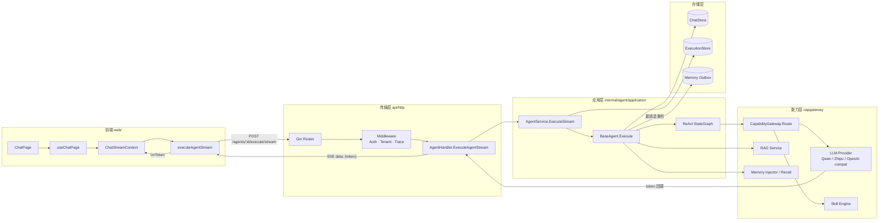
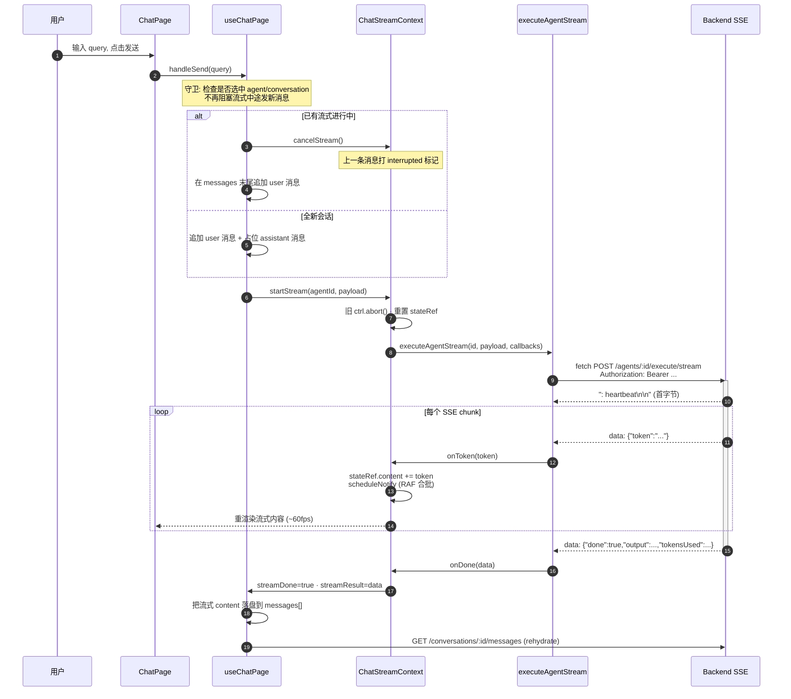
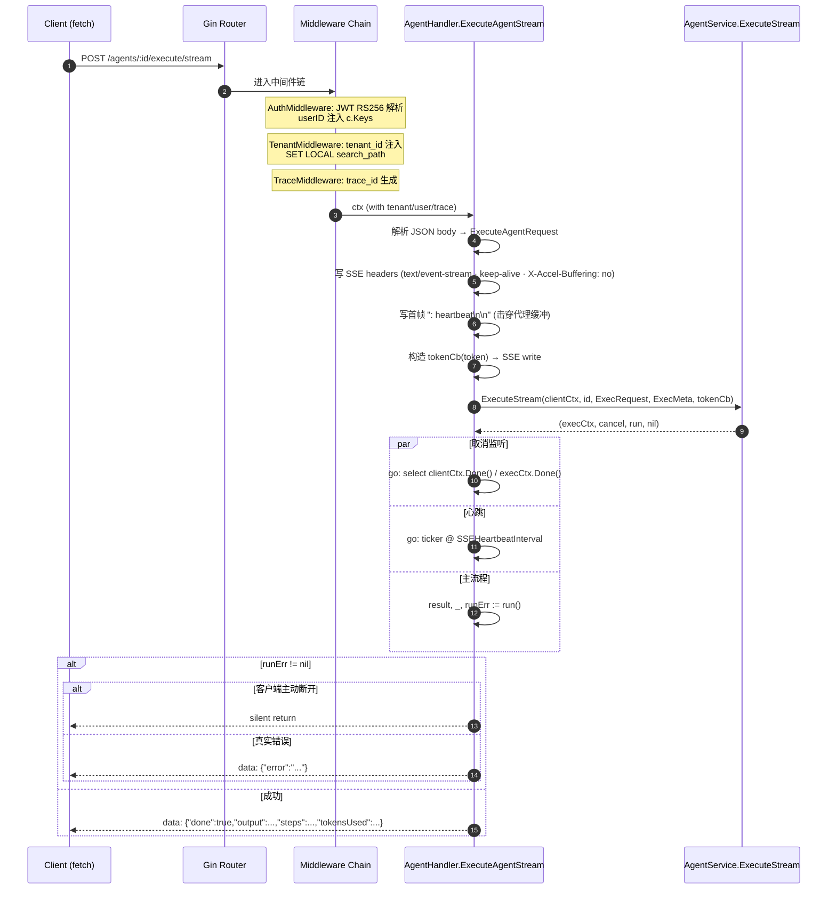
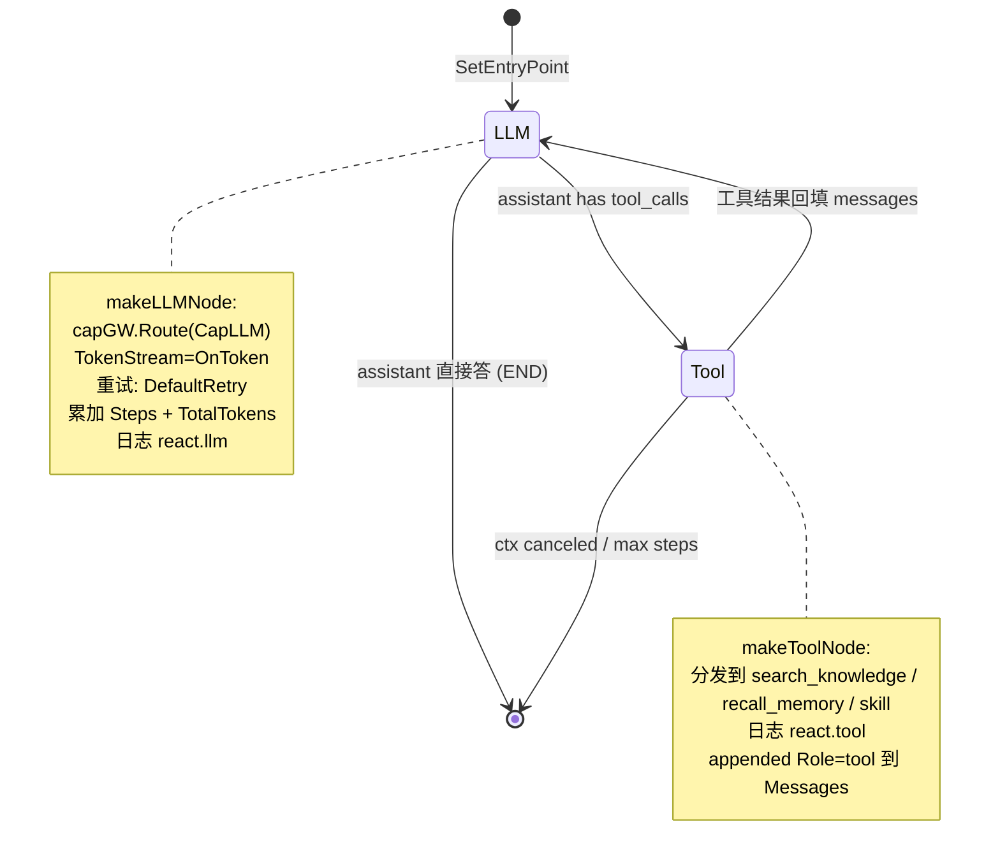
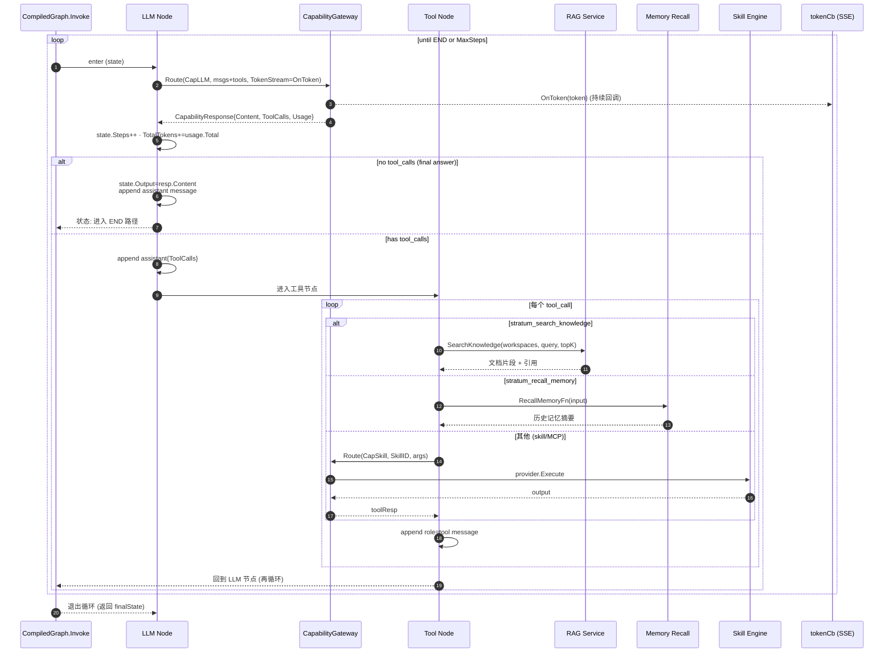
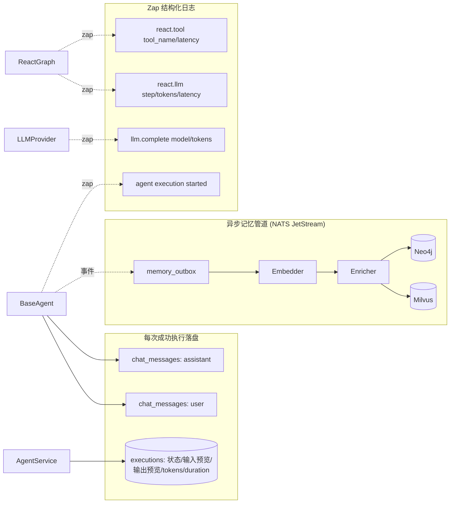
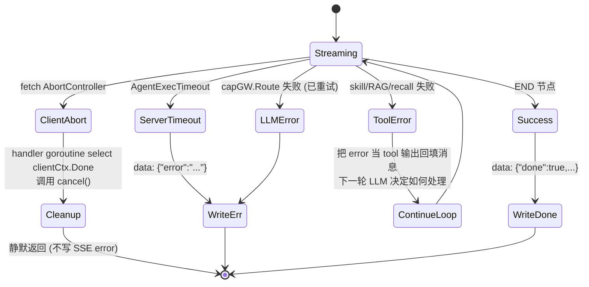

# Agent 会话完整流程图

以一次 agent chat 的 query 输入为切入点，从前端用户键入消息，经由 SSE 流式接口、AgentService 编排、ReAct StateGraph 调度，到 LLM/工具调用、消息持久化与流式回传 token，绘制端到端业务流程。

---

## 1. 鸟瞰：一次会话的端到端



**关键点**

- 前端用 `fetch` + `ReadableStream` 解析 SSE，不走 axios
- HTTP 边界做的事只有：解析 → 鉴权/租户 → 调用 Service → 把 token 回调写成 SSE 帧
- `AgentService` 是编排门面；`BaseAgent.Execute` 是真正的执行体；ReAct 循环在 `agent/application/graph` 包里
- Token 流通过 `WithTokenCallback` 注入到 ReAct LLM 节点；最终答案那一轮的每个 token 都触发回调

---

## 2. 前端：从输入框到流式渲染



**前端关键设计**

- `ChatStreamContext` 用 `ref` + `requestAnimationFrame` 合批通知，避免每个 token 触发 React 重渲染
- 流式中可发新消息：旧 controller `abort` → 旧消息 UI 标 "已中断" → 立即开始新流
- 刷新/切会话时通过 `getStreamState()` 恢复未完成流的 UI

---

## 3. 后端入口：SSE Handler 的 5 件事



**关键约束**

- `clientCtx` 是 gin 请求 context，客户端断连即取消
- `execCtx` 是 `context.WithoutCancel(streamCtx)` + `WithTimeout(AgentExecTimeout)`，**不会**因为 `Stream`/`MemoryInjector` 调用回流被误取消
- 取消监听 goroutine 是双向的：客户端断 → cancel exec；exec 自然结束 → goroutine 退出

---

## 4. AgentService：装配与编排


**装配顺序的语义**

| 顺序 | 作用 | 失败影响 |
|---|---|---|
| Registry.Get | 加载 Agent 聚合 | 直接 404 |
| TenantResolver.Resolve | 拿到该租户的 LLM 完成器 + apiKey | 该 Agent 无可用模型 |
| InjectCompleter | 把 streaming completer 塞进 ctx | RAG / 工具内嵌 LLM 调用走流式 |
| attachChatStore | 让 BaseAgent 能读写历史 | 历史记录退化为单轮 |
| buildExtraTools | MCP 工具 + Allowed Skills 转 ToolDefinition | 工具调用将报 not found |

---

## 5. BaseAgent.Execute：会话级业务流程


**消息装配规则（`BuildContextMessages`）**

```text
[system] systemPrompt + memCtx
[history…] 倒数 N 条 (HistoryWindow)
[user] 当前 query
按 maxContextTokens 自尾向头丢弃溢出
```

---

## 6. ReAct StateGraph：核心循环





**循环边界**

- `MaxSteps`：每进入一次 LLM 节点 +1
- `cfg.Timeout` (默认 120s)：通过 `execCtx` 控制；ReAct 内每步开头检查 `ctx.Done()`
- `reactLLMTimeout = 60s`：单次 LLM 调用超时（独立于 exec 总超时）
- 重试：`DefaultRetry` 策略包裹每次 `capGW.Route`，瞬态错误指数退避

---

## 7. Token 流：从 LLM Provider 到浏览器

```mermaid
flowchart LR
    Llm[LLM Provider<br/>OpenAI compat SSE chunk] -->|chunk| Compl[Per-Tenant Completer]
    Compl -->|TokenStream callback| GwLLM[CapabilityGateway LLM 适配]
    GwLLM -->|OnToken| ReactState[ReActState.OnToken]
    ReactState -->|cfg.TokenCallback| BaseAgent
    BaseAgent --> SvcCb[tokenCb 闭包]
    SvcCb --> SSE[Handler tokenCb<br/>fmt.Fprintf data: token]
    SSE --> Wire[(网络 SSE 帧)]
    Wire --> FetchReader[fetch ReadableStream]
    FetchReader --> Parse[split '\n\n' · slice 'data:']
    Parse --> Stream[ChatStreamContext.onToken]
    Stream --> Raf[scheduleNotify RAF]
    Raf --> React[React Re-render @ ~60fps]
    React --> User[用户看到流式文字]
```



**只有"最终答案"那一轮的 token 会被用户看到**

工具决策轮的 LLM 输出是 tool_call JSON，content 几乎为空——前端不会看到任何 token；用户只在 LLM 决定不再调用工具、直接生成自然语言时才看到流式输出。

---

## 8. 持久化与可观测性



| 日志事件 | 关键字段 |
|---|---|
| `agent execution started` | agent_id, trace_id, conversation_id, type, input |
| `react.llm` | trace_id, tenant_id, model, step, prompt/completion/total_tokens, latency_ms, has_tool_calls |
| `react.tool` | trace_id, tool_name, latency_ms |
| `llm.complete` | model, provider, prompt_tokens, completion_tokens, latency_ms |

---

## 9. 错误与中断



**前端断点续显**

- 用户切走再切回会话：`useChatPage` 通过 `getStreamState()` 检测同 `conversationId` 的活跃流，把累计 content 重新挂到占位 message 上
- 中途发新消息：旧 `ctrl.abort()` → 后端 `clientCtx` 被取消 → execCtx 被 cancel goroutine 取消 → ReAct 在下一个 `ctx.Done()` 检查点退出 → 数据库 **不**写入这条未完成的 assistant message（因为 `execErr != nil`）

---

## 10. 关键文件索引

| 关注点 | 路径 |
|---|---|
| 前端流式 hook | `web/src/modules/agent/hooks/ChatStreamContext.tsx` |
| 前端聊天页 hook | `web/src/modules/agent/hooks/useChatPage.ts` |
| 前端 SSE fetch | `web/src/modules/agent/api/agent.api.ts:executeAgentStream` |
| HTTP Handler | `api/http/handler/agent_exec_handler.go` |
| AgentService 编排 | `internal/agent/application/agent_service.go` |
| BaseAgent 执行 | `internal/agent/application/agent.go:Execute (L183)` |
| ReAct 图定义 | `internal/agent/application/graph/react.go` |
| Graph Invoke 引擎 | `internal/agent/application/graph/graph.go` |
| 上下文消息装配 | `internal/agent/application/agent.go:BuildContextMessages` |
| ChatStore | `internal/agent/infrastructure/chatstore/` |
| ExecutionStore | `internal/agent/infrastructure/execstore/` |
| 容量网关路由 | `internal/agent/domain/port/capability.go` + `infrastructure/capgateway/` |
| 记忆注入 | `internal/memory/...` (consumer-side port at `internal/agent/domain/port/memory.go`) |

---

## 元约束速查（来自 CLAUDE.md）

- AI 不做控制逻辑：ReAct 循环判定 / 工具路由 / 重试退避全部硬编码在 `react.go` + `RetryFn`
- handler ≤15 行/方法：`ExecuteAgentStream` 实测 ~60 行（SSE 模板代码无可压缩，已是最简）
- 跨 ctx 通过消费方 port：`port.CapabilityGateway` 定义在 agent 的 `domain/port/`，由 capgateway 实现
- 多租户：`SET LOCAL search_path` 在 TenantMiddleware 注入；execCtx 通过 `context.WithoutCancel` 隔离，但 `tenantdb` 已在 ctx 中绑定
