# Agent 会话完整流程图

以一次 agent chat 的 query 输入为切入点，从前端用户键入消息，经由 SSE 流式接口、AgentService 编排、ReAct StateGraph 调度，到 LLM/工具调用、消息持久化与流式回传 token，绘制端到端业务流程。

---

## 1. 鸟瞰：一次会话的端到端

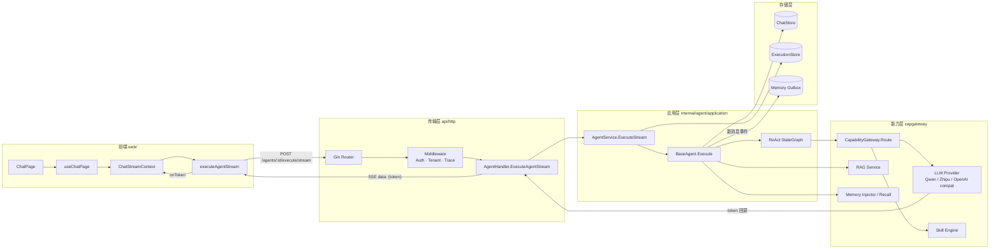

**关键点**

- 前端用 `fetch` + `ReadableStream` 解析 SSE，不走 axios
- HTTP 边界做的事只有：解析 → 鉴权/租户 → 调用 Service → 把 token 回调写成 SSE 帧
- `AgentService` 是编排门面；`BaseAgent.Execute` 是真正的执行体；ReAct 循环在 `agent/application/graph` 包里
- Token 流通过 `WithTokenCallback` 注入到 ReAct LLM 节点；最终答案那一轮的每个 token 都触发回调

---

## 2. 前端：从输入框到流式渲染

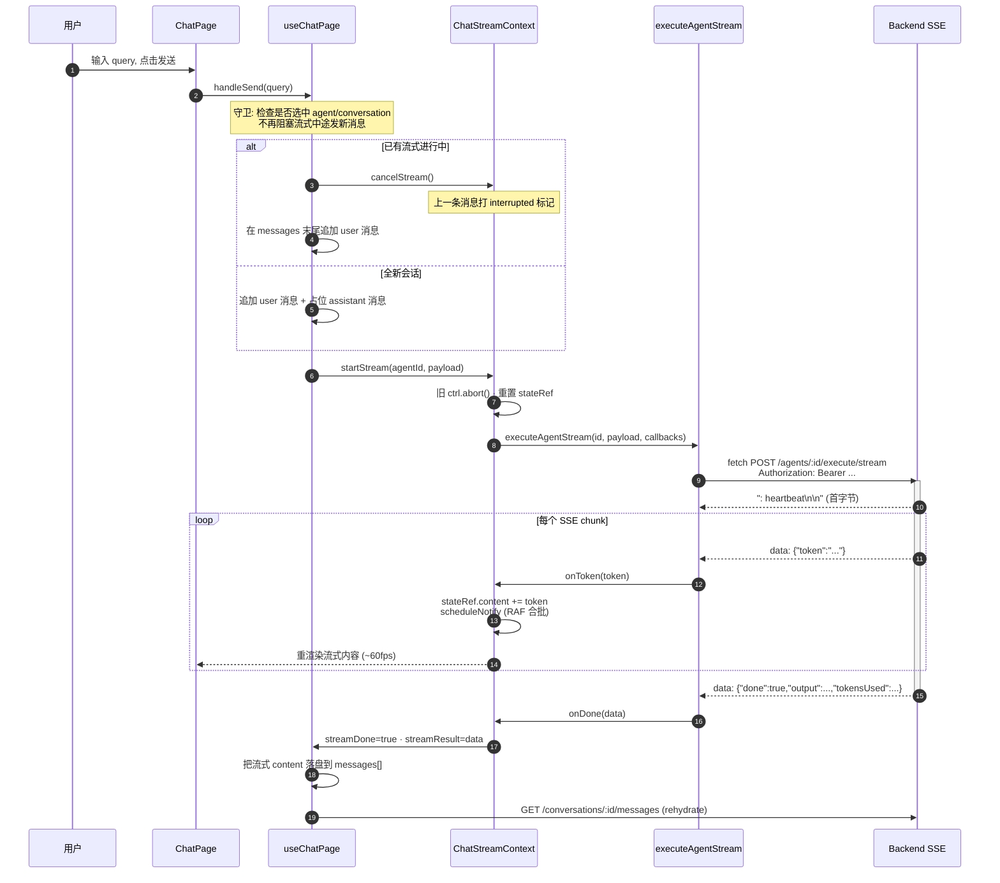

**前端关键设计**

- `ChatStreamContext` 用 `ref` + `requestAnimationFrame` 合批通知，避免每个 token 触发 React 重渲染
- 流式中可发新消息：旧 controller `abort` → 旧消息 UI 标 "已中断" → 立即开始新流
- 刷新/切会话时通过 `getStreamState()` 恢复未完成流的 UI

---

## 3. 后端入口：SSE Handler 的 5 件事

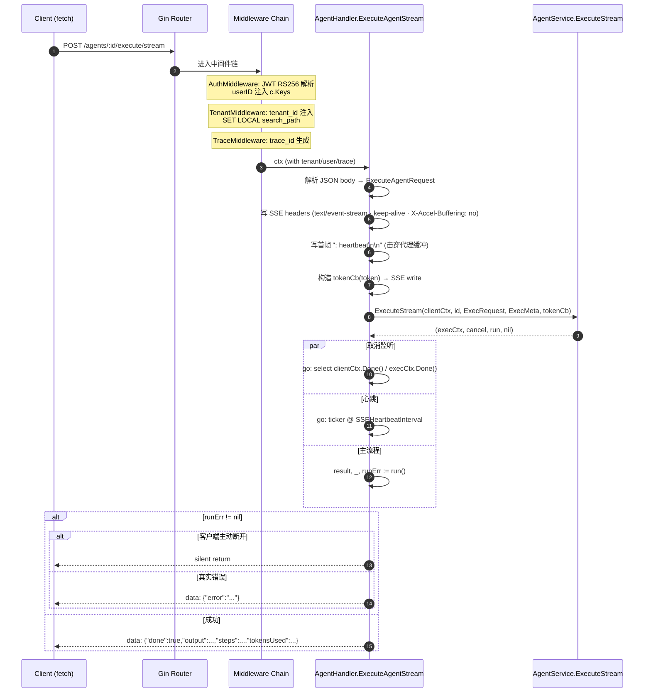

**关键约束**

- `clientCtx` 是 gin 请求 context，客户端断连即取消
- `execCtx` 是 `context.WithoutCancel(streamCtx)` + `WithTimeout(AgentExecTimeout)`，**不会**因为 `Stream`/`MemoryInjector` 调用回流被误取消
- 取消监听 goroutine 是双向的：客户端断 → cancel exec；exec 自然结束 → goroutine 退出

---

## 4. AgentService：装配与编排

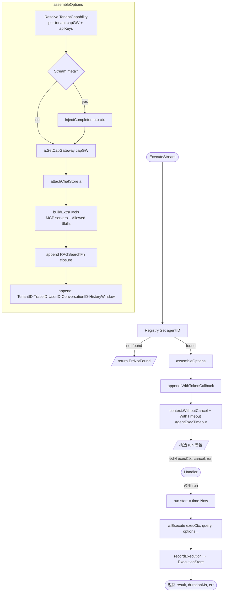

**装配顺序的语义**

| 顺序 | 作用 | 失败影响 |
|---|---|---|
| Registry.Get | 加载 Agent 聚合 | 直接 404 |
| TenantResolver.Resolve | 拿到该租户的 LLM 完成器 + apiKey | 该 Agent 无可用模型 |
| InjectCompleter | 把 streaming completer 塞进 ctx | RAG / 工具内嵌 LLM 调用走流式 |
| attachChatStore | 让 BaseAgent 能读写历史 | 历史记录退化为单轮 |
| buildExtraTools | MCP 工具 + Allowed Skills 转 ToolDefinition | 工具调用将报 not found |

---

## 5. BaseAgent.Execute：会话级业务流程


**消息装配规则（`BuildContextMessages`）**

```text
[system] systemPrompt + memCtx
[history…] 倒数 N 条 (HistoryWindow)
[user] 当前 query
按 maxContextTokens 自尾向头丢弃溢出
```

---

## 6. ReAct StateGraph：核心循环

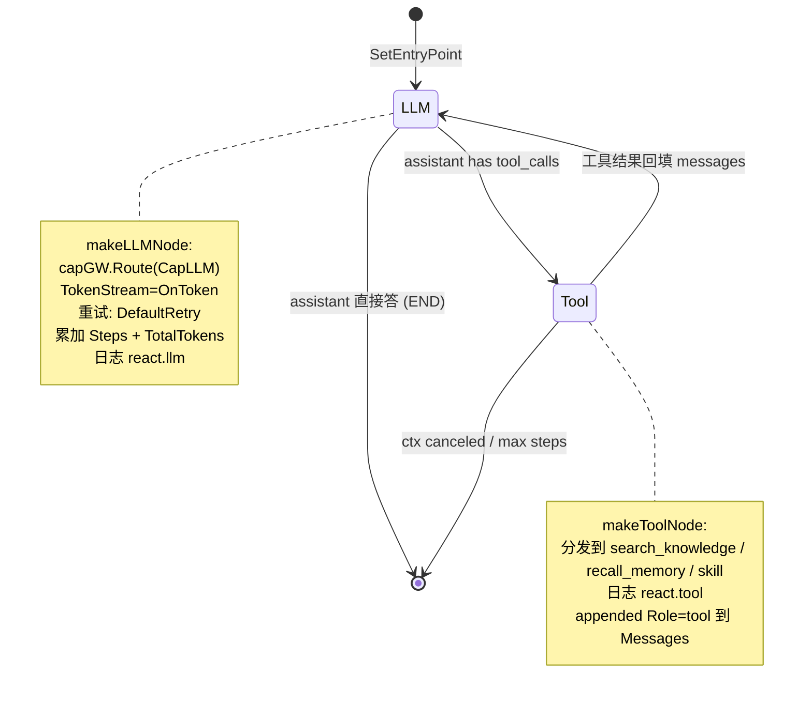

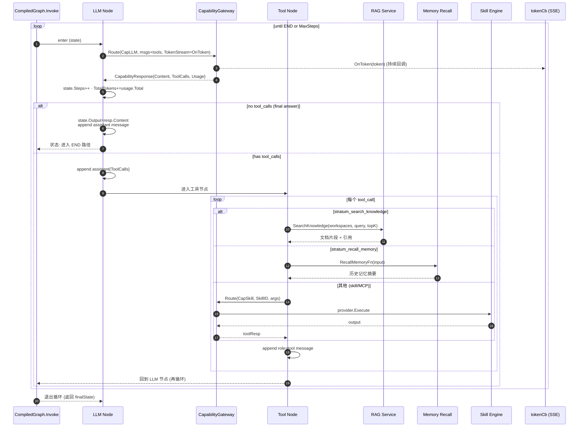

**循环边界**

- `MaxSteps`：每进入一次 LLM 节点 +1
- `cfg.Timeout` (默认 120s)：通过 `execCtx` 控制；ReAct 内每步开头检查 `ctx.Done()`
- `reactLLMTimeout = 60s`：单次 LLM 调用超时（独立于 exec 总超时）
- 重试：`DefaultRetry` 策略包裹每次 `capGW.Route`，瞬态错误指数退避

---

## 7. Token 流：从 LLM Provider 到浏览器

```mermaid
flowchart LR
    Llm[LLM Provider<br/>OpenAI compat SSE chunk] -->|chunk| Compl[Per-Tenant Completer]
    Compl -->|TokenStream callback| GwLLM[CapabilityGateway LLM 适配]
    GwLLM -->|OnToken| ReactState[ReActState.OnToken]
    ReactState -->|cfg.TokenCallback| BaseAgent
    BaseAgent --> SvcCb[tokenCb 闭包]
    SvcCb --> SSE[Handler tokenCb<br/>fmt.Fprintf data: token]
    SSE --> Wire[(网络 SSE 帧)]
    Wire --> FetchReader[fetch ReadableStream]
    FetchReader --> Parse[split '\n\n' · slice 'data:']
    Parse --> Stream[ChatStreamContext.onToken]
    Stream --> Raf[scheduleNotify RAF]
    Raf --> React[React Re-render @ ~60fps]
    React --> User[用户看到流式文字]
```

**只有"最终答案"那一轮的 token 会被用户看到**

工具决策轮的 LLM 输出是 tool_call JSON，content 几乎为空——前端不会看到任何 token；用户只在 LLM 决定不再调用工具、直接生成自然语言时才看到流式输出。

---

## 8. 持久化与可观测性

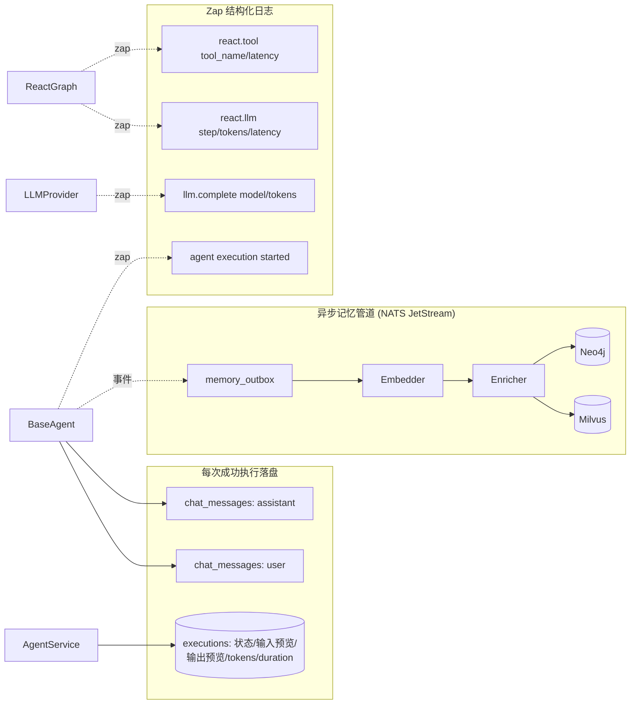

| 日志事件 | 关键字段 |
|---|---|
| `agent execution started` | agent_id, trace_id, conversation_id, type, input |
| `react.llm` | trace_id, tenant_id, model, step, prompt/completion/total_tokens, latency_ms, has_tool_calls |
| `react.tool` | trace_id, tool_name, latency_ms |
| `llm.complete` | model, provider, prompt_tokens, completion_tokens, latency_ms |

---

## 9. 错误与中断

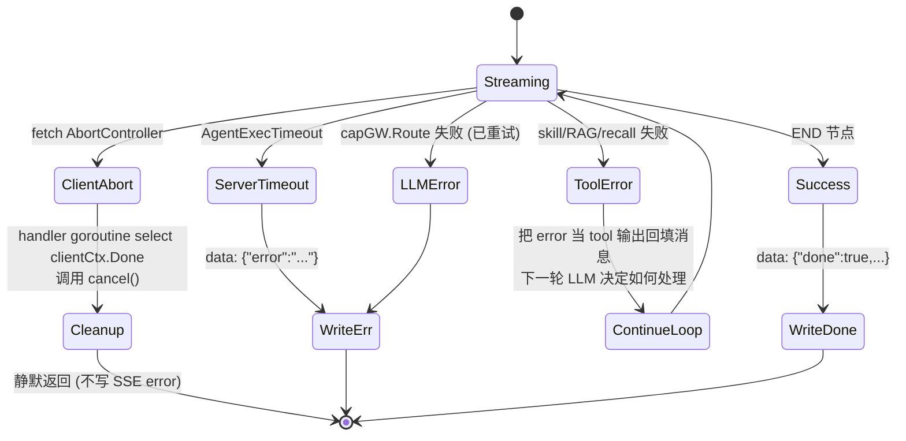

**前端断点续显**

- 用户切走再切回会话：`useChatPage` 通过 `getStreamState()` 检测同 `conversationId` 的活跃流，把累计 content 重新挂到占位 message 上
- 中途发新消息：旧 `ctrl.abort()` → 后端 `clientCtx` 被取消 → execCtx 被 cancel goroutine 取消 → ReAct 在下一个 `ctx.Done()` 检查点退出 → 数据库 **不**写入这条未完成的 assistant message（因为 `execErr != nil`）

---

## 10. 关键文件索引

| 关注点 | 路径 |
|---|---|
| 前端流式 hook | `web/src/modules/agent/hooks/ChatStreamContext.tsx` |
| 前端聊天页 hook | `web/src/modules/agent/hooks/useChatPage.ts` |
| 前端 SSE fetch | `web/src/modules/agent/api/agent.api.ts:executeAgentStream` |
| HTTP Handler | `api/http/handler/agent_exec_handler.go` |
| AgentService 编排 | `internal/agent/application/agent_service.go` |
| BaseAgent 执行 | `internal/agent/application/agent.go:Execute (L183)` |
| ReAct 图定义 | `internal/agent/application/graph/react.go` |
| Graph Invoke 引擎 | `internal/agent/application/graph/graph.go` |
| 上下文消息装配 | `internal/agent/application/agent.go:BuildContextMessages` |
| ChatStore | `internal/agent/infrastructure/chatstore/` |
| ExecutionStore | `internal/agent/infrastructure/execstore/` |
| 容量网关路由 | `internal/agent/domain/port/capability.go` + `infrastructure/capgateway/` |
| 记忆注入 | `internal/memory/...` (consumer-side port at `internal/agent/domain/port/memory.go`) |

---

## 元约束速查（来自 CLAUDE.md）

- AI 不做控制逻辑：ReAct 循环判定 / 工具路由 / 重试退避全部硬编码在 `react.go` + `RetryFn`
- handler ≤15 行/方法：`ExecuteAgentStream` 实测 ~60 行（SSE 模板代码无可压缩，已是最简）
- 跨 ctx 通过消费方 port：`port.CapabilityGateway` 定义在 agent 的 `domain/port/`，由 capgateway 实现
- 多租户：`SET LOCAL search_path` 在 TenantMiddleware 注入；execCtx 通过 `context.WithoutCancel` 隔离，但 `tenantdb` 已在 ctx 中绑定

---

## 11. 用户记忆能力（业务流程 + 实现细节）

Stratum 的"用户记忆"分为**短期**（按 `conversation_id` 直读 `chat_messages`）与**长期**（异步管道沉淀到 `memory_entries` / `memory_entities` / `memory_summaries` / Milvus 向量库）两层。  
代码主路径在 `internal/memory/{application,infrastructure}` 和 `internal/agent/application/agent.go`，由 `api/wiring/memory.go` 按 Container 装配；写、读、召回、删除四条业务流彼此解耦但共用同一份数据。

### 11.1 数据归属与存储一览

| 存储 | 表 / Collection | 写入方 | 读取方 | 备注 |
|---|---|---|---|---|
| PG · tenant schema | `chat_messages` | `ChatStore.AddMessage`（同事务） | `BaseAgent.Execute` 加载历史；前端 `/conversations/:id/messages` | 短期记忆唯一源 |
| PG · tenant schema | `memory_outbox` | `ChatStore.AddMessage`（同事务） | `OutboxPoller` 出队 | 解耦"消息可见 ⟺ 事件可发" |
| PG · tenant schema | `memory_entries` | `EnricherWorker.persistEnrichment` | `MemoryInjector.BuildContext`、`RecallHandler.textSearch` | 长期记忆富化结果（importance / keywords / token_estimate） |
| PG · tenant schema | `memory_entities` | `EnricherWorker.persistEnrichment`（按 entity 循环 UPSERT） | `MemoryInjector.BuildContext` | 命名实体表，scope = user / agent |
| PG · tenant schema | `memory_summaries` | `EnricherWorker.writeSummary`（条件触发） | `MemoryInjector.BuildContext` | 会话累计 token 超过阈值时滚动生成 |
| PG · tenant schema | `memory_extraction_queue` | `MessageBuffer.flush` | （TODO，`BuildMemoryWorkers` 暂未上线 worker） | LLM 事实抽取队列 |
| PG · tenant schema | `memory_facts` | `MemoryService.ExtractFacts` | `MemoryService.ForgetMemory` / `Clear*` | 事实抽取产物，soft-delete |
| Milvus | `memory_<tenantID>`（短横线换下划线） | `EmbedderWorker` 通过 `MilvusVectorAdapter.Upsert` | `RecallHandler.tryVectorSearch` | 消息维度向量；scope/agent_id 走 metadata 过滤 |
| Milvus | `memory_facts_<tenantID>` | `MemoryService.ExtractFacts` | `ForgetMemory` / `ClearUserMemories` 清理 | 事实维度向量 |

> 命名规则：tenantID 含短横线时 Milvus collection 用下划线替换（见 `pkg/milvus/collections.go`、`api/wiring/memory.go: DeleteAllByUser`）。

### 11.2 整体业务全景

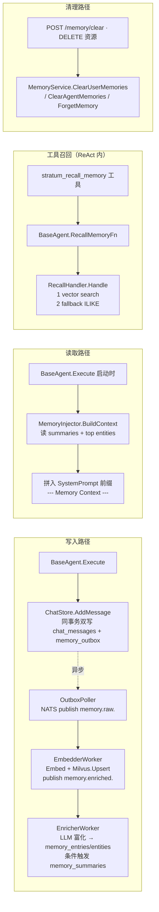

四条路径在请求/事件层面解耦：写入与读取通过 PG + Milvus 持久化层联系；同步链路（agent 主流程）只触发"短期写"与"系统提示词注入"，长期富化全部走 NATS JetStream 异步。

### 11.3 写入主路径：chat_messages 与 memory_outbox 同事务双写

入口：`PgChatStore.AddMessage`（`internal/agent/infrastructure/persistence/chat_store.go`），由 `BaseAgent.Execute` 在 ReAct 收尾时调用两次（user、assistant 各一条）。

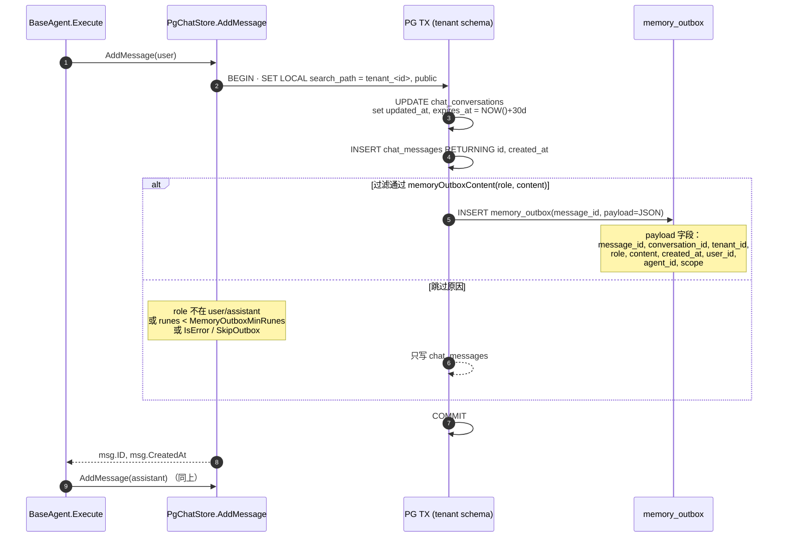

**关键设计要点**

| 设计点 | 含义 / 代码位置 |
|---|---|
| 同事务双写 | `chat_messages` 与 `memory_outbox` 在同一 `BEGIN…COMMIT` 内插入。chat_store.go 内的 `outboxQueued / outboxSkipReason` 双变量给后续日志使用。 |
| Outbox 过滤 | `memoryOutboxContent` 只允许 `user` / `assistant`、`runes >= MemoryOutboxMinRunes`，并按 `MemoryOutboxMaxRunes` 截断；`SkipOutbox=true` 或 `IsError=true` 直接跳过。 |
| Tenant 路由 | `execTenantID` 强制 `SET LOCAL search_path = "tenant_<id>", public`，并对 tenant_id 做字符白名单校验。 |
| 用户/Agent 元信息 | `ChatMessage.UserID` / `AgentID` / `MemoryScope` 在 `BaseAgent.Execute` 写消息时一并传入，payload 直接随 outbox 落库，下游 worker 不再二次查询。 |
| 失败回滚 | `tx.Rollback` 由 `execTenantID` 兜底，写失败时 `chat_messages` 与 `memory_outbox` 一起回滚——避免"消息可见但事件丢失"或"事件已发但消息丢失"。 |

### 11.4 异步管道：Outbox → Embedder → Enricher

管道生命周期由 `cmd/server` Harness 控制；构造在 `api/wiring/memory.go: buildMemory`，在 `MEMORY_PIPELINE_ENABLED=true` 且 NATS / Milvus 可达时启动。

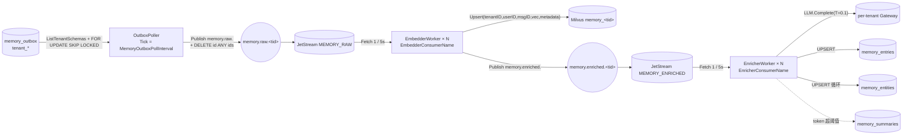

#### 11.4.1 OutboxPoller — 全租户轮询、SKIP LOCKED、至少一次

`internal/memory/infrastructure/pipeline/outbox_poller.go`

- 每 `MemoryOutboxPollInterval` 触发一次：`tenantdb.ListTenantSchemas` 拿全部 `tenant_xxx`，逐个调用 `pollTenant`。
- 每个 tenant 单独事务：`SET LOCAL search_path`，`SELECT id, payload FROM memory_outbox ORDER BY id LIMIT $1 FOR UPDATE SKIP LOCKED`。
- 每条记录：`json.Unmarshal` → `MemoryRawEvent`，组装 subject `memory.raw.<tenantID>`，调用 `js.Publish`（带 `MemoryOutboxPublishTimeout` 超时）；publish 失败立刻 `return err`（事务回滚，下一轮重发，至少一次）。
- 全部 publish 成功后 `DELETE FROM memory_outbox WHERE id = ANY($1)`，最后 `COMMIT`；Prometheus 计数 `outboxPublished{tenant_id, status}`。
- 多实例并发：靠 `FOR UPDATE SKIP LOCKED`，互不阻塞——"谁锁到谁负责"。

#### 11.4.2 EmbedderWorker — 向量化 + Milvus Upsert + 转发

`internal/memory/infrastructure/pipeline/embedder.go`

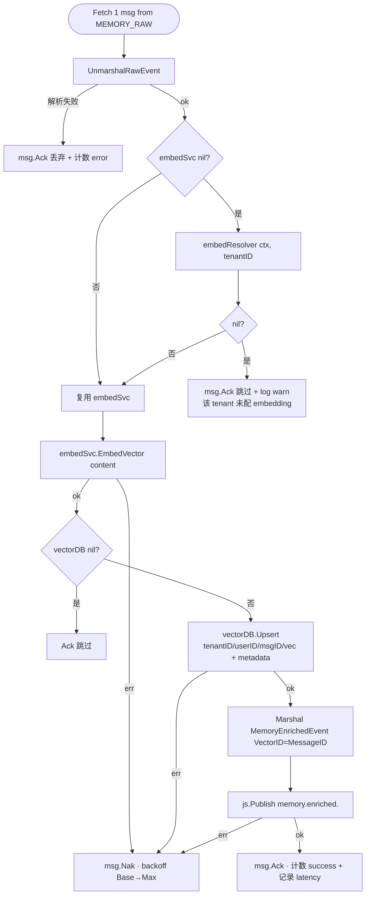

- Embedding client 优先用 wiring 注入的全局 `embedSvc`（当前 wiring 传 nil），否则用 `embedResolver(ctx, tenantID)` 解析的租户专属客户端；二者都拿不到时直接 Ack 跳过，避免无效重投。
- Milvus collection 名按 tenant 取，写入 metadata：`conversation_id / user_id / agent_id / scope / role / content / created_at(RFC3339)`；向量 ID = `MessageID`，与 `chat_messages.id`、未来的 `memory_entries.id` 同源。
- 失败统一 `msg.Nak`，由 JetStream 重投递；达到 `MaxDeliver` 后进 DLQ。`safeProcessMessage` 用 `defer recover` 把单条 panic 隔离在一条消息内。
- Fetch 拉空 / 出错时按 `MemoryFetchBackoffBase → Max` 退避；`sleepCtx` 监听 `ctx.Done` 与 `stopCh`，保证关闭信号能立即生效。

#### 11.4.3 EnricherWorker — LLM 富化 + 实体写入 + 摘要回滚

`internal/memory/infrastructure/pipeline/enricher.go`

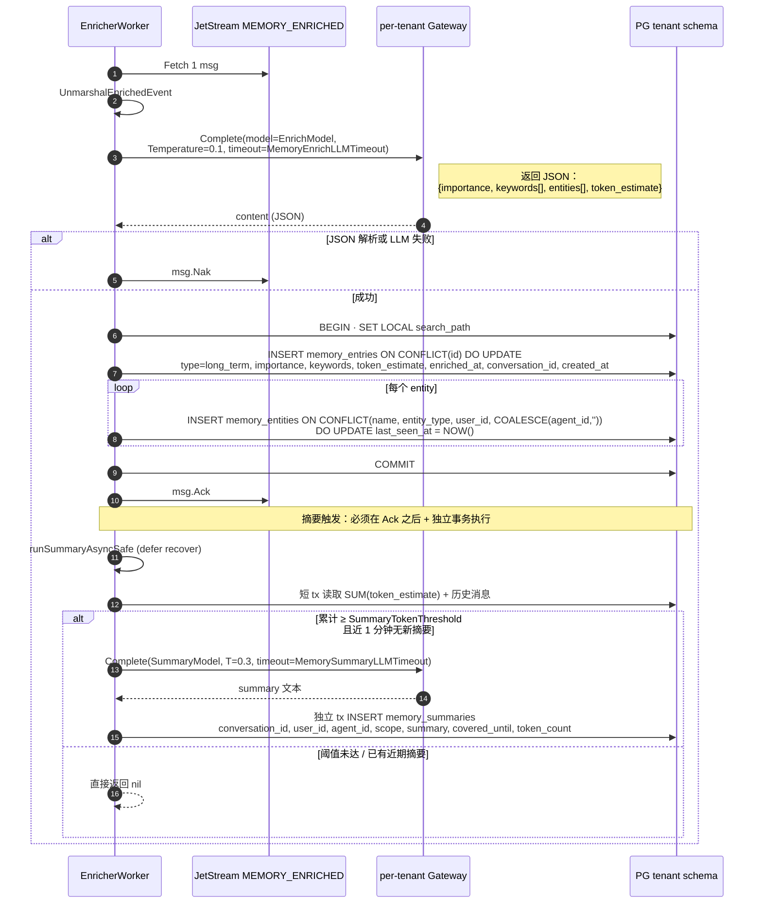

**摘要旁路的关键修复**（来自 `enricher.go: maybeTriggerSummary` 注释）

> 旧实现把 LLM Complete 塞进 `persistEnrichment` 的事务里，单条记录持锁 30s+，高 QPS 下 pgxpool 连接耗尽。现在拆成三段：短 tx 读阈值与历史 → 解锁后调 LLM → 另起 tx 写摘要；并且必须发生在 `msg.Ack` 之后，失败只 warn，绝不影响主富化结果。

**重要不变量**

- `memory_entries.id = chat_messages.id = MemoryEnrichedEvent.MessageID = Milvus vector_id`，三库通过同一 UUID 串联。
- `memory_entities` 唯一键 `(name, entity_type, user_id, COALESCE(agent_id, ''))`：scope=user 时 `agent_id` 为空，scope=agent 时按 agent 隔离。
- LLM 不可控副作用全部隔离在富化阶段；ChatStore 与 Embedder 不会调用 LLM，主链路绝不被 LLM 延迟阻塞。
- `safeProcessMessage` 与 `runSummaryAsyncSafe` 两道 `defer recover` 把"单条数据导致 worker 崩溃"的风险吃掉。

### 11.5 备用写入通道：MessageBuffer + 事实抽取（演进中）

`internal/memory/application/message_buffer.go` + `extraction.go`：与上面的"消息维度"管道并行，用于**事实级抽取**（更精细，但当前 worker 未在 `BuildMemoryWorkers` 中启用，处于演进状态）。

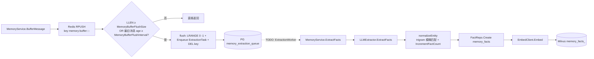

- **缓冲键**：`memory:buffer:<tenant>:<user>:<agent>:<conv>`，按会话维度合批，避免单条消息频繁触发 LLM。
- **触发条件**：批数 ≥ `MemoryBufferFlushSize` 或最早消息超过 `MemoryBufferFlushInterval` 即 flush。flush 完成后立刻 `DEL` 整个 key。
- **`ExtractFacts`**：拼接所有消息 → LLM 抽取事实数组 → 对每个事实：`FindSupersedeCandidates`（trigram 相似度，supersede 决策 TODO） → `normalizeEntity`（fuzzy match 升级旧实体 fact_count，否则新建） → `domain.NewFact` 校验后写 `memory_facts` → `EmbedClient.Embed` 后写 `memory_facts_<tenantID>`。
- **现状**：`BuildMemoryWorkers` 仍是空切片（占位 TODO），表示 ExtractionWorker / SupersedeWorker / ProfileWorker / GCWorker 暂未在 Container 中拉起；这条通道目前由 API 直接调用 `BufferMessage` / `ExtractFacts` 触发，agent 主链路不依赖它。

### 11.6 读取路径 A：系统提示词注入

`BaseAgent.Execute` 启动时通过 `MemoryInjector.BuildContext`（`internal/memory/infrastructure/pipeline/injector.go`）把"近期摘要 + 高频实体"注入 system prompt。

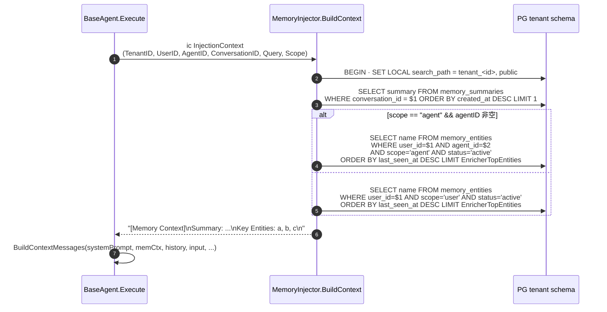

- 全部走只读事务，失败只 `Warn` 不阻塞主链路（`agent.go: memory injection failed`）。
- 摘要与实体都空时返回空串，避免在 prompt 上加噪声。
- `Scope` 由 agent 配置中的 `MemoryScope` 决定（user 全局共享 / agent 按代理隔离），同一 UserID 不同 Agent 在 scope=user 下可共享实体，scope=agent 下完全独立。

### 11.7 读取路径 B：stratum_recall_memory 工具召回

ReAct 期间，LLM 可以选择调用 `stratum_recall_memory` 工具——agent.go 在 `MemoryInjector != nil` 时把它注册到 `availableTools`，handler 是 `RecallHandler.Handle`（`internal/memory/infrastructure/pipeline/recall_tool.go`），由 `api/wiring/memory.go` 暴露为 `RecallMemoryFn`。

```mermaid
flowchart LR
    Tool[LLM 调用 stratum_recall_memory<br/>input: query + limit] --> Fn[BaseAgent.RecallMemoryFn<br/>注入 tenantID/userID/agentID/scope]
    Fn --> H[RecallHandler.Handle]
    H --> Try{embedSvc + vectorDB 可用?}
    Try -- 否 --> Text[textSearch]
    Try -- 是 --> Em[EmbedVector query]
    Em -- err --> Text
    Em -- ok --> Filter{构造 Milvus expr}
    Filter --> Vec[vectorDB.SearchWithFilter<br/>collection=memory_<tid>,<br/>topK=MemoryLongTermTopK]
    Vec -- 命中 --> JsonV[json.Marshal RecallEntry array]
    Vec -- 空/err --> Text
    Text --> SQL[BEGIN · SET search_path<br/>SELECT content, role, importance, created_at<br/>FROM memory_entries<br/>WHERE enriched_at IS NOT NULL<br/>AND content ILIKE %query%<br/>AND user_id = $<br/>AND (scope='user' OR scope='agent' + agent_id)]
    SQL --> Order[ORDER BY importance DESC, created_at DESC LIMIT req.Limit]
    Order --> JsonT[json.Marshal 或 "No relevant memories found."]
    JsonV --> Out[作为 role=tool 消息回填 ReActState.Messages]
    JsonT --> Out
```

- **向量优先 + 降级 ILIKE**：embedding / Milvus 可用时走语义召回；任何环节失败（embedding error / vector 空命中）平滑降级到全文 ILIKE。
- **scope 过滤**：scope=agent 时叠加 `agent_id == "<id>"`；user_id 含引号或反斜杠时直接拒绝（防注入）。
- **限流**：`limit` 默认 5，最大 20；vector 路径用 `constants.MemoryLongTermTopK`。
- **可观测**：`memory.recall.vector` / `memory.recall` 两段 Debug 日志，带 trace_id、tenant_id、query、命中数。
- 工具结果作为 `role=tool` 消息回填 `ReActState.Messages`，下一轮 LLM 决定继续调用工具还是直接产出答案。

### 11.8 删除与清理路径

| API / 触发 | 调用 | 影响范围 |
|---|---|---|
| `MemoryService.ForgetMemory(factID)` | `FactRepo.Update(MarkDeleted)` + Milvus `memory_facts_<tid>` 删 ID（best-effort） | 单条事实 soft-delete；孤立向量由 GC worker 兜底 |
| `MemoryService.ClearUserMemories` | `FactRepo.DeleteAllByUser` + Milvus `memory_<tid>` `DeleteByFilter("user_id == ..." )` + `MemoryRepo.DeleteAllByUser` + `EntityRepo.DeleteAllByUser` | 同租户内某 user 全量硬删（facts + entries + entities + 向量） |
| `MemoryService.ClearAgentMemories` | `FactRepo.DeleteAllByAgent` 返回 IDs + Milvus `memory_facts_<tid>.Delete(IDs)` + `MemoryRepo.DeleteAllByAgent` | 单 agent 全量硬删；当前 entities 不按 agent 删（按 CLAUDE.md 历史记录是未完成项） |
| DELETE conversation | `PgChatStore.DeleteConversation` | 删 `chat_messages` + `chat_conversations`；不级联清 long-term（依赖上面三个 API 主动调用） |

> 多租户路由：所有删除调用都通过 `execTenant(ctx, tenantID, fn)` 或 `execTenantID` 切到 `tenant_<id>` schema；Milvus collection 名按 tenantID 拼接（短横线 → 下划线）；缺一个就会把删除请求打到 public schema，复现历史 SQLSTATE 42P01 bug。

### 11.9 失败语义与背压（端到端）

| 位置 | 失败语义 | 防护 / 兜底 |
|---|---|---|
| `ChatStore.AddMessage` 同事务双写 | 业务 tx 回滚 → 既不留消息也不留 outbox | 强一致；调用方只看到一个 error |
| `OutboxPoller.pollTenant` publish 失败 | tx 回滚保留 outbox 行 | 下一轮重发；多实例并发用 `FOR UPDATE SKIP LOCKED` |
| `OutboxPoller` json.Unmarshal 失败 | 仅日志 + 把 id 加入待删列表（脏数据自动出队） | 不会卡死队列；用 metrics 监控 |
| `EmbedderWorker` Embedding 失败 | `msg.Nak` + backoff 重投 | 达到 `MaxDeliver` 进 DLQ |
| `EmbedderWorker` Milvus 失败 | 同上 | vectorDB 故障时只影响向量化，PG 主链路不受影响 |
| `EmbedderWorker` publish enriched 失败 | 同上 | "已 Upsert Milvus 但未发 enriched"会等下次重投；Upsert 幂等可重放 |
| `EnricherWorker` LLM 失败 / JSON 解析失败 | `msg.Nak` 重试，超过 `MaxDeliver` 进 DLQ | 不污染数据库 |
| `EnricherWorker` persistEnrichment 失败 | tx 回滚 + `msg.Nak` | 至少一次写；`ON CONFLICT DO UPDATE` 保证幂等 |
| `EnricherWorker` 摘要触发失败 | `runSummaryAsyncSafe` 只 warn | 主富化已 Ack，绝不返工；摘要下次累计达阈值再尝试 |
| `MemoryInjector.BuildContext` 失败 | agent.go 捕获并 `Warn`，memCtx 留空 | 主链路不阻塞 |
| `RecallHandler.tryVectorSearch` 失败 | 自动降级到 `textSearch` | 始终返回结果（可能为空字符串） |
| `Pipeline.Stop()` | 关闭独立 ctx + WaitGroup | outbox 残留行下次重启续传；JetStream 持久化保留未 Ack 消息 |

---

## 12. 登录、认证与授权

Stratum 的认证体系基于 GitHub OAuth + 双 JWT（access + onboarding）+ 刷新 cookie；授权采用三层（global_role / tenant_role / 资源所有者）+ 租户激活检查。

### 12.1 登录全景：三种结果分支

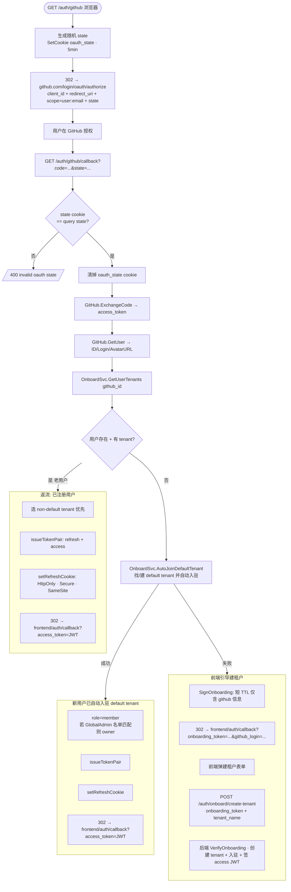

**三种产物对比**

| 类型 | TTL | 载荷 | 用途 |
|---|---|---|---|
| access JWT (RS256) | 短（分钟级） | `sub, tid, role, global_role, ava, ghl, jti` | 业务请求 `Authorization: Bearer` |
| refresh token | 长（HttpOnly cookie） | server 端 token_store 里的随机串 | `/auth/refresh` 续 access |
| onboarding JWT (RS256) | 极短 | `github_id, github_login, avatar_url` | 仅用于建租户那一次 |

### 12.2 已认证请求的中间件链

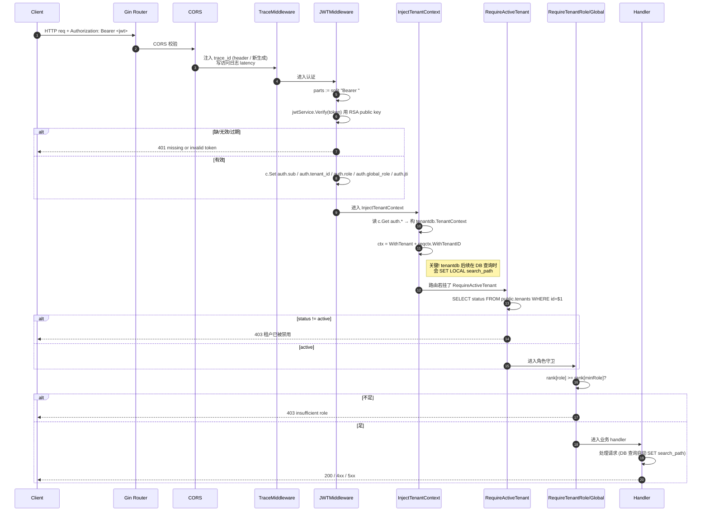

### 12.3 授权三层模型

```mermaid
flowchart TB
    Req[请求 + JWT claims] --> L1{global_role}
    L1 -- global_admin --> Pass1[跨租户全权]
    L1 -- 空 --> L2

    L2{tenant_role 等级<br/>owner=3 > admin=2 > member=1} -- 不足 minRole --> R403_role[/403 insufficient tenant role/]
    L2 -- 足 --> L3

    L3{租户激活态}
    L3 -- status != active --> R403_tenant[/403 租户已被禁用/]
    L3 -- active --> L4

    L4{资源所有者校验}
    L4 -- 业务层 user_id != claims.sub --> R403_owner[/403 not owner/]
    L4 -- ok --> Allow[执行业务]
```

**职责分配**

| 检查项 | 责任层 | 实现 |
|---|---|---|
| 是否登录 | middleware | `JWTMiddleware` 验签 + Bearer |
| 全局管理员 | middleware | `RequireGlobalAdmin` 检查 `auth.global_role` |
| 租户角色门槛 | middleware | `RequireTenantRole(minRole)` 比较 rank |
| 租户激活态 | middleware | `RequireActiveTenant` 查 `public.tenants.status` |
| 资源归属 | application 层 | service 比较 `userID == record.UserID`（如 conversation 仅 owner 可读写） |
| 多租户隔离 | infrastructure | `tenantdb.SET LOCAL search_path = tenant_<id>` —— 跨租户访问物理上读不到表 |

### 12.4 RBAC 角色矩阵

```mermaid
classDiagram
    class GlobalRole {
        global_admin
        (空)
    }
    class TenantRole {
        owner
        admin
        member
    }
    class Resource {
        Tenants
        Users / Onboarding
        Agents / Conversations
        Knowledge / Skills / MCP
        Memories
    }

    GlobalRole --> Resource: 跨租户读写所有资源
    TenantRole --> Resource: 在自己 tenant_<id> schema 内读写
    Resource: owner-only: 删租户/转让/计费
    Resource: admin: 管理用户与配置
    Resource: member: 只能用业务功能
```

### 12.5 Token 续期与失效

```mermaid
sequenceDiagram
    autonumber
    participant FE as 前端
    participant API as /auth/refresh
    participant TStore as token_store (DB)
    participant JWT as JWTService

    Note over FE: access JWT 401 expired
    FE->>API: POST /auth/refresh<br/>(自动带 HttpOnly refresh cookie)
    API->>API: 取 cookie raw_rt
    API->>TStore: lookup hash(raw_rt)<br/>未撤销 + 未过期 + 用户存在
    alt 校验失败
        API-->>FE: 401 → 跳登录
    else ok
        API->>JWT: Sign 新 access JWT (RS256)
        API->>TStore: 旋转 refresh token<br/>写新行 + 撤销旧行 (一次性)
        API->>FE: SetCookie 新 refresh + body 新 access
    end

    Note over FE: 用户登出
    FE->>API: POST /auth/logout
    API->>TStore: 撤销当前 refresh token<br/>(可选: 把 jti 加入 access blacklist)
    API->>FE: 清 cookie + 200
```

**安全要点**

- access JWT 用 **RS256**：边缘网关只需公钥即可验签，不接触私钥
- refresh token 走 **HttpOnly + Secure + SameSite cookie**，不暴露给 JS
- token_store 存 hash 不存原值；轮换时旧值立即作废（refresh token rotation）
- onboarding token 单次使用：建租户成功后即作废
- 前端**禁止把 access JWT 写 localStorage**（CLAUDE.md 已有约束）；存内存 Context

### 12.6 关键代码索引

| 关注点 | 路径 |
|---|---|
| GitHub OAuth 重定向/回调 | `api/http/handler/auth_oauth_handler.go` |
| 登录注册/会话/租户 handler | `api/http/handler/auth_session_handler.go` · `auth_register_handler.go` · `auth_tenant_handler.go` |
| JWT 签发与验签 | `internal/iam/application/jwt_service.go` |
| OnboardService 自动入驻 | `internal/iam/application/onboard_service.go` |
| GitHub Client | `internal/iam/infrastructure/oauth/github.go` |
| Token 持久化 | `internal/iam/infrastructure/persistence/token_store.go` |
| JWT Middleware | `api/middleware/jwt.go` |
| Tenant 注入 | `api/middleware/inject_tenant.go` |
| 角色守卫 | `api/middleware/require_role.go` |
| 租户激活检查 | `api/middleware/require_active_tenant.go` |
| Outbox poller | `internal/memory/infrastructure/pipeline/outbox_poller.go` |
| Embedder worker | `internal/memory/infrastructure/pipeline/embedder.go` |
| Enricher worker | `internal/memory/infrastructure/pipeline/enricher.go` |
| 管道编排 | `internal/memory/infrastructure/pipeline/pipeline.go` |
| 事件结构 | `internal/memory/infrastructure/pipeline/events.go` |
| JetStream 配置 | `internal/memory/infrastructure/pipeline/jetstream.go` |
