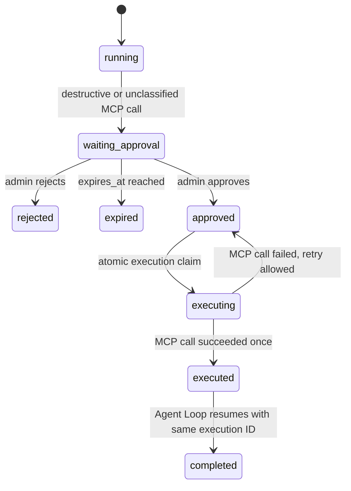

# Agent Chat Flow

## Normal Run

```mermaid
sequenceDiagram
    participant UI as Chat UI
    participant API as Agent HTTP/SSE
    participant Loop as Agent Loop
    participant LLM as LLM Gateway
    participant MCP as MCP ClientManager
    participant KM as Knowledge/Memory
    participant DB as Tenant PostgreSQL

    UI->>API: POST /agents/:id/execute/stream
    API->>Loop: ExecuteStream + tenant/user/trace
    Loop->>DB: load Agent + pinned Skill catalog
    Loop->>LLM: messages + effective tools
    alt activate Skill
        LLM-->>Loop: stratum_activate_skill(skill_id)
        Loop->>Loop: replace active Skill, inject instructions, narrow permissions
        Loop->>LLM: active instructions + effective tools
    else knowledge or memory
        LLM-->>Loop: built-in tool call
        Loop->>KM: authorized intersection only
        KM-->>Loop: observation
    else MCP read/reversible
        LLM-->>Loop: mcp:<server>:<tool>
        Loop->>MCP: CallTool(server, raw tool name, args)
        MCP-->>Loop: observation
    end
    Loop->>LLM: observations
    opt loop context reaches 80% safety threshold
        Loop->>Loop: keep anchors + recent tool groups; elide older groups atomically
    end
    LLM-->>Loop: final answer tokens
    Loop->>DB: execution + tool traces + trace events
    API-->>UI: SSE done
```

上下文实际处理规则：初始请求按 `MaxContextTokens` 和历史窗口从最老消息开始截断；循环内请求达到预算的 80% 后，只压缩发送给 LLM 的消息副本，保留开头的 system/user 锚点与最近 3 个完整消息组。当前 wiring 没有注入 `HistoryCompactor`，因此较早轮次以“已省略 N 轮”标记替代；数据库会话历史和 trace 不被裁剪。

## Approval Run



暂停时：

1. `agent_tool_approvals` 保存 AES-GCM ciphertext；错误与 SSE 只包含安全 ID/名称/risk。
2. `agent_execution_checkpoints.status=waiting_approval`，runtime state 只含 approval ID。
3. SSE 发送 `event: approval_required`。
4. UI 可调用 decision API；批准后调用 resume API。
5. resume 重新解析 payload 中固定的 Skill revisions，并只 bypass 完全匹配的工具调用一次。

## Effective Permissions

```text
MCP tools  = tenant/user permission ∩ Agent.mcpToolIds ∩ active Skill.mcpToolIds
Knowledge  = Agent.workspaceIds ∩ active Skill.workspaceIds
Memory     = Agent.memoryScope ∩ active Skill.memoryScopes
```

没有 active Skill 时，Agent 可使用自身明确 allowlist。激活 Skill 后 requirements 只能收窄权限，不能扩大权限。

## Evaluation

Skill evaluation 是 Agent scenario evaluation：evaluation worker 找到绑定该 Skill 的 Agent，固定被测 revision 为 active Skill，再通过真实 Agent Loop 执行 case。禁止直接执行 Skill revision。
