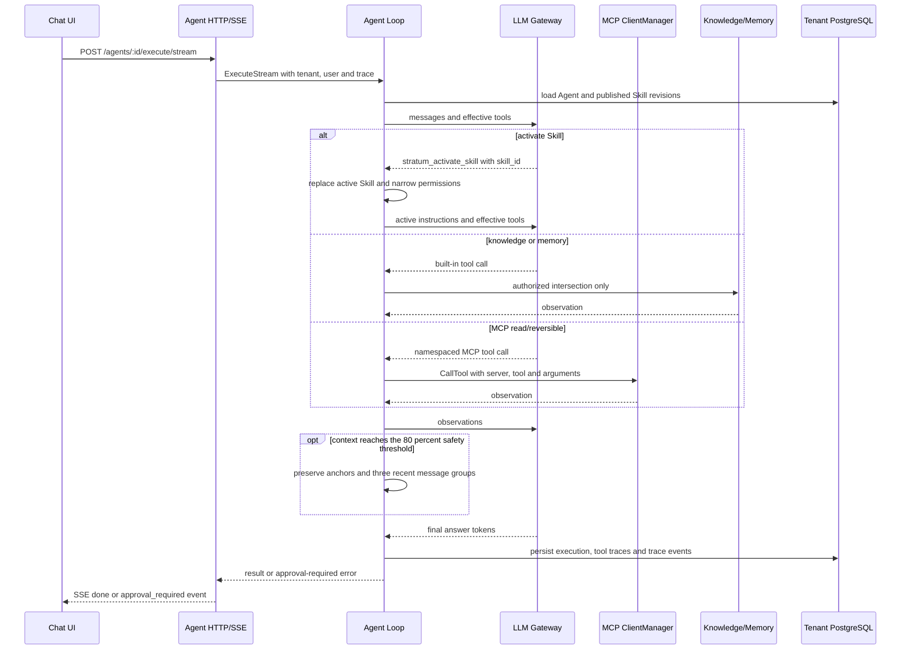
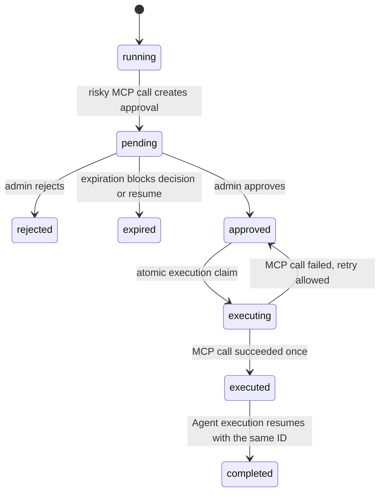

# Agent Chat Flow

> 当前事实基线：`2c93938`（2026-07-21）。路由入口见 `api/http/router.go`，执行与审批编排见
> `internal/agent/application/agent_service.go`，ReAct 工具循环见
> `internal/agent/application/graph/react.go`。

## Normal Run



上下文实际处理规则：初始请求按 `MaxContextTokens` 和历史窗口截断较老消息；循环内请求达到预算的
80% 后，只压缩发送给 LLM 的消息副本，保留 system/user 锚点与最近 3 个完整消息组。
`HistoryCompactor` 是可选端口；未注入时用省略标记替代较早轮次。数据库会话历史、执行记录和 trace
不会被该步骤裁剪。

## Approval Run



暂停时：

1. `agent_tool_approvals.status=pending`，敏感 payload 以 AES-GCM ciphertext 保存。
2. execution record 和 checkpoint 使用 `waiting_approval`；checkpoint runtime state 只含 approval ID。
3. SSE 发送 `event: approval_required`。
4. 管理员通过 decision API 作出 `approved` 或 `rejected` 决策；批准后再调用 resume API。
5. resume 使用原 execution ID，重新解析 payload 中固定的 Skill revisions，并只允许完全匹配的
   server、tool 和 arguments 绕过审批一次。
6. 执行前以原子更新把审批从 `approved` claim 为 `executing`；MCP 失败回到 `approved`，成功转为
   `executed`，防止并发重复执行。

## Effective Permissions

```text
MCP tools  = tenant/user permission ∩ Agent.mcpToolIds ∩ active Skill.mcpToolIds
Knowledge  = Agent.workspaceIds ∩ active Skill.workspaceIds
Memory     = Agent.memoryScope ∩ active Skill.memoryScopes
```

没有 active Skill 时，Agent 可使用自身明确 allowlist。激活 Skill 后 requirements 只能收窄权限，不能扩大权限。

## Evaluation

Skill evaluation 是 Agent scenario evaluation：evaluation worker 找到绑定该 Skill 的 Agent，将被测
revision 作为 active Skill 固定注入，再通过真实 Agent Loop 执行 case。Skill revision 本身不是独立的
可执行单元。
