# Agent 会话完整流程图

以一次 agent chat 的 query 输入为切入点，从前端用户键入消息，经由 SSE 流式接口、AgentService 编排、ReAct StateGraph 调度，到 LLM/工具调用、消息持久化与流式回传 token，绘制端到端业务流程。

---

## 1. 鸟瞰：一次会话的端到端

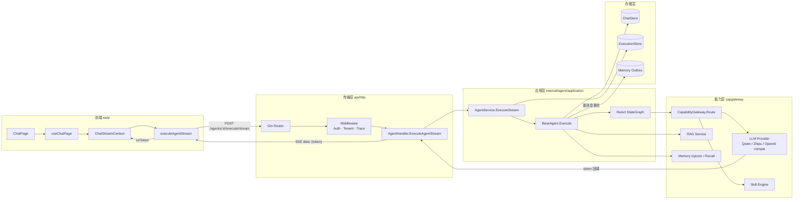

**关键点**

- 前端用 `fetch` + `ReadableStream` 解析 SSE，不走 axios
- HTTP 边界做的事只有：解析 → 鉴权/租户 → 调用 Service → 把 token 回调写成 SSE 帧
- `AgentService` 是编排门面；`BaseAgent.Execute` 是真正的执行体；ReAct 循环在 `agent/application/graph` 包里
- Token 流通过 `WithTokenCallback` 注入到 ReAct LLM 节点；最终答案那一轮的每个 token 都触发回调

---

## 2. 前端：从输入框到流式渲染

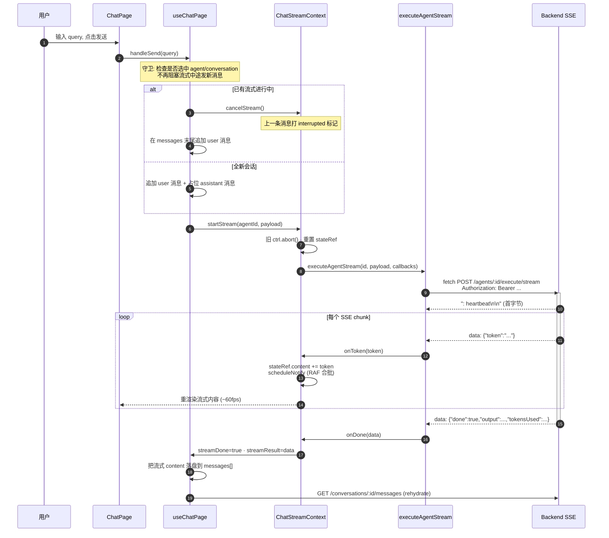

**前端关键设计**

- `ChatStreamContext` 用 `ref` + `requestAnimationFrame` 合批通知，避免每个 token 触发 React 重渲染
- 流式中可发新消息：旧 controller `abort` → 旧消息 UI 标 "已中断" → 立即开始新流
- 刷新/切会话时通过 `getStreamState()` 恢复未完成流的 UI

---

## 3. 后端入口：SSE Handler 的 5 件事

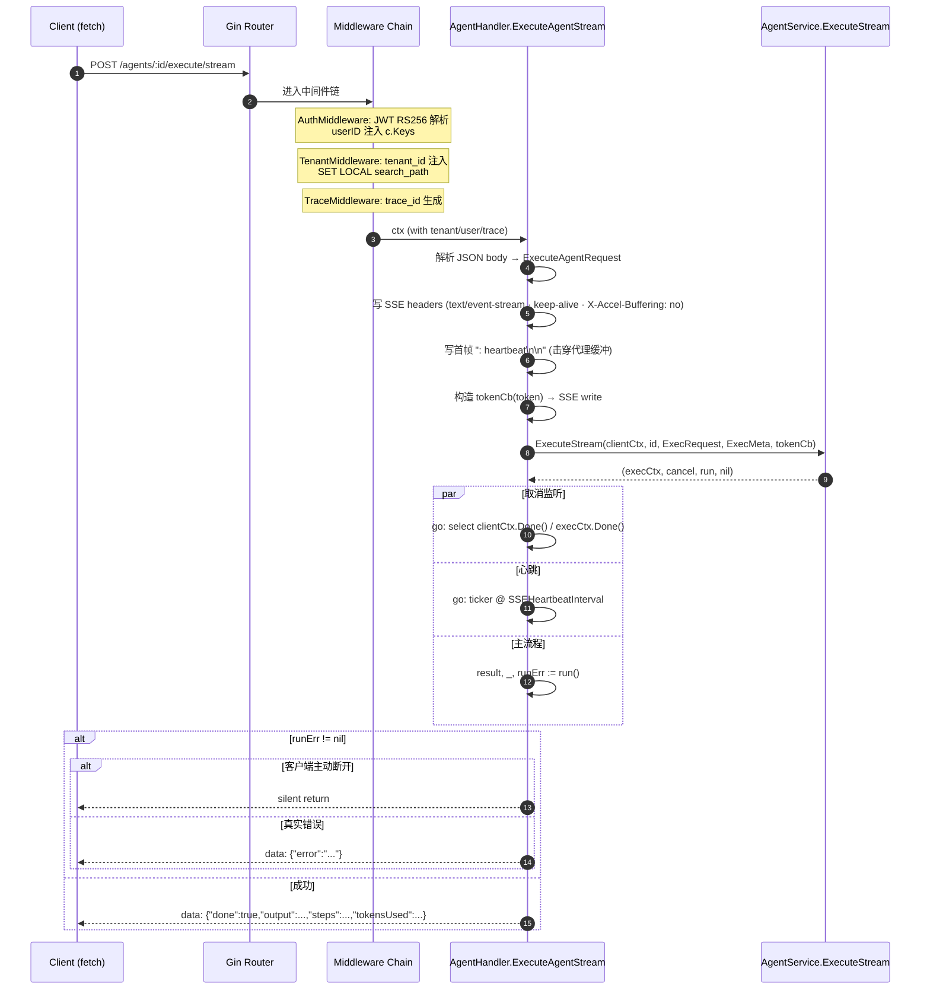

**关键约束**

- `clientCtx` 是 gin 请求 context，客户端断连即取消
- `execCtx` 是 `context.WithoutCancel(streamCtx)` + `WithTimeout(AgentExecTimeout)`，**不会**因为 `Stream`/`MemoryInjector` 调用回流被误取消
- 取消监听 goroutine 是双向的：客户端断 → cancel exec；exec 自然结束 → goroutine 退出

---

## 4. AgentService：装配与编排


**装配顺序的语义**

| 顺序 | 作用 | 失败影响 |
|---|---|---|
| Registry.Get | 加载 Agent 聚合 | 直接 404 |
| TenantResolver.Resolve | 拿到该租户的 LLM 完成器 + apiKey | 该 Agent 无可用模型 |
| InjectCompleter | 把 streaming completer 塞进 ctx | RAG / 工具内嵌 LLM 调用走流式 |
| attachChatStore | 让 BaseAgent 能读写历史 | 历史记录退化为单轮 |
| buildExtraTools | MCP 工具 + Allowed Skills 转 ToolDefinition | 工具调用将报 not found |

---

## 5. BaseAgent.Execute：会话级业务流程

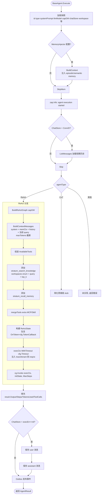

**消息装配规则（`BuildContextMessages`）**

```text
[system] systemPrompt + memCtx
[history…] 倒数 N 条 (HistoryWindow)
[user] 当前 query
按 maxContextTokens 自尾向头丢弃溢出
```

---

## 6. ReAct StateGraph：核心循环

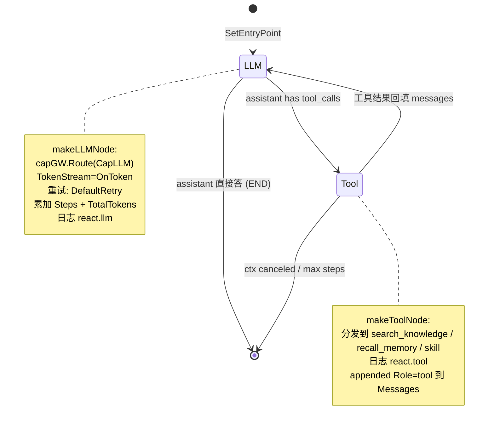

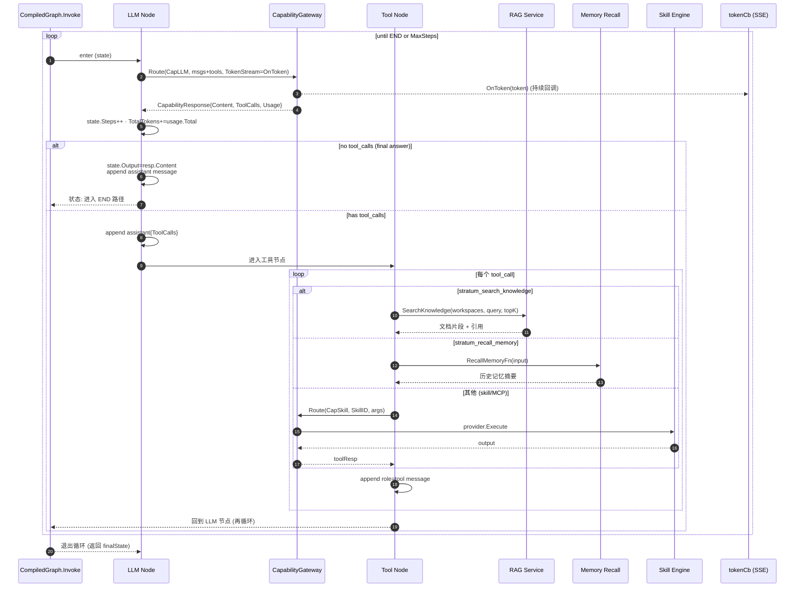

**循环边界**

- `MaxSteps`：每进入一次 LLM 节点 +1
- `cfg.Timeout` (默认 120s)：通过 `execCtx` 控制；ReAct 内每步开头检查 `ctx.Done()`
- `reactLLMTimeout = 60s`：单次 LLM 调用超时（独立于 exec 总超时）
- 重试：`DefaultRetry` 策略包裹每次 `capGW.Route`，瞬态错误指数退避

---

## 7. Token 流：从 LLM Provider 到浏览器

```mermaid
flowchart LR
    Llm[LLM Provider<br/>OpenAI compat SSE chunk] -->|chunk| Compl[Per-Tenant Completer]
    Compl -->|TokenStream callback| GwLLM[CapabilityGateway LLM 适配]
    GwLLM -->|OnToken| ReactState[ReActState.OnToken]
    ReactState -->|cfg.TokenCallback| BaseAgent
    BaseAgent --> SvcCb[tokenCb 闭包]
    SvcCb --> SSE[Handler tokenCb<br/>fmt.Fprintf data: token]
    SSE --> Wire[(网络 SSE 帧)]
    Wire --> FetchReader[fetch ReadableStream]
    FetchReader --> Parse[split '\n\n' · slice 'data:']
    Parse --> Stream[ChatStreamContext.onToken]
    Stream --> Raf[scheduleNotify RAF]
    Raf --> React[React Re-render @ ~60fps]
    React --> User[用户看到流式文字]
```

**只有"最终答案"那一轮的 token 会被用户看到**

工具决策轮的 LLM 输出是 tool_call JSON，content 几乎为空——前端不会看到任何 token；用户只在 LLM 决定不再调用工具、直接生成自然语言时才看到流式输出。

---

## 8. 持久化与可观测性

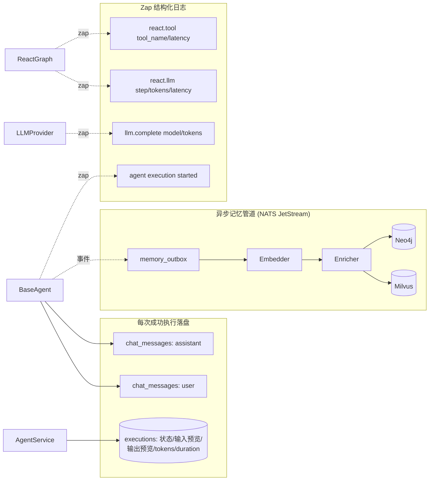

| 日志事件 | 关键字段 |
|---|---|
| `agent execution started` | agent_id, trace_id, conversation_id, type, input |
| `react.llm` | trace_id, tenant_id, model, step, prompt/completion/total_tokens, latency_ms, has_tool_calls |
| `react.tool` | trace_id, tool_name, latency_ms |
| `llm.complete` | model, provider, prompt_tokens, completion_tokens, latency_ms |

---

## 9. 错误与中断

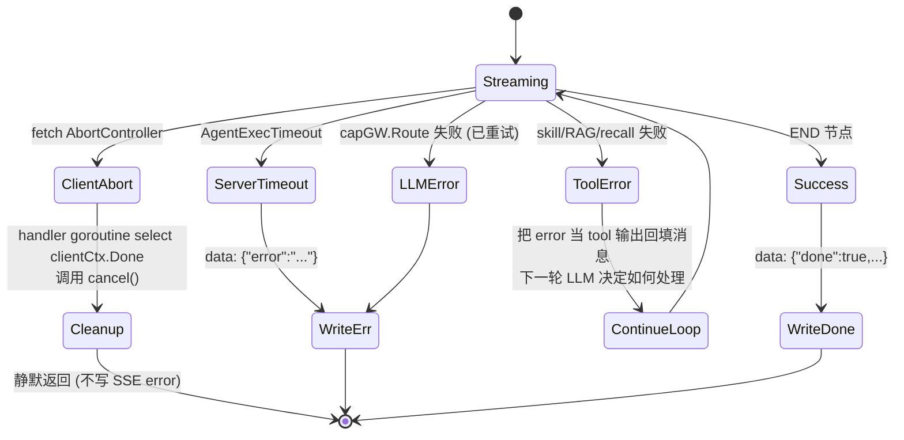

**前端断点续显**

- 用户切走再切回会话：`useChatPage` 通过 `getStreamState()` 检测同 `conversationId` 的活跃流，把累计 content 重新挂到占位 message 上
- 中途发新消息：旧 `ctrl.abort()` → 后端 `clientCtx` 被取消 → execCtx 被 cancel goroutine 取消 → ReAct 在下一个 `ctx.Done()` 检查点退出 → 数据库 **不**写入这条未完成的 assistant message（因为 `execErr != nil`）

---

## 10. 关键文件索引

| 关注点 | 路径 |
|---|---|
| 前端流式 hook | `web/src/modules/agent/hooks/ChatStreamContext.tsx` |
| 前端聊天页 hook | `web/src/modules/agent/hooks/useChatPage.ts` |
| 前端 SSE fetch | `web/src/modules/agent/api/agent.api.ts:executeAgentStream` |
| HTTP Handler | `api/http/handler/agent_exec_handler.go` |
| AgentService 编排 | `internal/agent/application/agent_service.go` |
| BaseAgent 执行 | `internal/agent/application/agent.go:Execute (L183)` |
| ReAct 图定义 | `internal/agent/application/graph/react.go` |
| Graph Invoke 引擎 | `internal/agent/application/graph/graph.go` |
| 上下文消息装配 | `internal/agent/application/agent.go:BuildContextMessages` |
| ChatStore | `internal/agent/infrastructure/chatstore/` |
| ExecutionStore | `internal/agent/infrastructure/execstore/` |
| 容量网关路由 | `internal/agent/domain/port/capability.go` + `infrastructure/capgateway/` |
| 记忆注入 | `internal/memory/...` (consumer-side port at `internal/agent/domain/port/memory.go`) |

---

## 元约束速查（来自 CLAUDE.md）

- AI 不做控制逻辑：ReAct 循环判定 / 工具路由 / 重试退避全部硬编码在 `react.go` + `RetryFn`
- handler ≤15 行/方法：`ExecuteAgentStream` 实测 ~60 行（SSE 模板代码无可压缩，已是最简）
- 跨 ctx 通过消费方 port：`port.CapabilityGateway` 定义在 agent 的 `domain/port/`，由 capgateway 实现
- 多租户：`SET LOCAL search_path` 在 TenantMiddleware 注入；execCtx 通过 `context.WithoutCancel` 隔离，但 `tenantdb` 已在 ctx 中绑定

---

## 11. 异步记忆写入管道（详细）

ChatStore 落盘的 `chat_messages` 只是"短期记忆"（按 conversation_id 直读）。**长期记忆**走 outbox → JetStream → embedder → enricher 三段式异步管道，最终落到 Milvus 向量库 + PostgreSQL `memory_entries` + `entities` 表。

### 11.1 三段式管道总览

```mermaid
flowchart LR
    subgraph Tx["事务边界 (BaseAgent.Execute)"]
        Save[保存 chat_messages]
        OB[INSERT memory_outbox<br/>同事务原子提交]
    end

    subgraph Stage1["Stage 1: Outbox Poller (每 N 秒轮询全租户)"]
        Pol[轮询每个 tenant_xxx schema<br/>FOR UPDATE SKIP LOCKED]
        Pub1[NATS Publish<br/>memory.raw.<tenant_id>]
        Del[DELETE FROM memory_outbox]
        Pol --> Pub1 --> Del
    end

    subgraph Stage2["Stage 2: Embedder Worker (N 个并发)"]
        Fetch1[JetStream Fetch 1 msg]
        Resolve1[per-tenant EmbedClient resolver]
        Embed[EmbedVector text → []float32]
        Mil[Milvus.Upsert<br/>tenantID + userID + msgID + vector + metadata]
        Pub2[NATS Publish<br/>memory.enriched.<tenant_id>]
        Ack1[msg.Ack]
        Fetch1 --> Resolve1 --> Embed --> Mil --> Pub2 --> Ack1
    end

    subgraph Stage3["Stage 3: Enricher Worker (N 个并发)"]
        Fetch2[JetStream Fetch 1 msg]
        Resolve2[per-tenant LLMClient resolver]
        Llm[LLM.Complete<br/>抽取实体/关键词/重要度<br/>Temperature=0.1]
        Tx2[BEGIN tx · SET LOCAL search_path]
        Up1[UPSERT memory_entries<br/>type=long_term + importance + keywords]
        Up2[UPSERT entities<br/>GREATEST confidence 合并]
        Commit[COMMIT]
        Ack2[msg.Ack]
        Fetch2 --> Resolve2 --> Llm --> Tx2 --> Up1 --> Up2 --> Commit --> Ack2
    end

    Save --> OB
    OB -.每 N 秒.-> Pol
    Pub1 -. JetStream MEMORY_RAW .-> Fetch1
    Pub2 -. JetStream MEMORY_ENRICHED .-> Fetch2
```

### 11.2 Outbox：原子写入 + 解耦发布

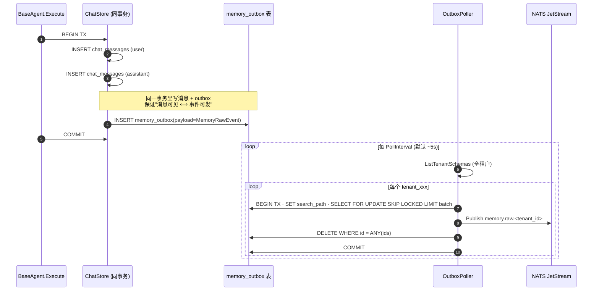

**关键设计**

| 设计点 | 含义 |
|---|---|
| 同事务双写 | 业务表 + outbox 必须原子提交，否则消息可见但事件丢失（或反之） |
| `FOR UPDATE SKIP LOCKED` | 多 poller 实例并存时不互相阻塞，"谁锁到谁负责" |
| `SET LOCAL search_path` | 每个 tenant 独立 schema，poller 顺序轮询所有 schema |
| 主题路由 `memory.raw.<tenant_id>` | JetStream 按 tenant 分流，下游可按租户做配额/限流 |
| DELETE 在 publish 之后 | "至少一次"语义；publish 失败回滚事务保留行，下次再发 |

### 11.3 Embedder：向量化 + Milvus Upsert

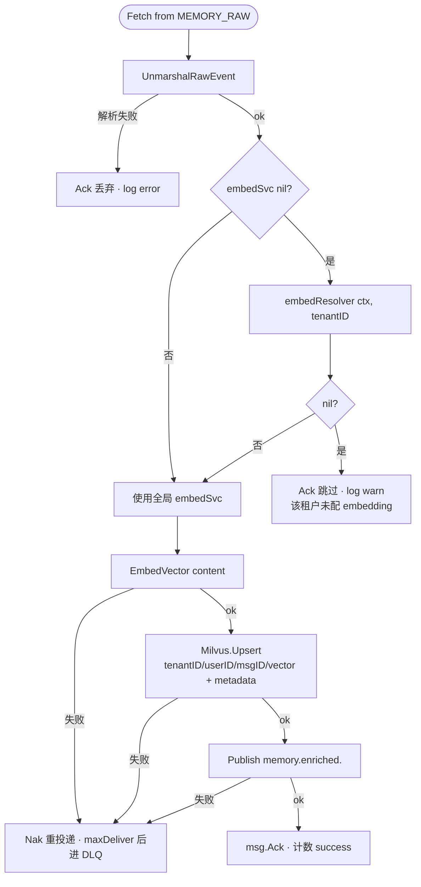

**Milvus 写入 metadata 字段**

```text
conversation_id · user_id · agent_id · role · content · created_at(RFC3339)
```

向量 ID = `MessageID`（chat_message 主键）；后续 recall 时通过 ID 反查 `memory_entries` 拿到富化结果。

### 11.4 Enricher：LLM 富化 + 关系图谱写入

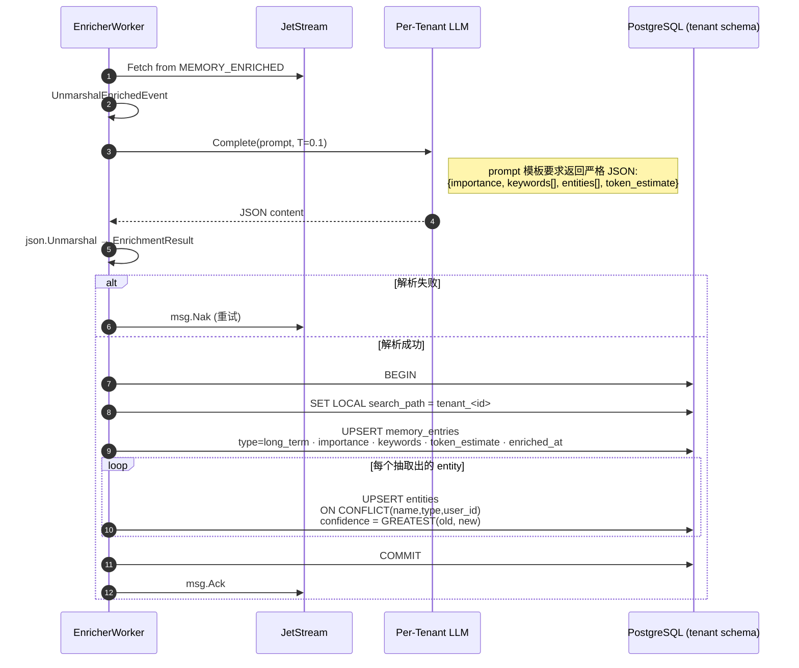

**重要不变量**

- `memory_entries.id = chat_messages.id = vector_id`（Milvus），三库通过同一 UUID 串联
- `entities` 唯一键 `(name, type, user_id)`：实体属于用户，不属于租户也不属于 conversation
- 富化结果是**只读**事实：用户 UI 不直接展示 importance/keywords，只在 recall 时用做排序/过滤
- LLM 解析失败会一直 Nak，达到 `maxDeliver` 后消息进死信队列；不会污染数据

### 11.5 召回：从 stratum_recall_memory 工具到 LLM

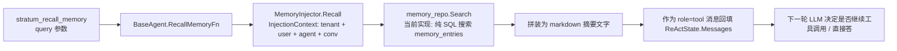

> 当前 `memory_repo.Search` 采用 PostgreSQL 全文/关键字检索（不是向量召回）；Milvus 向量库已写入但**召回路径暂未启用语义检索**，是已识别的演进点（参见观察 5279）。

### 11.6 失败语义与背压

| 失败位置 | 语义 | 防护 |
|---|---|---|
| outbox 同事务写入 | 业务事务回滚 → 事件不发布 | 业务表与 outbox 强一致 |
| poller publish 失败 | 事务 rollback 保留 outbox 行 | 下次轮询重发 |
| embedder Embed 失败 | Nak → 重新投递 | `maxDeliver` 上限后转 DLQ |
| embedder Milvus 失败 | Nak | 同上；vectorDB 故障时 backlog 累积 |
| enricher LLM 失败 | Nak | 同上；DLQ 由人工 / 巡检处理 |
| 全管道关闭 | `Pipeline.Stop()` 取消 ctx + Wait wg | outbox 行保留，重启后续传 |

---

## 12. 登录、认证与授权

Stratum 的认证体系基于 GitHub OAuth + 双 JWT（access + onboarding）+ 刷新 cookie；授权采用三层（global_role / tenant_role / 资源所有者）+ 租户激活检查。

### 12.1 登录全景：三种结果分支


**三种产物对比**

| 类型 | TTL | 载荷 | 用途 |
|---|---|---|---|
| access JWT (RS256) | 短（分钟级） | `sub, tid, role, global_role, ava, ghl, jti` | 业务请求 `Authorization: Bearer` |
| refresh token | 长（HttpOnly cookie） | server 端 token_store 里的随机串 | `/auth/refresh` 续 access |
| onboarding JWT (RS256) | 极短 | `github_id, github_login, avatar_url` | 仅用于建租户那一次 |

### 12.2 已认证请求的中间件链

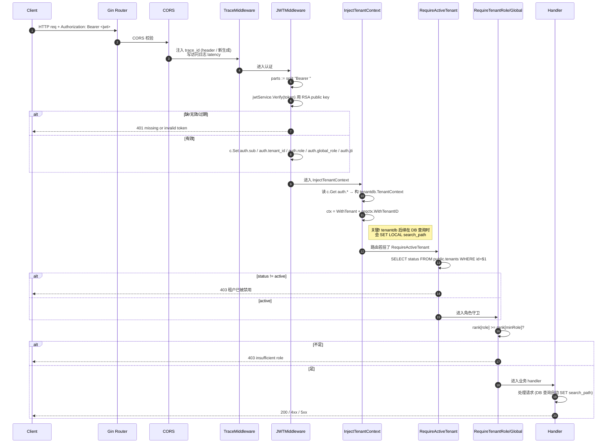

### 12.3 授权三层模型

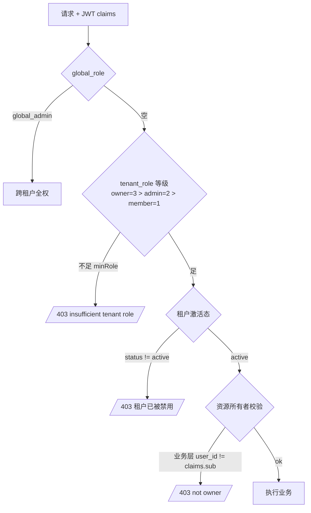

**职责分配**

| 检查项 | 责任层 | 实现 |
|---|---|---|
| 是否登录 | middleware | `JWTMiddleware` 验签 + Bearer |
| 全局管理员 | middleware | `RequireGlobalAdmin` 检查 `auth.global_role` |
| 租户角色门槛 | middleware | `RequireTenantRole(minRole)` 比较 rank |
| 租户激活态 | middleware | `RequireActiveTenant` 查 `public.tenants.status` |
| 资源归属 | application 层 | service 比较 `userID == record.UserID`（如 conversation 仅 owner 可读写） |
| 多租户隔离 | infrastructure | `tenantdb.SET LOCAL search_path = tenant_<id>` —— 跨租户访问物理上读不到表 |

### 12.4 RBAC 角色矩阵

```mermaid
classDiagram
    class GlobalRole {
        global_admin
        (空)
    }
    class TenantRole {
        owner
        admin
        member
    }
    class Resource {
        Tenants
        Users / Onboarding
        Agents / Conversations
        Knowledge / Skills / MCP
        Memories
    }

    GlobalRole --> Resource: 跨租户读写所有资源
    TenantRole --> Resource: 在自己 tenant_<id> schema 内读写
    Resource: owner-only: 删租户/转让/计费
    Resource: admin: 管理用户与配置
    Resource: member: 只能用业务功能
```

### 12.5 Token 续期与失效

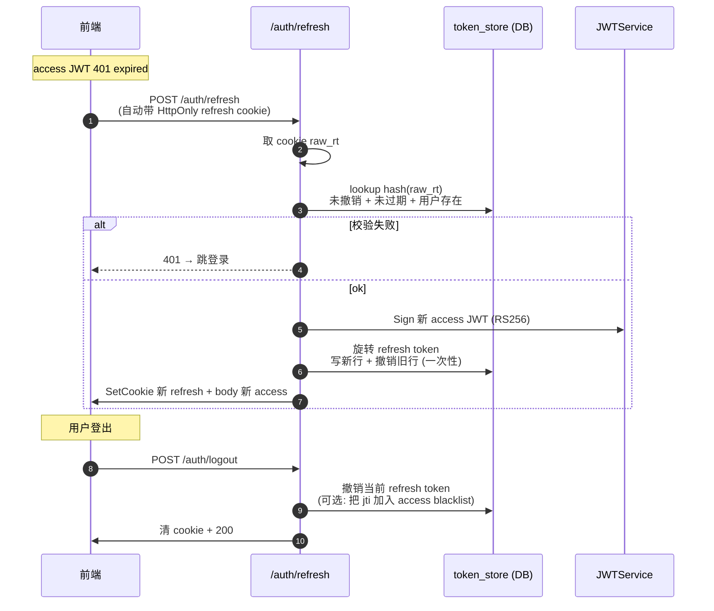

**安全要点**

- access JWT 用 **RS256**：边缘网关只需公钥即可验签，不接触私钥
- refresh token 走 **HttpOnly + Secure + SameSite cookie**，不暴露给 JS
- token_store 存 hash 不存原值；轮换时旧值立即作废（refresh token rotation）
- onboarding token 单次使用：建租户成功后即作废
- 前端**禁止把 access JWT 写 localStorage**（CLAUDE.md 已有约束）；存内存 Context

### 12.6 关键代码索引

| 关注点 | 路径 |
|---|---|
| GitHub OAuth 重定向/回调 | `api/http/handler/auth_oauth_handler.go` |
| 登录注册/会话/租户 handler | `api/http/handler/auth_session_handler.go` · `auth_register_handler.go` · `auth_tenant_handler.go` |
| JWT 签发与验签 | `internal/iam/application/jwt_service.go` |
| OnboardService 自动入驻 | `internal/iam/application/onboard_service.go` |
| GitHub Client | `internal/iam/infrastructure/oauth/github.go` |
| Token 持久化 | `internal/iam/infrastructure/persistence/token_store.go` |
| JWT Middleware | `api/middleware/jwt.go` |
| Tenant 注入 | `api/middleware/inject_tenant.go` |
| 角色守卫 | `api/middleware/require_role.go` |
| 租户激活检查 | `api/middleware/require_active_tenant.go` |
| Outbox poller | `internal/memory/infrastructure/pipeline/outbox_poller.go` |
| Embedder worker | `internal/memory/infrastructure/pipeline/embedder.go` |
| Enricher worker | `internal/memory/infrastructure/pipeline/enricher.go` |
| 管道编排 | `internal/memory/infrastructure/pipeline/pipeline.go` |
| 事件结构 | `internal/memory/infrastructure/pipeline/events.go` |
| JetStream 配置 | `internal/memory/infrastructure/pipeline/jetstream.go` |
