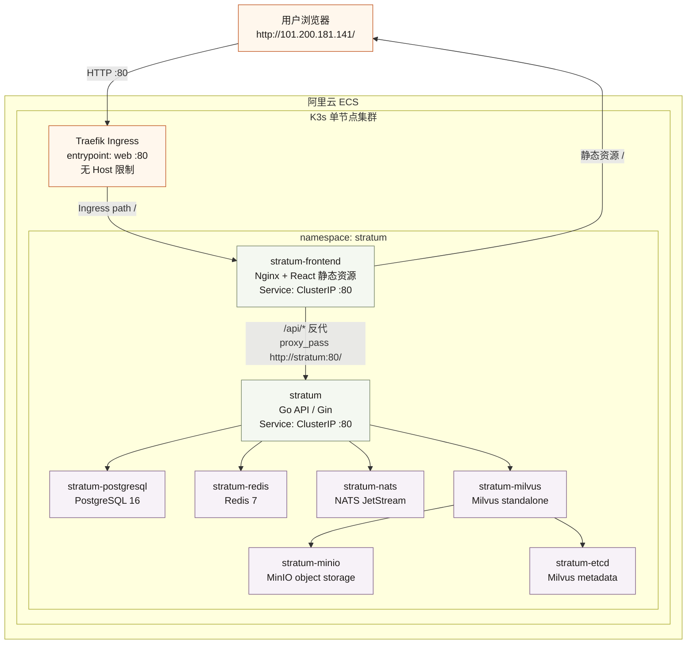

# Stratum Demo 部署架构图

当前 demo 访问目标：

```text
http://101.200.181.141/
```

浏览器请求进入 ECS 公网 IP，通过 K3s 内置 Traefik 的 HTTP `web` 入口进入集群，再路由到前端 Nginx。前端页面中的 `/api/` 请求由前端 Nginx 反向代理到 Go 后端 Service，实现前后端串联。



## 当前 HTTP 直连配置

- `helm/values-demo.yaml`
  - `config.frontendUrl: "http://101.200.181.141"`
  - `config.githubCallbackUrl: "http://101.200.181.141/auth/github/callback"`
  - `config.secureCookies: "false"`
  - `ingress.annotations.traefik.ingress.kubernetes.io/router.entrypoints: "web"`
  - `ingress.hosts[0].host: ""`
  - `ingress.tls: []`

- `helm/templates/ingress.yaml`
  - 支持空 `host`，渲染为不限制 Host 的 Ingress rule。
  - 这样浏览器直接请求 `http://101.200.181.141/` 时可以命中前端。

## 前后端串联

前端 Nginx 配置位于 `helm/templates/frontend-configmap.yaml`：

```nginx
location /api/ {
    proxy_pass http://stratum:80/;
}
```

这里会剥掉 `/api/` 前缀。例如：

```text
浏览器:  GET /api/auth/me
前端:    proxy_pass 到 http://stratum:80/auth/me
后端:    Gin 路由 /auth/me
```

## 后续接入域名和 HTTPS

有正式域名后，建议恢复为域名 + HTTPS：

1. DNS A 记录指向 `101.200.181.141`。
2. `ingress.hosts[0].host` 改成正式域名。
3. 恢复 `cert-manager.io/cluster-issuer` 注解。
4. Ingress entrypoint 改为 `websecure`，恢复 TLS secret。
5. `frontendUrl` 和 `githubCallbackUrl` 改成 `https://<正式域名>`。
6. `secureCookies` 改回 `true`。
