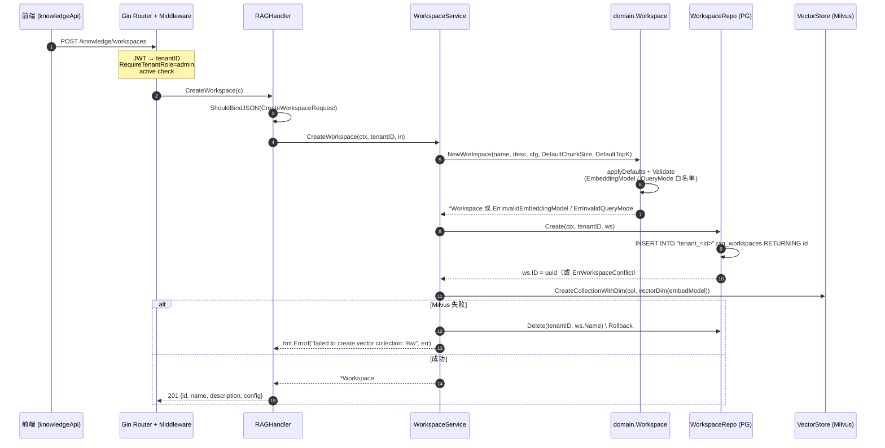
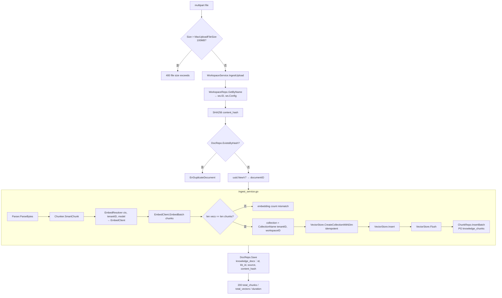
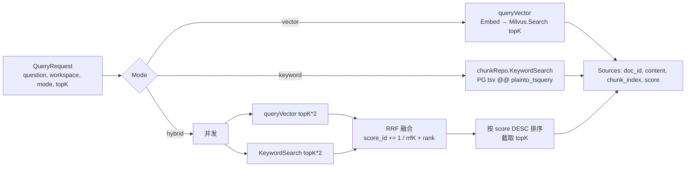

# 知识库（Knowledge Workspace）全流程与业务实现

> Bounded context: `knowledge`。负责 RAG workspace CRUD、文档摄取（parse → chunk → embed → 向量入库 → 关键词入库）与三种查询模式（vector / keyword / hybrid RRF）。

## 1. 分层职责

| 层 | 路径 | 说明 |
|----|------|------|
| Handler | `api/http/handler/rag_handler.go` | 绑定请求、鉴权解析 tenantID、编排响应；≤15 行/方法 |
| DTO | `api/http/dto/rag.go` | `CreateWorkspaceRequest` / `UpdateWorkspaceRequest` / `QueryRequest` / `UploadDocumentRequest` |
| Router | `api/http/router.go` (`registerKnowledge`) | `/knowledge/*` 分组，member 读 / admin 写 / `BodyLimit(MaxUploadBytes)` 挡入口 |
| Application | `internal/knowledge/application/` | `WorkspaceService` · `KnowledgeIngest` · `RAGService` |
| Domain | `internal/knowledge/domain/` | `Workspace` 聚合、`WorkspaceConfig` 值对象、Sentinel errors |
| Port | `internal/knowledge/domain/port/` | `WorkspaceRepo` · `DocRepo` · `ChunkRepo` · `DocumentParser` · `Embedder` |
| Infrastructure | `internal/knowledge/infrastructure/persistence/` | `WorkspaceRepo` · `DocRepo` · `ChunkRepo`；`pkg/storage/milvus.VectorStore` · `pkg/textchunk.Chunker` |
| Wiring | `api/wiring/knowledge.go` (`buildKnowledge`) | 装配依赖、注入 `EmbedResolver`、`DocRepo`、`VectorStore` |

**依赖方向**：`handler → application → domain/port`；`infrastructure` 实现 `port`；wiring 集中构造，禁止反向依赖。

---

## 2. HTTP API 契约

Base：`/knowledge`（挂在 JWT + tenant 中间件下，member 角色可读）

| Method | Path | Role | 说明 |
|--------|------|------|------|
| GET | `/knowledge/workspaces` | member | 列出当前 tenant 全部 workspace |
| GET | `/knowledge/workspaces/:name/stats` | member | 元数据 + Milvus 统计（`vector_count`, `collection`） |
| POST | `/knowledge/query` | member + active | RAG 查询：vector/keyword/hybrid |
| POST | `/knowledge/workspaces` | admin + active | 创建 workspace |
| PATCH | `/knowledge/workspaces/:name` | admin + active | 部分更新（rename / description / 可变 config） |
| DELETE | `/knowledge/workspaces/:name` | admin + active | 删除 workspace，级联清 Milvus + PG chunks + DB 记录 |
| POST | `/knowledge/ingest` | admin + active + `BodyLimit` | multipart 上传文档并摄取 |

请求/响应形状：见 `api/http/dto/rag.go`。响应错误体固定 `{"error":"..."}`（由 `middleware.ErrorHandler` 映射）。

---

## 3. 端到端时序图



关键不变量：**PG 与 Milvus 双写**——若 Milvus 建集失败，同步删 PG 行，保证租户 workspace 视图与向量集合最终一致。

---

## 4. 领域模型与业务规则

### 4.1 聚合与值对象（`internal/knowledge/domain/workspace.go`）

```go
type Workspace struct {
    ID, Name, Description string
    Config    WorkspaceConfig
    CreatedAt, UpdatedAt time.Time
}
type WorkspaceConfig struct {
    EmbeddingModel string // "text-embedding-v3" | "embedding-3"
    ChunkSize      int
    ChunkOverlap   int
    QueryMode      string // "vector" | "graph" | "hybrid"
    TopK           int
}
```

### 4.2 默认值 & 白名单

| 字段 | Default | Allowed |
|------|---------|---------|
| EmbeddingModel | `text-embedding-v3` | `{text-embedding-v3, embedding-3}` |
| QueryMode | `hybrid` | `{vector, graph, hybrid}` |
| ChunkSize | `512` | 任意正整数 |
| ChunkOverlap | `64` | 任意正整数 |
| TopK | `5` | 任意正整数 |

### 4.3 不变性规则（`MergeUpdate`）

| 字段 | 可变 | 违反时 |
|------|------|--------|
| EmbeddingModel | ❌ | `ErrEmbeddingModelImmutable` |
| ChunkSize | ❌ | `ErrChunkSizeImmutable` |
| ChunkOverlap | ❌ | `ErrChunkOverlapImmutable` |
| QueryMode | ✅（须在白名单） | `ErrInvalidQueryMode` |
| TopK | ✅ | — |

**为什么不可变**：`EmbeddingModel` 决定 Milvus collection 的向量维度（1024 / 2048 / 1536），修改后已入库向量与新查询向量维度不匹配 → 数据全废。`ChunkSize` / `ChunkOverlap` 决定语料切分策略，中途改动会导致新旧 chunk 边界不一致，检索命中率崩塌。

### 4.4 向量维度决议（`vectorDim`）

```go
func vectorDim(model string) int {
    switch model {
    case "text-embedding-v2", "text-embedding-v3", "text-embedding-v4":
        return 1024
    case "embedding-3":
        return 2048
    default:
        return 1536
    }
}
```

在 `CreateWorkspace` 与 `IngestDocument` 两处独立调用（后者兜底 idempotent `CreateCollectionWithDim`）。

---

## 5. 文档摄取流水线（`POST /knowledge/ingest`）

### 5.1 流程图



### 5.2 关键实现细节

- **去重键**：`SHA256(fileBytes)` 落到 `knowledge_docs.content_hash`；查表用 `(workspace_id, content_hash)` 组合索引（`idx_knowledge_docs_ws_hash`）。
- **DocumentID**：uuid v7（含时间序），Milvus chunk ID = `<documentID>_chunk_<i>`。
- **Collection 命名**：`kb_<sanitized(workspaceID)>`，`workspaceID` 是 uuid，故 `tenantID` 在函数签名中被忽略——workspaceID 全局唯一足以隔离。
- **PG chunks 落库容错**：`ChunkRepo.InsertBatch` 失败仅 `logger.Warn`，不阻断摄取——向量已成功入 Milvus，PG 关键词索引重建可后台补偿。这里对齐"暴露错误但不静默容错"：`result.Errors` 会带回错误详情给上游。
- **EmbedResolver**：`api/wiring/knowledge.go:buildKnowledgeEmbedResolver` 逐租户从 `public.tenants.settings.llm_api_keys` 解密 AES 密钥→构造 `llmgateway.Gateway`→缓存 `TenantGatewayCache`（TTL = `constants.GatewayCacheTTL`）。Workspace-level `EmbeddingModel` 会覆盖 tenant 默认。

### 5.3 Chunker 策略（`pkg/textchunk/chunker.go`）

`SmartChunk` = 优先 `ChunkByParagraphs`；若整段为单段落再退化到 `ChunkText`（按最大长度 + 句末标点回溯）；两者都失败退到 `ChunkBySemanticBreaks`（连续换行 / `====` / `----` 分隔）。中文句末：`。！？．`；西文句末：`.!?`（Latin 字符判断避免小数点误切）。

---

## 6. 查询流水线（`POST /knowledge/query`）

### 6.1 三种模式



### 6.2 RRF (Reciprocal Rank Fusion) 参数

```go
const rrfK = 60.0
rrfScores[r.ID] += 1.0 / (rrfK + float64(rank+1))
```

**为什么 rrfK=60**：这是 RRF 原论文（Cormack 2009）经验值；等价于把稀有信号（keyword 命中）与稠密信号（向量近邻）在 top-N 内做线性可加、rank 越低贡献越小的融合，避免任意一路 score 分布主导结果。

**为什么向量与关键词都取 `topK*2`**：给融合层留召回冗余；截断在融合后完成。

### 6.3 Handler 至 Service 的编排

`RAGHandler.Query` 先用 tenantID + workspace 名到 `WorkspaceService.GetWorkspace` 拿 `ws.ID` 和 `ws.Config.EmbeddingModel`，再喂给 `RAGService.Query`；`collectionName = CollectionName(tenantID, ws.ID)` 决定 Milvus 查哪个集合。

---

## 7. 数据模型

### 7.1 PostgreSQL（`tenant_<tenantID>` schema，见 `pkg/storage/postgres/tenant_schema.sql`）

```sql
CREATE TABLE rag_workspaces (
    id          UUID PRIMARY KEY DEFAULT gen_random_uuid(),
    name        TEXT NOT NULL UNIQUE,
    description TEXT,
    config      JSONB NOT NULL DEFAULT '{}',
    created_at  TIMESTAMPTZ NOT NULL DEFAULT NOW(),
    updated_at  TIMESTAMPTZ NOT NULL DEFAULT NOW()
);

CREATE TABLE knowledge_docs (
    id           UUID PRIMARY KEY DEFAULT gen_random_uuid(),
    workspace_id UUID REFERENCES rag_workspaces(id) ON DELETE CASCADE,
    title        TEXT NOT NULL,
    source       TEXT,
    metadata     JSONB NOT NULL DEFAULT '{}',
    content_hash TEXT,                      -- SHA256 去重
    created_at   TIMESTAMPTZ NOT NULL DEFAULT NOW()
);
CREATE INDEX idx_knowledge_docs_ws_hash ON knowledge_docs (workspace_id, content_hash);

CREATE TABLE knowledge_chunks (
    id             TEXT PRIMARY KEY,        -- <docID>_chunk_<i>
    workspace_name TEXT NOT NULL,
    doc_id         TEXT NOT NULL,
    chunk_index    BIGINT NOT NULL,
    content        TEXT NOT NULL,
    tsv            tsvector GENERATED ALWAYS AS (to_tsvector('simple', content)) STORED,
    created_at     TIMESTAMPTZ NOT NULL DEFAULT NOW()
);
CREATE INDEX idx_kc_tsv       ON knowledge_chunks USING GIN(tsv);
CREATE INDEX idx_kc_workspace ON knowledge_chunks(workspace_name);
```

**注意**：`knowledge_chunks.workspace_name` 用 name 而非 id（历史遗留，rename 时需注意级联维护）；`knowledge_docs.workspace_id` 用 ID + ON DELETE CASCADE。

### 7.2 Milvus Collection

- 命名：`kb_<sanitized(workspaceID)>`
- Fields：`id` (varchar, PK), `content` (varchar), `source_document` (varchar), `chunk_index` (int64), `vector` (float_vector, dim=`vectorDim(model)`)
- 生命周期：`CreateWorkspace` 时建集；`IngestDocument` idempotent 复建（无副作用）；`DeleteWorkspace` `DeleteCollection`。

### 7.3 config JSONB 形状

```json
{
  "embedding_model": "text-embedding-v3",
  "chunk_size": 512,
  "chunk_overlap": 64,
  "query_mode": "hybrid",
  "top_k": 5
}
```

编码：`json.Marshal → string(b)`（pgx v5 JSONB 编码规范，见项目根 CLAUDE.md）。

---

## 8. 多租户隔离

- **PG schema**：`tenant_<tenantID>`，SQL 全量 `INSERT INTO "%s".rag_workspaces` 拼接 schema 名。`WorkspaceRepo` 直接用 `r.db` 而非 `execTenant`，因为 name 全部经 `schemaFor(tenantID)` 硬拼——单条 statement 无跨表事务需求（对比 `memory` context 的 `execTenant` 保护 tenant-scoped 表访问）。
- **Milvus collection**：`CollectionName(_, workspaceID)` 用 uuid v7 保证全局唯一，`tenantID` 参数在 `constants.CollectionName` 中被忽略，靠 workspaceID 单独隔离。
- **Embedding 提供方**：`buildKnowledgeEmbedResolver` 用 tenant 加密后的 `llm_api_keys` 单独构造 gateway 并缓存；租户间 API key 严格隔离。

---

## 9. 错误处理与 Sentinel

| Sentinel | 场景 | HTTP 映射 |
|----------|------|-----------|
| `ErrInvalidEmbeddingModel` | 白名单外 model | 400 |
| `ErrInvalidQueryMode` | 白名单外 mode | 400 |
| `ErrEmbeddingModelImmutable` | 更新 embedding_model | 409 |
| `ErrChunkSizeImmutable` | 更新 chunk_size | 409 |
| `ErrChunkOverlapImmutable` | 更新 chunk_overlap | 409 |
| `ErrWorkspaceNotFound` | pgx.ErrNoRows | 404 |
| `ErrWorkspaceConflict` | 唯一键冲突 (23505) | 409 |
| `ErrWorkspaceLinked` | 外键锁 (23503) | 409 |
| `ErrDuplicateDocument` | 上传 hash 命中 | 409 |

分层翻译：`infrastructure` 翻译 pgx 错误码 → `domain.Err*` → `application` 透传 → `middleware.ErrorHandler` 映射 HTTP 码，响应体 `{"error":"..."}`。

---

## 10. 生命周期与回滚

### 10.1 Create 双写事务性

代码显式补偿：Milvus 建集失败 → `WorkspaceRepo.Delete`。**为什么不放 PG 事务**：跨系统（PG + Milvus）无 XA；用应用层补偿保证最终一致——出错立刻 rollback DB 行，用户重试即可；DB 行留在 Milvus 无集合的状态无价值（下次上传立即报错），必须清。

### 10.2 Delete 级联

`DeleteWorkspace`：先 `ingestSvc.DeleteWorkspaceData` (Milvus.DeleteCollection + chunkRepo.DeleteByWorkspace) → 再 `repo.Delete`。**顺序原因**：外部资源先清；DB 删除失败可重试，Milvus / PG chunks 已清不留孤儿；反之若先删 DB 再 Milvus 失败，下次没有 workspaceID 无法索引 collection 名（uuid 已丢），会产生永久孤儿集合。

---

## 11. 前端集成（`web/src/modules/knowledge/`）

- API：`api/knowledge.api.ts` — 全部走 `services/client.ts` 的 axios 实例。
- Zod schemas：`model/knowledge.ts` 定义 `workspaceSchema` / `queryResultSchema`，服务端响应经 `.parse()` 强校验。
- 表单：`components/WorkspaceConfigForm.tsx` — `chunk_size`、`chunk_overlap` 输入框 `disabled` + Tooltip "创建后不可修改"，与 domain 不变性规则对齐。
- 查询面板：`components/WorkspaceQueryPanel.tsx` + `WorkspaceQueryResult.tsx` — 展示 `answer` + `sources[{document_id, content, score}]`。

---

## 12. 相关常量索引

| 常量 | 位置 | 值 |
|------|------|------|
| `MaxUploadFileSize` | `pkg/constants/knowledge.go` | 100MB |
| `MaxUploadBytes` | `pkg/constants` | body limit 中间件用 |
| `CollectionPrefix` | `pkg/constants/knowledge.go` | `"kb"` |
| `GatewayCacheTTL` | `pkg/constants` | tenant gateway 缓存 |
| `DefaultChunkSize` / `DefaultChunkOverlap` / `DefaultTopK` | `internal/knowledge/domain/workspace.go` | 512 / 64 / 5 |
| `rrfK` | `internal/knowledge/application/rag_service.go` | 60.0（inline const，仅本函数内使用） |

---

## 13. 阅读起点建议

- 想改 API 契约 → `api/http/dto/rag.go` + `api/http/handler/rag_handler.go`
- 想改业务规则 / 不变性 → `internal/knowledge/domain/workspace.go`
- 想接新 embedding 提供方 → `AllowedEmbeddingModels` + `vectorDim` + `buildKnowledgeEmbedResolver`
- 想调查询召回 → `internal/knowledge/application/rag_service.go` (`Query` / `rrfK`)
- 想扩存储 schema → `pkg/storage/postgres/tenant_schema.sql`（tenant-only 表 DDL 必须放这里，不要写编号迁移）
