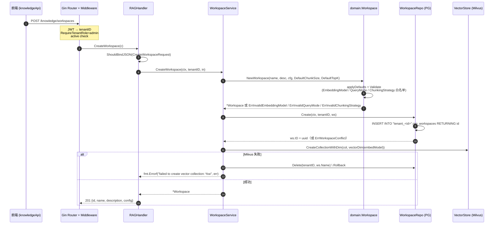
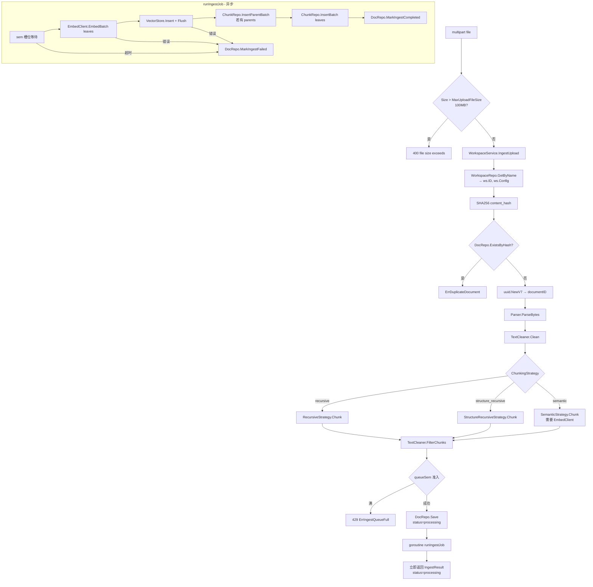
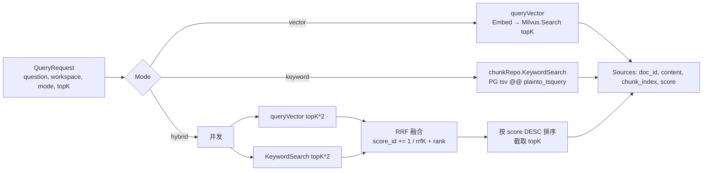

# 知识库（Knowledge Workspace）全流程与业务实现

> Bounded context: `knowledge`。负责 RAG workspace CRUD、文档摄取（parse → clean → chunk → embed → 向量入库 → 关键词入库）与三种查询模式（vector / keyword / hybrid RRF）。

## 1. 分层职责

| 层 | 路径 | 说明 |
|----|------|------|
| Handler | `api/http/handler/rag_handler.go` | 绑定请求、鉴权解析 tenantID、编排响应；≤15 行/方法 |
| DTO | `api/http/dto/rag.go` | `CreateWorkspaceRequest` / `UpdateWorkspaceRequest` / `QueryRequest` / `UploadDocumentRequest` |
| Router | `api/http/router.go` (`registerKnowledge`) | `/knowledge/*` 分组，member 读 / admin 写 / `BodyLimit(MaxUploadBytes)` 挡入口 |
| Application | `internal/knowledge/application/` | `WorkspaceService` · `KnowledgeIngest` · `RAGService` |
| Domain | `internal/knowledge/domain/` | `Workspace` 聚合、`WorkspaceConfig` 值对象、Sentinel errors |
| Port | `internal/knowledge/domain/port/` | `WorkspaceRepo` · `DocRepo` · `ChunkRepo` · `DocumentParser` · `Embedder` |
| Infrastructure | `internal/knowledge/infrastructure/persistence/` | `WorkspaceRepo` · `DocRepo` · `ChunkRepo`；`pkg/storage/milvus.VectorStore` · `pkg/textchunk` 策略包 |
| Wiring | `api/wiring/knowledge.go` (`buildKnowledge`) | 装配依赖、注入 `EmbedResolver`、`DocRepo`、`VectorStore` |

**依赖方向**：`handler → application → domain/port`；`infrastructure` 实现 `port`；wiring 集中构造，禁止反向依赖。

---

## 2. HTTP API 契约

Base：`/knowledge`（挂在 JWT + tenant 中间件下，member 角色可读）

| Method | Path | Role | 说明 |
|--------|------|------|------|
| GET | `/knowledge/workspaces` | member | 列出当前 tenant 全部 workspace |
| GET | `/knowledge/workspaces/:name/stats` | member | 元数据 + Milvus 统计（`vector_count`, `collection`） |
| GET | `/knowledge/workspaces/:name/documents` | member | 列出该 workspace 文档及摄取状态（前端轮询） |
| POST | `/knowledge/query` | member + active | RAG 查询：vector/keyword/hybrid |
| POST | `/knowledge/workspaces` | admin + active | 创建 workspace |
| PATCH | `/knowledge/workspaces/:name` | admin + active | 部分更新（rename / description / 可变 config） |
| DELETE | `/knowledge/workspaces/:name` | admin + active | 删除 workspace，级联清 Milvus + PG chunks + DB 记录 |
| POST | `/knowledge/ingest` | admin + active + `BodyLimit` | multipart 上传文档并异步摄取 |

请求/响应形状：见 `api/http/dto/rag.go`。响应错误体固定 `{"error":"..."}`（由 `middleware.ErrorHandler` 映射）。

---

## 3. 端到端时序图



关键不变量：**PG 与 Milvus 双写**——若 Milvus 建集失败，同步删 PG 行，保证租户 workspace 视图与向量集合最终一致。

---

## 7. 数据库 Schema（per-tenant `"tenant_<id>"` schema）

### 7.1 `rag_workspaces`

```sql
CREATE TABLE rag_workspaces (
    id          UUID PRIMARY KEY DEFAULT gen_random_uuid(),
    name        VARCHAR(255) NOT NULL UNIQUE,
    description TEXT NOT NULL DEFAULT '',
    config      JSONB NOT NULL DEFAULT '{}',
    created_at  TIMESTAMPTZ NOT NULL DEFAULT NOW(),
    updated_at  TIMESTAMPTZ NOT NULL DEFAULT NOW()
);
```

**注意**：`config` 列存储的 JSONB 结构为 `{embedding_model, chunk_size, chunk_overlap, query_mode, top_k}`。**`chunking_strategy` 目前未持久化到 JSONB**（`persistence.jsonbConfig` / `toJSONB` / `fromJSONB` 尚未包含该字段）——域层有该字段但读回时为空，回退到 `DefaultChunkingStrategy = "structure_recursive"`。

### 7.2 `knowledge_docs`

```sql
CREATE TABLE knowledge_docs (
    id                  VARCHAR(255) PRIMARY KEY,
    workspace_id        UUID NOT NULL REFERENCES rag_workspaces(id) ON DELETE CASCADE,
    title               TEXT NOT NULL DEFAULT '',
    content_hash        VARCHAR(64),
    ingest_status       VARCHAR(32) NOT NULL DEFAULT 'processing',
    ingest_error        TEXT NOT NULL DEFAULT '',
    processed_chunks    INT NOT NULL DEFAULT 0,
    total_chunks        INT NOT NULL DEFAULT 0,
    created_at          TIMESTAMPTZ NOT NULL DEFAULT NOW(),
    ingest_started_at   TIMESTAMPTZ,
    ingest_finished_at  TIMESTAMPTZ
);
CREATE UNIQUE INDEX ON knowledge_docs(workspace_id, content_hash);
```

`ingest_status` 三态：`processing` → `completed` | `failed`

### 7.3 `knowledge_chunks`

```sql
CREATE TABLE knowledge_chunks (
    id            VARCHAR(255) PRIMARY KEY,
    workspace_id  UUID NOT NULL,
    doc_id        VARCHAR(255) NOT NULL REFERENCES knowledge_docs(id) ON DELETE CASCADE,
    chunk_index   BIGINT NOT NULL,
    content       TEXT NOT NULL,
    parent_id     VARCHAR(255),      -- 指向 knowledge_parent_chunks.id（Parent-Child 策略才有值）
    tsv           TSVECTOR GENERATED ALWAYS AS (to_tsvector('simple', content)) STORED
);
CREATE INDEX ON knowledge_chunks USING GIN(tsv);
CREATE INDEX ON knowledge_chunks(workspace_id);
```

`parent_id` 格式：`<documentID>_parent_<i>`（`structure_recursive` 策略才填充）。

### 7.4 `knowledge_parent_chunks`（新增）

```sql
CREATE TABLE knowledge_parent_chunks (
    id            VARCHAR(255) PRIMARY KEY,
    workspace_id  UUID NOT NULL,
    doc_id        VARCHAR(255) NOT NULL,
    chunk_index   BIGINT NOT NULL,
    content       TEXT NOT NULL
);
CREATE INDEX ON knowledge_parent_chunks(workspace_id);
```

存储 `structure_recursive` 策略生成的父块（大上下文单元），仅用于 RAG 检索后的上下文扩展，不进 Milvus。

### 7.5 Milvus Collection Schema

Collection 名称：`CollectionName(tenantID, workspaceID)` → `knowledge_<tenantID>_<workspaceID>`

| 字段 | 类型 | 说明 |
|------|------|------|
| `id` | VarChar PK | `<documentID>_chunk_<i>` |
| `user_id` | VarChar | 预留过滤字段（知识库摄取时为空） |
| `agent_id` | VarChar | 预留过滤字段 |
| `scope` | VarChar | 预留 |
| `content` | VarChar | chunk 文本 |
| `source_document` | VarChar | documentID |
| `chunk_index` | Int64 | chunk 序号 |
| `vector` | FloatVector(dim) | 嵌入向量（dim 由 `vectorDim(embedModel)` 决定） |

索引：IVF_FLAT L2，nlist=128；标量字段 `user_id`/`agent_id`/`scope` 建 Trie 索引。

---

## 8. 文档摄取状态跟踪

### 8.1 DocRepo 接口（`port/doc_repo.go`）

```go
type DocRepo interface {
    Save(ctx, tenantID, kbID string, doc *Document) error
    List(ctx, tenantID, kbID string) ([]*Document, error)
    Delete(ctx, tenantID, kbID, docID string) error
    ExistsByHash(ctx, tenantID, workspaceID, hash string) (bool, error)
    CountByWorkspace(ctx, tenantID, workspaceID string) (int, error)
    MarkIngestStarted(ctx, tenantID, docID string, totalChunks int) error
    MarkIngestCompleted(ctx, tenantID, docID string, processedChunks int) error
    MarkIngestFailed(ctx, tenantID, docID, errMsg string) error
    RecoverStuckIngests(ctx, tenantID string, threshold time.Duration) (int, error)
}
```

### 8.2 状态机

```
Save(status='processing')
      ↓
   goroutine 启动
      ↓
    成功 → MarkIngestCompleted(processedChunks=N)
    失败 → MarkIngestFailed(errMsg)
    超时 → MarkIngestFailed("worker slot wait timed out")
```

`RecoverStuckIngests`：服务重启时调用，将超过阈值仍处于 `processing` 的文档置为 `failed`（errMsg = "ingest aborted by server restart"）。

### 8.3 前端轮询模式

```
POST /knowledge/ingest         → status=processing (立即)
GET  /workspaces/:name/documents → 每次返回最新 ingest_status
```

前端持续轮询 `GET /documents` 直到 `ingest_status != 'processing'`；`DocumentView` 暴露 `ProcessedChunks`、`TotalChunks` 可展示进度百分比。

---

## 9. 错误映射（`middleware/error_mapping.go`）

| Domain Sentinel | HTTP | 触发场景 |
|----------------|------|---------|
| `ErrWorkspaceConflict` | 409 | POST workspace name 已存在 |
| `ErrWorkspaceNotFound` | 404 | GET/PATCH/DELETE workspace 不存在 |
| `ErrInvalidEmbeddingModel` | 400 | 创建 workspace 时模型不在白名单 |
| `ErrInvalidQueryMode` | 400 | 创建/更新 workspace 时 query_mode 非法 |
| `ErrInvalidChunkingStrategy` | 400 | 创建 workspace 时策略不在白名单 |
| `ErrEmbeddingModelImmutable` | 422 | PATCH 尝试修改 embedding_model |
| `ErrChunkSizeImmutable` | 422 | PATCH 尝试修改 chunk_size |
| `ErrChunkOverlapImmutable` | 422 | PATCH 尝试修改 chunk_overlap |
| `ErrChunkingStrategyImmutable` | 422 | PATCH 尝试修改 chunking_strategy |
| `ErrDuplicateDocument` | 409 | 摄取内容 hash 与已入库文档冲突 |
| `ErrIngestQueueFull` | 429 | 准入队列满（queueSem 已满） |
| `ErrChunkLimitExceeded` | 400 | 单文档 chunk 数超 `MaxChunksPerDocument` |

---

## 10. 前端集成（`web/src/modules/knowledge/`）

### 10.1 数据模型（`model/knowledge.ts`）

```typescript
type WorkspaceConfig = {
  embedding_model: string;       // 创建时必填
  chunking_strategy: string;     // default: "structure_recursive"
  chunk_size?: number;           // 不传则后端 default 512
  chunk_overlap?: number;
  query_mode?: string;
  top_k?: number;
};

type KnowledgeDocument = {
  id: string;
  source: string;               // 原始文件名
  content_hash: string;
  ingest_status: string;        // 'processing' | 'completed' | 'failed'
  ingest_error: string;
  processed_chunks: number;
  total_chunks: number;
  created_at?: string | null;
  ingest_started_at?: string | null;
  ingest_finished_at?: string | null;
};
```

### 10.2 创建 Workspace（`components/WorkspaceCreateModal.tsx`）

- `description` 必填（产品规范）
- `name` 提交后只读（向量 collection 命名绑定）
- `chunking_strategy` 选择器三选一，默认 `structure_recursive`
- `embedding_model` 提交后灰显不可改

### 10.3 文档状态展示规则

| `ingest_status` | UI 呈现 |
|----------------|---------|
| `processing` | Spin + "处理中 X/N chunks" |
| `completed` | CheckCircle 绿色 + processedChunks |
| `failed` | ExclamationCircle 红色 + `ingest_error` tooltip |

---

## 11. 已知限制与注意事项

1. **`ChunkingStrategy` 未持久化**：`workspace_repo.go` 的 `jsonbConfig` 未包含 `chunking_strategy` 字段，导致 workspace 从 DB 读取后该字段始终为空，实际 chunking 时回退到 `DefaultChunkingStrategy = "structure_recursive"`。若需策略差异化，需补全 `toJSONB` / `fromJSONB`。

2. **`DeleteByWorkspace` 未删 parent_chunks**：`ChunkRepo.DeleteByWorkspace` 只删 `knowledge_chunks`，`knowledge_parent_chunks` 未清理。删除 workspace 时 parent 数据残留，会逐步积累。

3. **`chunking_strategy` 字段不在 `WorkspaceService.IngestUpload` 透传**：upload 请求的 `ChunkingStrategy` 字段来源于 `ws.Config.ChunkingStrategy`，但由于第1点，读回的 Config 该字段为空，最终固定用 `structure_recursive`。

4. **关键词搜索全局语言 `simple`**：`plainto_tsquery('simple', ...)` 不支持中文分词，中文文档关键词检索召回率低，需替换为 `zhparser` 或借助 pgvector 全向量检索。

---

## 4. 领域模型与业务规则

### 4.1 聚合与值对象（`internal/knowledge/domain/workspace.go`）

```go
type Workspace struct {
    ID, Name, Description string
    Config    WorkspaceConfig
    CreatedAt, UpdatedAt time.Time
}
type WorkspaceConfig struct {
    EmbeddingModel   string // "text-embedding-v3" | "embedding-3"
    ChunkingStrategy string // "recursive" | "structure_recursive" | "semantic"
    ChunkSize        int
    ChunkOverlap     int
    QueryMode        string // "vector" | "graph" | "hybrid"
    TopK             int
}
```

### 4.2 默认值 & 白名单

| 字段 | Default | Allowed |
|------|---------|---------|
| EmbeddingModel | `text-embedding-v3` | `{text-embedding-v3, embedding-3}` |
| ChunkingStrategy | `structure_recursive` | `{recursive, structure_recursive, semantic}` |
| QueryMode | `hybrid` | `{vector, graph, hybrid}` |
| ChunkSize | `512` | 任意正整数 |
| ChunkOverlap | `64` | 任意正整数 |
| TopK | `5` | 任意正整数 |

### 4.3 不变性规则（`MergeUpdate`）

| 字段 | 可变 | 违反时 |
|------|------|--------|
| EmbeddingModel | ❌ | `ErrEmbeddingModelImmutable` |
| ChunkSize | ❌ | `ErrChunkSizeImmutable` |
| ChunkOverlap | ❌ | `ErrChunkOverlapImmutable` |
| ChunkingStrategy | ❌ | `ErrChunkingStrategyImmutable` |
| QueryMode | ✅（须在白名单） | `ErrInvalidQueryMode` |
| TopK | ✅ | — |

**为什么 `ChunkingStrategy` 不可变**：不同策略生成的 chunk 边界与 parent-child 关系完全不同，混合摄取会导致关键词索引结构与向量索引结构不一致，检索时 parent 回溯断链。

**为什么 `EmbeddingModel` / `ChunkSize` / `ChunkOverlap` 不可变**：`EmbeddingModel` 决定 Milvus collection 维度（1024/2048/1536），改后已入库向量与新查询向量维度不匹配。`ChunkSize/ChunkOverlap` 改变后新旧 chunk 边界不一致，检索命中率崩塌。

### 4.4 向量维度决议（`vectorDim`，`workspace_service.go`）

```go
func vectorDim(model string) int {
    switch model {
    case "text-embedding-v2", "text-embedding-v3", "text-embedding-v4":
        return 1024
    case "embedding-3":
        return 2048
    default:
        return 1536
    }
}
```

---

## 5. 文档摄取流水线（`POST /knowledge/ingest`）

### 5.1 架构：同步接受 + 异步执行

`IngestDocument` 立即返回 `Status='processing'`，后台 goroutine 完成 embed → vector → PG 写入。前端通过 `GET /workspaces/:name/documents` 轮询终态。

两级并发控制：

- **queueSem**（有缓冲 channel）：入口准入，满则立即返回 `ErrIngestQueueFull`（HTTP 429）
- **sem**（有缓冲 channel）：worker 槽位，goroutine 在后台阻塞等待，超 `KnowledgeIngestTimeout` 标为失败

goroutine 通过 `context.WithoutCancel` 与请求 context 解耦，客户端断开不中断摄取。

### 5.2 流程图



### 5.3 关键实现细节

- **去重键**：`SHA256(fileBytes)` 落 `knowledge_docs.content_hash`；查表用 `(workspace_id, content_hash)` 组合索引。
- **DocumentID**：uuid v7（含时间序），Milvus chunk ID = `<documentID>_chunk_<i>`，parent ID = `<documentID>_parent_<i>`。
- **TextCleaner**（`pkg/textchunk/cleaner.go`）：`Clean` 规范化空白/控制字符，`FilterChunks` 剔除过短片段，在 chunking 前后各执行一次。
- **PG chunks 落库容错**：`InsertBatch` / `InsertParentBatch` 失败仅 `logger.Warn`，不回滚——向量已入 Milvus，PG 关键词索引可后台补偿。
- **EmbedResolver**：逐租户从 `public.tenants.settings.llm_api_keys` 解密密钥→构造 `llmgateway.Gateway`→缓存 `TenantGatewayCache`（TTL = `constants.GatewayCacheTTL`）。Workspace-level `EmbeddingModel` 覆盖 tenant 默认。

### 5.4 三种 Chunking Strategy（`pkg/textchunk/`）

所有策略实现 `Strategy` 接口：

```go
type Strategy interface {
    Name() string
    Chunk(ctx context.Context, text string, maxRunes, overlapRunes int, embedder Embedder) ChunkResult
}

type ChunkResult struct {
    Leaves  []TextChunk // 小检索单元：入 Milvus + PG knowledge_chunks
    Parents []TextChunk // 大上下文单元：仅入 PG knowledge_parent_chunks（Parent-Child策略才有）
}
```

| 策略 | 文件 | 机制 | Parents |
|------|------|------|---------|
| `recursive` | `recursive.go` | 递归按段落/句子切割，超长再细分，带 overlap | 无 |
| `structure_recursive`（**默认**） | `structure.go` | Markdown 标题层级 → 父块；段落/句子 → 叶块；叶块 `ParentID` 指向父 | 有 |
| `semantic` | `semantic.go` | 逐句嵌入，余弦相似度低于阈值则切分；语义相似句子聚合成块 | 无 |

**Semantic 特殊点**：需在 chunking 阶段传入 `EmbedClient`，`KnowledgeIngest` 在策略为 `semantic` 时提前 resolve；其余策略 `embedder = nil`。

**旧 `SmartChunk`**：`pkg/textchunk/chunker.go` 保留，但摄取主路径已切换到 `Strategy` 接口，不再直接调用。

---

## 6. 查询流水线（`POST /knowledge/query`）

### 6.1 三种模式



### 6.2 RRF 参数

```go
const rrfK = 60.0
rrfScores[r.ID] += 1.0 / (rrfK + float64(rank+1))
```

`rrfK=60`：RRF 原论文（Cormack 2009）经验值；向量与关键词各取 `topK*2` 留召回冗余，截断在融合后完成。

### 6.3 Handler → Service 编排

`RAGHandler.Query` 先 `WorkspaceService.GetWorkspace` 拿 `ws.ID + ws.Config.EmbeddingModel`，再喂给 `RAGService.Query`；`collectionName = CollectionName(tenantID, ws.ID)` 决定查哪个 Milvus 集合。
