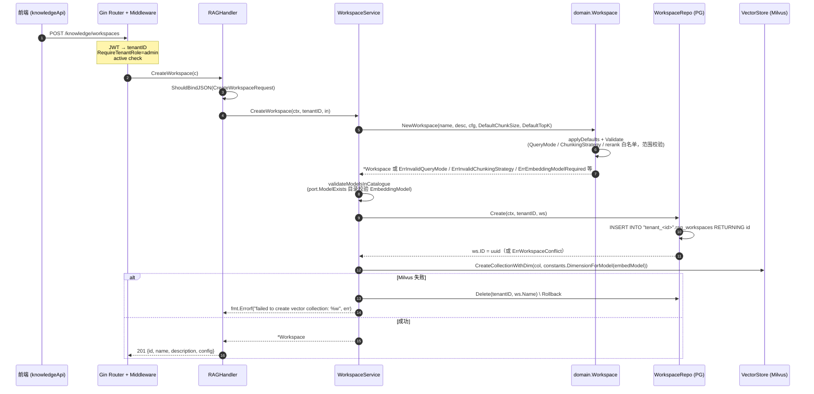
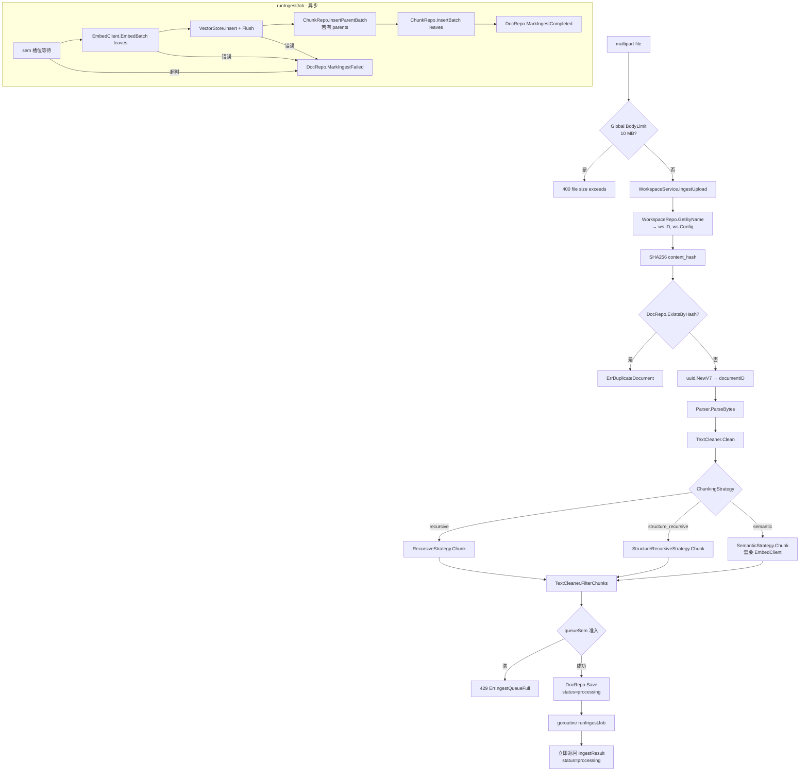
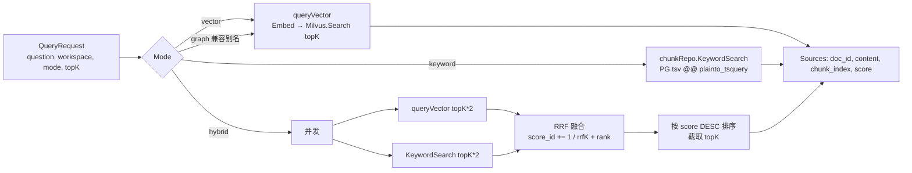

# 知识库（Knowledge Workspace）全流程与业务实现

> Bounded context: `knowledge`。负责 RAG workspace CRUD、文档摄取（parse → clean → chunk → embed → 向量入库 → 关键词入库）与三种查询模式（vector / keyword / hybrid RRF）。

## 1. 分层职责

| 层 | 路径 | 说明 |
|----|------|------|
| Handler | `api/http/handler/rag_handler.go` | 绑定请求、鉴权解析 tenantID、编排响应；≤15 行/方法 |
| DTO | `api/http/dto/gen/rag.go`（proto 生成，`proto/knowledge/rag.proto` 是参数契约唯一事实源） | `CreateWorkspaceRequest` / `UpdateWorkspaceRequest` / `QueryRequest` / `IngestDocumentRequest` / `DocumentAccessRequest` / `PreviewDocumentResponse` / `WorkspaceListItem`；multipart 上传 DTO 在 `api/http/dto/gen/rag_manual.go`（`UploadDocumentRequest`） |
| Router | `api/http/router.go` (`registerKnowledge`) | `/knowledge/*` 分组，member 读 / admin 写 / `BodyLimit(MaxUploadBytes)` 挡入口 |
| Application | `internal/knowledge/application/` | `WorkspaceService` · `KnowledgeIngest` · `RAGService` |
| Domain | `internal/knowledge/domain/` | `Workspace` 聚合、`WorkspaceConfig` 值对象、Sentinel errors |
| Port | `internal/knowledge/domain/port/` | `WorkspaceRepo` · `DocRepo` · `ChunkRepo` · `DocumentParser` · `Embedder` |
| Infrastructure | `internal/knowledge/infrastructure/persistence/` | `WorkspaceRepo` · `DocRepo` · `ChunkRepo`；`pkg/storage/milvus.VectorStore` · `pkg/textchunk` 策略包 |
| Wiring | `api/wiring/knowledge.go` (`buildKnowledge`) | 装配依赖、注入 `EmbedResolver`、`DocRepo`、`VectorStore` |

**依赖方向**：`handler → application → domain/port`；`infrastructure` 实现 `port`；wiring 集中构造，禁止反向依赖。

---

## 2. HTTP API 契约

Base：`/knowledge`（挂在 JWT + tenant 中间件下，member 角色可读）

| Method | Path | Role | 说明 |
|--------|------|------|------|
| GET | `/knowledge/workspaces` | member | 列出当前 tenant 全部 workspace |
| GET | `/knowledge/workspaces/:name/stats` | member | 元数据 + Milvus 统计（`vector_count`, `collection`） |
| GET | `/knowledge/workspaces/:name/documents` | member | 列出该 workspace 文档及摄取状态（前端轮询） |
| GET | `/knowledge/workspaces/:name/documents/:documentID/preview` | member + active | 按 chunk 重组预览文档内容（原始文本不落库） |
| POST | `/knowledge/query` | member + active | RAG 查询：vector/keyword/hybrid |
| POST | `/knowledge/workspaces` | admin + active | 创建 workspace |
| PATCH | `/knowledge/workspaces/:name` | member* + active | 部分更新（rename / description / 可变检索参数） |
| DELETE | `/knowledge/workspaces/:name` | admin + active | 删除 workspace，级联清 Milvus + PG chunks + DB 记录 |
| PUT | `/knowledge/workspaces/:name/editors` | admin + active | 设置 workspace 编辑器集合（`editors`） |
| DELETE | `/knowledge/workspaces/:name/documents/:documentID` | admin + active | 删除文档（级联清向量 + chunks） |
| PUT | `/knowledge/workspaces/:name/documents/:documentID/access` | admin + active | 整体替换文档级访问白名单（`allowed_user_ids` / `allowed_role_ids`） |
| POST | `/knowledge/workspaces/:name/documents/:documentID/request-access` | member + active | 申请文档查看权（operation-proposal grant 通道） |
| POST | `/knowledge/ingest` | member* + active + `BodyLimit` | multipart 上传文档并异步摄取（202 Accepted） |

请求/响应形状：见 `api/http/dto/gen/`（`rag.go` + `rag_manual.go`）。响应错误体固定 `{"error":"..."}`（由 `middleware.ErrorHandler` 映射）。

\* 带 `*` 的写操作路由只挂 `requireActive`（member 可进），真正判定在 service 所有权矩阵：owner/admin 天然放行；白名单「可编辑人」member 获得与 admin 一致的编辑能力——PATCH 可改 name/description/检索参数、POST ingest 可上传文档；其余 member 一律 403（fail-closed）。删除文档/workspace、白名单管理（editors/access）、版本回滚仍 admin 门禁。不可变字段（embedding_model / chunk_size / chunk_overlap / chunking_strategy）对所有人由 domain `applyImmutableSettings` 拒绝（返回 4xx），member 能改的 config 仅检索参数。

---

## 3. 端到端时序图


```mermaid
sequenceDiagram
    autonumber
    participant FE as 前端 (knowledgeApi)
    participant GW as Gin Router + Middleware
    participant H as RAGHandler
    participant WS as WorkspaceService
    participant DOM as domain.Workspace
    participant WR as WorkspaceRepo (PG)
    participant VS as VectorStore (Milvus)

    FE->>GW: POST /knowledge/workspaces
    Note over GW: JWT → tenantID<br/>RequireTenantRole=admin<br/>active check
    GW->>H: CreateWorkspace(c)
    H->>H: ShouldBindJSON(CreateWorkspaceRequest)
    H->>WS: CreateWorkspace(ctx, tenantID, in)
    WS->>DOM: NewWorkspace(name, desc, cfg, DefaultChunkSize, DefaultTopK)
    DOM->>DOM: applyDefaults + Validate<br/>(QueryMode / ChunkingStrategy / rerank 白名单，范围校验)
    DOM-->>WS: *Workspace 或 ErrInvalidQueryMode / ErrInvalidChunkingStrategy / ErrEmbeddingModelRequired 等
    WS->>WS: validateModelsInCatalogue<br/>(port.ModelExists 目录校验 EmbeddingModel)
    WS->>WR: Create(ctx, tenantID, ws)
    WR->>WR: INSERT INTO "tenant_<id>".rag_workspaces RETURNING id
    WR-->>WS: ws.ID = uuid（或 ErrWorkspaceConflict）
    WS->>VS: CreateCollectionWithDim(col, constants.DimensionForModel(embedModel))
    alt Milvus 失败
        WS->>WR: Delete(tenantID, ws.Name)  \  Rollback
        WS-->>H: fmt.Errorf("failed to create vector collection: %w", err)
    else 成功
        WS-->>H: *Workspace
        H-->>GW: 201 {id, name, description, config}
    end
```

关键不变量：**PG 与 Milvus 双写**——若 Milvus 建集失败，同步删 PG 行，保证租户 workspace 视图与向量集合最终一致。

---

## 4. 数据库 Schema（per-tenant `"tenant_<id>"` schema）

### 4.1 `rag_workspaces`

```sql
CREATE TABLE rag_workspaces (
    id          UUID PRIMARY KEY DEFAULT gen_random_uuid(),
    name        TEXT NOT NULL UNIQUE,
    description TEXT,
    config      JSONB NOT NULL DEFAULT '{}',
    created_by  TEXT NOT NULL DEFAULT '',
    created_at  TIMESTAMPTZ NOT NULL DEFAULT NOW(),
    updated_at  TIMESTAMPTZ NOT NULL DEFAULT NOW()
);
-- platform-managed workspace markers（存量租户幂等回填）
ALTER TABLE rag_workspaces ADD COLUMN IF NOT EXISTS system_key TEXT;
ALTER TABLE rag_workspaces ADD COLUMN IF NOT EXISTS management_mode TEXT NOT NULL DEFAULT 'tenant_managed';
ALTER TABLE rag_workspaces ADD COLUMN IF NOT EXISTS created_by TEXT NOT NULL DEFAULT '';
CREATE UNIQUE INDEX IF NOT EXISTS idx_rag_workspaces_system_key
    ON rag_workspaces(system_key) WHERE system_key IS NOT NULL;
```

`config` 列存储的 JSONB 结构为 `{embedding_model, chunk_size, chunk_overlap, query_mode, top_k, chunking_strategy, reranking, score_threshold, rerank_top_k, rerank_model, judge_model}`；`workspace_repo.go` 的 `toJSONB` / `fromJSONB` 必须保持双向一致。`system_key` 标记平台托管 workspace，`management_mode` 取值 `tenant_managed` / `platform_managed`，`created_by` 记录创建者 user id。

### 4.2 `knowledge_docs`

```sql
CREATE TABLE knowledge_docs (
    id           UUID PRIMARY KEY DEFAULT gen_random_uuid(),
    workspace_id UUID,
    title        TEXT NOT NULL,
    source       TEXT,
    metadata     JSONB NOT NULL DEFAULT '{}',
    created_at   TIMESTAMPTZ NOT NULL DEFAULT NOW()
);
-- 增量列（幂等回填，覆盖历史租户）
ALTER TABLE knowledge_docs ADD COLUMN IF NOT EXISTS content_hash TEXT;
ALTER TABLE knowledge_docs ADD COLUMN IF NOT EXISTS ingest_status TEXT NOT NULL DEFAULT 'completed'
    CHECK (ingest_status IN ('processing', 'completed', 'failed'));
ALTER TABLE knowledge_docs ADD COLUMN IF NOT EXISTS ingest_error TEXT NOT NULL DEFAULT '';
ALTER TABLE knowledge_docs ADD COLUMN IF NOT EXISTS processed_chunks INT NOT NULL DEFAULT 0;
ALTER TABLE knowledge_docs ADD COLUMN IF NOT EXISTS total_chunks INT NOT NULL DEFAULT 0;
ALTER TABLE knowledge_docs ADD COLUMN IF NOT EXISTS ingest_started_at TIMESTAMPTZ;
ALTER TABLE knowledge_docs ADD COLUMN IF NOT EXISTS ingest_finished_at TIMESTAMPTZ;
ALTER TABLE knowledge_docs ADD COLUMN IF NOT EXISTS allowed_user_ids TEXT[] NOT NULL DEFAULT '{}';
ALTER TABLE knowledge_docs ADD COLUMN IF NOT EXISTS allowed_role_ids TEXT[] NOT NULL DEFAULT '{}';
ALTER TABLE knowledge_docs ADD COLUMN IF NOT EXISTS created_by TEXT;
CREATE INDEX IF NOT EXISTS idx_knowledge_docs_ws_hash ON knowledge_docs (workspace_id, content_hash);
CREATE INDEX IF NOT EXISTS idx_knowledge_docs_ws_status ON knowledge_docs (workspace_id, ingest_status);
CREATE INDEX IF NOT EXISTS idx_knowledge_docs_allowed_users ON knowledge_docs USING GIN (allowed_user_ids);
CREATE INDEX IF NOT EXISTS idx_knowledge_docs_allowed_roles ON knowledge_docs USING GIN (allowed_role_ids);
```

`id` 为 UUID（`gen_random_uuid()`）；`source` 是原始文件名；`metadata` 为扩展 JSONB；`allowed_user_ids` / `allowed_role_ids` 构成文档级访问白名单（双空 = 无限制，继承 workspace 可见性，规则见 5.1 `VisibleDocIDs`）。`content_hash` 去重索引非 UNIQUE——重复检测在应用层 `ExistsByHash` 完成。`ingest_status` 三态：`processing` → `completed` | `failed`。

### 4.3 `knowledge_chunks`

```sql
CREATE TABLE IF NOT EXISTS knowledge_chunks (
    id             TEXT PRIMARY KEY,
    workspace_id   UUID NOT NULL REFERENCES rag_workspaces(id) ON DELETE CASCADE,
    doc_id         TEXT NOT NULL,
    chunk_index    BIGINT NOT NULL,
    content        TEXT NOT NULL,
    tsv            tsvector GENERATED ALWAYS AS (to_tsvector('public.chinese_zh', content)) STORED,
    created_at     TIMESTAMPTZ NOT NULL DEFAULT NOW()
);
CREATE INDEX IF NOT EXISTS idx_kc_tsv       ON knowledge_chunks USING GIN(tsv);
CREATE INDEX IF NOT EXISTS idx_kc_workspace ON knowledge_chunks(workspace_id);
-- 叶块关联父块（Parent-Child 策略才有值；NULL 走 SET NULL）
ALTER TABLE knowledge_chunks ADD COLUMN IF NOT EXISTS parent_id TEXT
    REFERENCES knowledge_parent_chunks(id) ON DELETE SET NULL;
```

`parent_id` 格式：`<documentID>_parent_<i>`（`structure_recursive` 策略才填充）。

### 4.4 `knowledge_parent_chunks`

```sql
CREATE TABLE IF NOT EXISTS knowledge_parent_chunks (
    id           TEXT PRIMARY KEY,
    workspace_id UUID NOT NULL REFERENCES rag_workspaces(id) ON DELETE CASCADE,
    doc_id       TEXT NOT NULL,
    chunk_index  BIGINT NOT NULL,
    content      TEXT NOT NULL,
    created_at   TIMESTAMPTZ NOT NULL DEFAULT NOW()
);
CREATE INDEX IF NOT EXISTS idx_kpc_workspace ON knowledge_parent_chunks(workspace_id);
CREATE INDEX IF NOT EXISTS idx_kpc_doc       ON knowledge_parent_chunks(workspace_id, doc_id);
```

存储 `structure_recursive` 策略生成的父块（大上下文单元），仅用于 RAG 检索后的上下文扩展，不进 Milvus。

### 4.5 `knowledge_chunks_quarantine`

```sql
CREATE TABLE IF NOT EXISTS knowledge_chunks_quarantine (
    id              TEXT PRIMARY KEY,
    workspace_name  TEXT,
    doc_id          TEXT NOT NULL,
    chunk_index     BIGINT NOT NULL,
    content         TEXT NOT NULL,
    reason          TEXT NOT NULL,
    quarantined_at  TIMESTAMPTZ NOT NULL DEFAULT NOW()
);
```

存量迁移无法映射到 workspace 的孤儿 chunk 会被移入隔离表（`reason='workspace_unmapped'`），保留审计痕迹而不阻断升级。

### 4.6 Milvus Collection Schema

Collection 名称：`CollectionName(tenantID, workspaceID, embedModel)` → `kb_<workspaceID>_<embedModel>`（embedModel 清洗后作后缀，切换模型即隔离向量数据）。存量无模型后缀集合用 `CollectionLegacyName(tenantID, workspaceID)` → `kb_<workspaceID>` 回退读取/清理。`workspaceID` 是全局唯一 UUID，因此当前实现忽略 `tenantID`；非法字符会替换为下划线。

| 字段 | 类型 | 说明 |
|------|------|------|
| `id` | VarChar PK | `<documentID>_chunk_<i>` |
| `user_id` | VarChar | 预留过滤字段（知识库摄取时为空） |
| `agent_id` | VarChar | 预留过滤字段 |
| `scope` | VarChar | 预留 |
| `content` | VarChar | chunk 文本 |
| `source_document` | VarChar | documentID |
| `chunk_index` | Int64 | chunk 序号 |
| `vector` | FloatVector(dim) | 嵌入向量（dim 由 `constants.DimensionForModel(embedModel)` 决定） |

索引：IVF_FLAT L2，nlist=128；标量字段 `user_id`/`agent_id`/`scope` 建 Trie 索引。

---

## 5. 文档摄取状态跟踪

### 5.1 DocRepo 接口（`port/doc_repo.go`）

```go
type DocRepo interface {
    Save(ctx, tenantID, kbID string, doc *Document) error
    List(ctx, tenantID, kbID string) ([]*Document, error)
    Delete(ctx, tenantID, kbID, docID string) error
    ExistsByHash(ctx, tenantID, workspaceID, hash string) (bool, error)
    CountByWorkspace(ctx, tenantID, workspaceID string) (int, error)
    MarkIngestStarted(ctx, tenantID, docID string, totalChunks int) error
    MarkIngestCompleted(ctx, tenantID, docID string, processedChunks int) error
    MarkIngestFailed(ctx, tenantID, docID, errMsg string) error
    RecoverStuckIngests(ctx, tenantID string, threshold time.Duration) (int, error)

    // 文档级访问控制
    // VisibleDocIDs: 匹配规则 viewerID ∈ allowed_user_ids OR role ∈ allowed_role_ids
    // OR viewerID = created_by；双白名单为空的行始终可见（继承 workspace 可见性）。
    VisibleDocIDs(ctx, tenantID, workspaceID, viewerID, role string) ([]string, error)
    // GetByID: workspace_id + id 双重约束防止跨 workspace 访问（doc_id 本身无 FK）。
    GetByID(ctx, tenantID, workspaceID, docID string) (*Document, error)
    // SetDocAccess: 整体替换文档级白名单（allowed_user_ids / allowed_role_ids）。
    SetDocAccess(ctx, tenantID, docID string, userIDs, roleIDs []string) error
}
```

### 5.2 状态机

```
Save(status='processing')
      ↓
   goroutine 启动
      ↓
    成功 → MarkIngestCompleted(processedChunks=N)
    失败 → MarkIngestFailed(errMsg)
    超时 → MarkIngestFailed("worker slot wait timed out")
```

`RecoverStuckIngests`：服务重启时调用，将超过阈值仍处于 `processing` 的文档置为 `failed`（errMsg = "ingest aborted by server restart"）。

### 5.3 前端轮询模式

```
POST /knowledge/ingest         → status=processing (立即)
GET  /workspaces/:name/documents → 每次返回最新 ingest_status
```

前端持续轮询 `GET /documents` 直到 `ingest_status != 'processing'`；`DocumentView` 暴露 `ProcessedChunks`、`TotalChunks` 可展示进度百分比。

---

## 6. 错误映射（`api/middleware/error_mapping.go`）

| Domain Sentinel | HTTP | 触发场景 |
|----------------|------|---------|
| `ErrWorkspaceConflict` | 409 | POST workspace name 已存在 |
| `ErrWorkspaceNotFound` | 404 | GET/PATCH/DELETE workspace 不存在 |
| `ErrInvalidEmbeddingModel` | 400 | 创建/更新 workspace 时模型不在全局模型目录（`port.ModelExists`，`CapEmbedding`） |
| `ErrInvalidQueryMode` | 400 | 创建/更新 workspace 时 query_mode 非法 |
| `ErrInvalidChunkingStrategy` | 400 | 创建 workspace 时策略不在白名单 |
| `ErrEmbeddingModelImmutable` | 400 | PATCH 尝试修改 embedding_model |
| `ErrChunkSizeImmutable` | 400 | PATCH 尝试修改 chunk_size |
| `ErrChunkOverlapImmutable` | 400 | PATCH 尝试修改 chunk_overlap |
| `ErrChunkingStrategyImmutable` | 500 | PATCH 尝试修改 chunking_strategy（未在映射表显式注册，走默认） |
| `ErrDuplicateDocument` | 409 | 摄取内容 hash 与已入库文档冲突 |
| `ErrIngestQueueFull` | 429 | 准入队列满（queueSem 已满） |
| `ErrChunkLimitExceeded` | 400 | 单文档 chunk 数超 `MaxChunksPerDocument` |

---

## 7. 前端集成（`web/src/modules/knowledge/`）

### 7.1 数据模型（`model/knowledge.ts`）

```typescript
type WorkspaceConfig = {
  embedding_model: string;       // 创建时必填
  chunking_strategy: string;     // default: "structure_recursive"
  chunk_size?: number;           // 不传则后端 default 512
  chunk_overlap?: number;
  query_mode?: string;
  top_k?: number;
};

type KnowledgeDocument = {
  id: string;
  source: string;               // 原始文件名
  content_hash: string;
  ingest_status: string;        // 'processing' | 'completed' | 'failed'
  ingest_error: string;
  processed_chunks: number;
  total_chunks: number;
  created_at?: string | null;
  ingest_started_at?: string | null;
  ingest_finished_at?: string | null;
};
```

### 7.2 创建 Workspace（`components/WorkspaceCreateModal.tsx`）

- `description` 必填（产品规范）
- `name` 提交后只读（向量 collection 命名绑定）
- `chunking_strategy` 选择器三选一，默认 `structure_recursive`
- `embedding_model` 提交后灰显不可改

### 7.3 文档状态展示规则

| `ingest_status` | UI 呈现 |
|----------------|---------|
| `processing` | Spin + "处理中 X/N chunks" |
| `completed` | CheckCircle 绿色 + processedChunks |
| `failed` | ExclamationCircle 红色 + `ingest_error` tooltip |

---

## 8. 已知限制与注意事项

1. **上传入口的有效上限是 10 MB**：全局 `BodyLimit(MaxRequestBodyBytes)`（10 MB）先于 knowledge 路由的 `BodyLimit(MaxUploadBytes)`（50 MB）执行，handler 内的 `MaxUploadFileSize`（100 MB）也无法放宽全局限制。调用方应按 10 MB 处理，除非同时调整三层限制。

2. **`graph` 仍是兼容别名**：领域白名单接受 `graph`，但 `RAGService.Query` 将它与 `vector` 走同一向量检索分支；当前没有独立图查询实现。

3. **异步摄取不是跨进程任务队列**：任务运行在进程内 goroutine 中；重启后启动流程会把超过 `KnowledgeIngestStuckThreshold` 的 `processing` 文档标记为 `failed`，不会自动续跑。

---

## 9. 领域模型与业务规则

### 9.1 聚合与值对象（`internal/knowledge/domain/workspace.go`）

```go
type Workspace struct {
    ID, Name, Description string
    Config    WorkspaceConfig
    CreatedAt, UpdatedAt time.Time
}
type WorkspaceConfig struct {
    EmbeddingModel   string  // 必填；存在性经全局模型目录校验（port.ModelExists, CapEmbedding），无静态默认
    ChunkingStrategy string  // "recursive" | "structure_recursive" | "semantic"
    ChunkSize        int
    ChunkOverlap     int
    QueryMode        string  // "vector" | "graph" | "hybrid"
    TopK             int
    Reranking        string  // ""（关闭） | "builtin-score-v1" | "provider:model"
    ScoreThreshold   float32 // 相似度过滤阈值，0 = 关闭
    RerankTopK       int     // 重排后最终条数，0 = 跟随 TopK
    RerankModel      string  // builtin-score-v1 的 LLM 语义重排模型（workspace 显式配置）
    JudgeModel       string  // 证据充分性 judge 模型；空 = judge 门关闭（fail-closed 放行）
}
```

### 9.2 默认值 & 白名单

| 字段 | Default | Allowed |
|------|---------|---------|
| EmbeddingModel | 无（必填，缺失报 `ErrEmbeddingModelRequired`） | 存在性经全局模型目录校验（`port.ModelExists`，`CapEmbedding`），非静态白名单 |
| ChunkingStrategy | `structure_recursive` | `{recursive, structure_recursive, semantic}` |
| QueryMode | `hybrid` | `{vector, graph, hybrid}` |
| ChunkSize | `512` | 任意正整数 |
| ChunkOverlap | `64` | 任意正整数 |
| TopK | `5` | `[1, 20]`（`constants.MaxRAGTopK`） |
| Reranking | `""`（关闭） | `""` / `builtin-score-v1` / `provider:model`（外部 provider 须在 rerank 目录存在） |
| ScoreThreshold | `0`（关闭过滤） | `[0, 1]` |
| RerankTopK | `0`（跟随 TopK） | `[0, 20]`（`constants.MaxRerankTopK`） |
| RerankModel | `""`（builtin 未装配） | `builtin-score-v1` 时必须显式配置 |
| JudgeModel | `""`（judge 门关闭） | chat 目录模型 |

### 9.3 不变性规则（`MergeUpdate`）

| 字段 | 可变 | 违反时 |
|------|------|--------|
| EmbeddingModel | ❌ | `ErrEmbeddingModelImmutable` |
| ChunkSize | ❌ | `ErrChunkSizeImmutable` |
| ChunkOverlap | ❌ | `ErrChunkOverlapImmutable` |
| ChunkingStrategy | ❌ | `ErrChunkingStrategyImmutable` |
| QueryMode | ✅（须在白名单） | `ErrInvalidQueryMode` |
| TopK | ✅ | `ErrInvalidTopK` |
| Reranking / RerankModel / JudgeModel | ✅ | `ErrInvalidRerankIdentity` / `ErrInvalidRerankModel` / `ErrInvalidJudgeModel` |
| ScoreThreshold | ✅ | `ErrInvalidScoreThreshold` |
| RerankTopK | ✅ | `ErrInvalidRerankTopK` |

**为什么 `ChunkingStrategy` 不可变**：不同策略生成的 chunk 边界与 parent-child 关系完全不同，混合摄取会导致关键词索引结构与向量索引结构不一致，检索时 parent 回溯断链。

**为什么 `EmbeddingModel` / `ChunkSize` / `ChunkOverlap` 不可变**：`EmbeddingModel` 决定 Milvus collection 维度（1024/2048/1536），改后已入库向量与新查询向量维度不匹配。`ChunkSize/ChunkOverlap` 改变后新旧 chunk 边界不一致，检索命中率崩塌。

### 9.4 向量维度决议（`constants.DimensionForModel`，`pkg/constants/embedding.go`）

```go
// 全系统嵌入维度单一事实源（跨包行为数字入 pkg/constants）
func DimensionForModel(name string) int {
    switch name {
    case "text-embedding-v1":
        return 1536 // DashScope v1
    case "text-embedding-v2", "text-embedding-v3", "text-embedding-v4":
        return 1024 // DashScope v2/v3/v4 default
    case "embedding-3":
        return 2048 // Zhipu
    default:
        return 1536 // OpenAI text-embedding-3-small / ada-002
    }
}
```

---

## 10. 文档摄取流水线（`POST /knowledge/ingest`）

### 10.1 架构：同步接受 + 异步执行

`IngestDocument` 立即返回 `Status='processing'`，后台 goroutine 完成 embed → vector → PG 写入。前端通过 `GET /workspaces/:name/documents` 轮询终态。

两级并发控制：

- **queueSem**（有缓冲 channel）：入口准入，满则立即返回 `ErrIngestQueueFull`（HTTP 429）
- **sem**（有缓冲 channel）：worker 槽位，goroutine 在后台阻塞等待，超 `KnowledgeIngestTimeout` 标为失败

goroutine 通过 `context.WithoutCancel` 与请求 context 解耦，客户端断开不中断摄取。

### 10.2 流程图


```mermaid
flowchart TD
    A[multipart file] --> B{Global BodyLimit<br/>10 MB?}
    B -->|是| E1[400 file size exceeds]
    B -->|否| C[WorkspaceService.IngestUpload]
    C --> D[WorkspaceRepo.GetByName<br/>→ ws.ID, ws.Config]
    D --> H[SHA256 content_hash]
    H --> DUP{DocRepo.ExistsByHash?}
    DUP -->|是| E2[ErrDuplicateDocument]
    DUP -->|否| ID[uuid.NewV7 → documentID]
    ID --> PARSE[Parser.ParseBytes]
    PARSE --> CLEAN[TextCleaner.Clean]
    CLEAN --> STRAT{ChunkingStrategy}
    STRAT -->|recursive| REC[RecursiveStrategy.Chunk]
    STRAT -->|structure_recursive| STR[StructureRecursiveStrategy.Chunk]
    STRAT -->|semantic| SEM[SemanticStrategy.Chunk<br/>需要 EmbedClient]
    REC --> FILTER[TextCleaner.FilterChunks]
    STR --> FILTER
    SEM --> FILTER
    FILTER --> Q{queueSem 准入}
    Q -->|满| E3[429 ErrIngestQueueFull]
    Q -->|成功| SAVE[DocRepo.Save<br/>status=processing]
    SAVE --> SPAWN[goroutine runIngestJob]
    SPAWN --> RESP[立即返回 IngestResult<br/>status=processing]

    subgraph ASYNC [runIngestJob - 异步]
        W[sem 槽位等待] --> EB[EmbedClient.EmbedBatch leaves]
        EB --> VI[VectorStore.Insert + Flush]
        VI --> PB[ChunkRepo.InsertParentBatch<br/>若有 parents]
        PB --> IB[ChunkRepo.InsertBatch leaves]
        IB --> DONE[DocRepo.MarkIngestCompleted]
        W -->|超时| FAIL[DocRepo.MarkIngestFailed]
        EB -->|错误| FAIL
        VI -->|错误| FAIL
    end
```

### 10.3 关键实现细节

- **去重键**：`SHA256(fileBytes)` 落 `knowledge_docs.content_hash`；查表用 `(workspace_id, content_hash)` 组合索引。
- **DocumentID**：uuid v7（含时间序），Milvus chunk ID = `<documentID>_chunk_<i>`，parent ID = `<documentID>_parent_<i>`。
- **TextCleaner**（`pkg/textchunk/cleaner.go`）：`Clean` 规范化空白/控制字符，`FilterChunks` 剔除过短片段，在 chunking 前后各执行一次。
- **PG chunks 落库容错**：`InsertBatch` / `InsertParentBatch` 失败仅 `logger.Warn`，不回滚——向量已入 Milvus，PG 关键词索引可后台补偿。
- **EmbedResolver**：逐租户按 workspace 显式配置的 `EmbeddingModel` 经 `ModelRegistry` 精确解析（无 fallback：空模型或不在 managed 目录即 fail-closed 返回 nil，绝不默认替换）。

### 10.4 三种 Chunking Strategy（`pkg/textchunk/`）

所有策略实现 `Strategy` 接口：

```go
type Strategy interface {
    Name() string
    Chunk(ctx context.Context, text string, maxRunes, overlapRunes int, embedder Embedder) ChunkResult
}

type ChunkResult struct {
    Leaves  []TextChunk // 小检索单元：入 Milvus + PG knowledge_chunks
    Parents []TextChunk // 大上下文单元：仅入 PG knowledge_parent_chunks（Parent-Child策略才有）
}
```

| 策略 | 文件 | 机制 | Parents |
|------|------|------|---------|
| `recursive` | `recursive.go` | 递归按段落/句子切割，超长再细分，带 overlap | 无 |
| `structure_recursive`（**默认**） | `structure.go` | Markdown 标题层级 → 父块；段落/句子 → 叶块；叶块 `ParentID` 指向父 | 有 |
| `semantic` | `semantic.go` | 逐句嵌入，余弦相似度低于阈值则切分；语义相似句子聚合成块 | 无 |

**Semantic 特殊点**：需在 chunking 阶段传入 `EmbedClient`，`KnowledgeIngest` 在策略为 `semantic` 时提前 resolve；其余策略 `embedder = nil`。

**旧 `SmartChunk`**：`pkg/textchunk/chunker.go` 保留，但摄取主路径已切换到 `Strategy` 接口，不再直接调用。

---

## 11. 查询流水线（`POST /knowledge/query`）

### 11.1 查询模式


```mermaid
flowchart LR
    Q[QueryRequest<br/>question, workspace, mode, topK] --> R{Mode}
    R -->|vector| V[queryVector<br/>Embed → Milvus.Search topK]
    R -->|graph 兼容别名| V
    R -->|keyword| K[chunkRepo.KeywordSearch<br/>PG tsv @@ plainto_tsquery]
    R -->|hybrid| H1[并发]
    H1 --> V2[queryVector topK*2]
    H1 --> K2[KeywordSearch topK*2]
    V2 --> RRF[RRF 融合<br/>score_id += 1 / rrfK + rank]
    K2 --> RRF
    RRF --> SORT[按 score DESC 排序<br/>截取 topK]
    V --> RESP[Sources: doc_id, content, chunk_index, score]
    K --> RESP
    SORT --> RESP
```

### 11.2 RRF 参数

```go
const rrfK = 60.0
rrfScores[r.ID] += 1.0 / (rrfK + float64(rank+1))
```

`rrfK=60`：RRF 原论文（Cormack 2009）经验值；向量与关键词各取 `topK*2` 留召回冗余，截断在融合后完成。

### 11.3 Handler → Service 编排

`RAGHandler.Query` 先 `WorkspaceService.GetWorkspace` 拿 `ws.ID + ws.Config.EmbeddingModel`，再喂给 `RAGService.Query`；`collectionName = CollectionName(tenantID, ws.ID, ws.Config.EmbeddingModel)` 决定查哪个 Milvus 集合（存量无后缀集合经 `CollectionLegacyName` 回退）。
