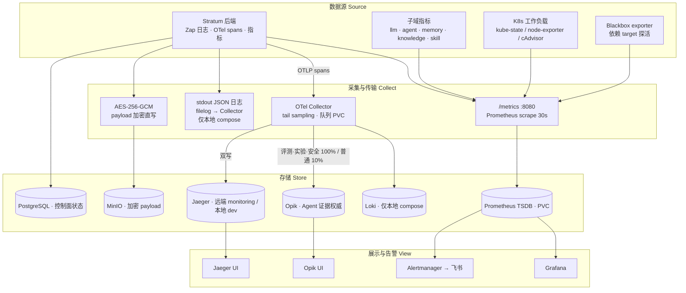
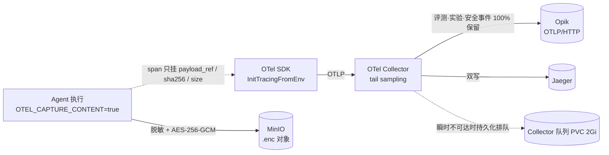

# Observability Development Rules

## Overview

可观测能力由「三支柱 + 一条 Agent 证据专线」构成：Zap 日志、Prometheus 指标、OTel 追踪，外加 Opik 作为 Agent 执行的权威证据源。payload 与标准 span 分离存储，敏感内容不进入追踪后端。



### Trace 数据流向

span 与 payload 是两条独立的落盘路径：span 走 Collector 采样后进入追踪后端，payload 在 Agent 侧加密直写 MinIO，span 只携带引用属性。



Trace 存储落点：

- **标准 span** → Collector tail sampling 后双写 **Opik**(`opik-backend.opik:8080/v1/private/otel`)与 **Jaeger**。Opik 是外部部署(自管 MongoDB + ClickHouse)，repo 只做 ingest；本地 compose 额外 `logging` exporter。tail sampling 在 pipeline 的 processors 阶段统一生效，两个 exporter 拿到同一批采样后的 span——传统分布式追踪(Jaeger 查调用链)保留，但普通流量仅 10%，评测/实验/安全/错误/慢查询 100%。
- **payload** → 不进 span 不进 PostgreSQL。启用 `OTEL_CAPTURE_CONTENT=true` 后先递归脱敏(`SanitizedTracePayload`)，再用平台 AES key 加密写入独立 MinIO bucket，对象路径 `object://<bucket>/<tenantID>/<traceID>/<uuid>-<kind>.enc`。span 只带 `opik.metadata.stratum.payload_ref / payload_sha256 / payload_size_bytes / payload_storage_status`。
- **Collector 队列** → `file_storage/queue` 持久化到 PVC(`opik-otel-collector-queue`, 2Gi)，下游瞬时不可达时本地排队重试，不丢 trace。
- **无 Collector 兜底** → `OTEL_EXPORTER_OTLP_ENDPOINT` 为空时 `InitOTelProvider` 不启动，回退 `logTracer`：trace/span ID 仅作为 `trace_id`/`span_id` 字段出现在 Zap 日志，不落追踪存储。

## Tracing (OpenTelemetry)

### Initialization

`cmd/server/main.go` 调用 `internal/platform/runtime.InitTracingFromEnv`。
仅当 `OTEL_EXPORTER_OTLP_ENDPOINT` 非空时初始化 OTLP TracerProvider；
`OTEL_SERVICE_NAME` 可覆盖默认 service name。初始化失败只记录 Warn，并关闭 tracing。

```go
shutdown := platformruntime.InitTracingFromEnv(logger)
if shutdown != nil {
    defer shutdown(ctx)
}
```

### Creating Spans

```go
tracer := observability.NewTracer(logger)
ctx, span := tracer.StartSpan(ctx, "agent.execute")
defer span.End()

span.SetAttributes(attribute.String("agent_id", id))
span.RecordError(err)
span.SetStatus(codes.Error, err.Error())
```

### Rules

- 每个 Handler 方法通过 `middleware/trace.go` (`TraceMiddleware`) 自动获得 Span
- internal 层关键操作手动创建子 Span
- Span 命名格式：`{component}.{operation}`，例如 `agent.execute`、`memory.search`。Skill 当前不直接执行，不应使用 `skill.execute` 暗示存在独立执行路径。

### Agent Evidence Backend

Agent 执行观测以 Opik 为权威证据源：

```text
Agent OTel spans -> OTel Collector tail sampling -> Opik OTLP/HTTP
Agent payloads   -> AES-256-GCM -> dedicated MinIO bucket
```

- Collector 到 Opik 必须使用 OTLP/HTTP；Opik 当前不接收 OTLP/gRPC。
- Stratum 查询字段同时写标准属性和 `opik.metadata.stratum.*`，后者用于 Opik REST 过滤。
- `agent_executions`、`agent_tool_traces`、`agent_trace_events` 已从 canonical tenant DDL 永久移除；tenant
  provisioning 会幂等删除历史表。`pkg/migration/sql/004_*`、`005_*` 仅作为不可变 public migration 历史保留。
- `GET /agents/executions`、`tool-traces`、`trace-events` 均通过 `TraceEvidenceProvider` 查询 Opik。
- Opik 不可用不阻断 Agent 执行，但证据查询和依赖证据校验的 feedback 返回 `503`。
- 评测、实验、失败和运行时已知的安全事件 Trace 由 Collector 100% 保留；普通 Trace 按配置采样。

大型或敏感 Payload 不进入 Span 或 PostgreSQL。启用 `TRACE_PAYLOAD_ENABLED=true` 与
`OTEL_CAPTURE_CONTENT=true` 后，Payload 先递归脱敏，再使用平台 AES key 加密并写入独立 MinIO bucket；
Span 只保存 `payload_ref`、SHA-256、明文大小和存储状态。MinIO 写入失败不阻断 Agent 执行。

PostgreSQL 继续保存 feedback、experiment、deployment、optimization、job、checkpoint 和 approval 等需要事务
一致性的控制面状态。

## Metrics (Prometheus)

### 内置指标

**HTTP**（`api/middleware/metrics.go` + `prometheus.go`）

```
http_requests_total{method, path, status}
http_request_duration_seconds{method, path}
http_requests_in_flight
```

**Skill**（collector 已注册，当前生产路径尚未接入记录调用）

```
skill_executions_total{skill_id, skill_type, status}
skill_execution_duration_seconds{skill_id}
skill_circuit_breaker_state{skill_id}           // 0=closed 1=open 2=half_open
```

**Agent**（`pkg/observability/prometheus.go`）

```
agent_executions_total{agent_id, agent_type, status}
agent_execution_duration_seconds{agent_id, agent_type}
agent_step_count{agent_id, agent_type}
```

**LLM**（`internal/llmgateway/`）

```
llm_requests_total{model, provider, status}
llm_request_duration_seconds{model, provider}
llm_token_usage_total{model, type}              // type: prompt|completion
llm_token_count{model, type}
llm_first_token_latency_seconds{model, provider}
```

**Knowledge**（`internal/knowledge/`）

```
knowledge_queries_total{query_type, status}
knowledge_query_duration_seconds{query_type}
knowledge_ingest_total{status}
knowledge_ingest_duration_seconds
knowledge_ingest_in_flight
```

**Memory Pipeline**（`internal/memory/infrastructure/pipeline/metrics.go`）

```
memory_outbox_pending                           // Gauge: 待处理 outbox 条数
memory_outbox_published_total{tenant_id, status}// Counter
memory_embed_duration_seconds                   // Histogram
memory_embed_total{tenant_id, status}           // Counter
memory_enrich_duration_seconds                  // Histogram
memory_enrich_total{tenant_id, status}          // Counter
memory_summary_triggered_total                  // Counter: 触发摘要次数
memory_dlq_total{tenant_id, stage}              // Counter: 进入 DLQ 次数
memory_entities_extracted_total                 // Counter: 实体抽取总数
```

### Circuit Breaker 状态说明

`skill_circuit_breaker_state` 取值：

- `0` = Closed（正常放行）
- `1` = Open（熔断，全部拒绝）
- `2` = HalfOpen（探测恢复中，只放一个请求）

### Adding New Metrics

在 `pkg/observability/prometheus.go` 中添加，遵循命名约定：

- Counter：`{domain}_{action}_total`
- Histogram：`{domain}_{action}_seconds`
- Gauge：`{domain}_{state}`

同时在 `observability.MetricsProvider` 接口中添加对应方法，并在 `PrometheusMetrics` 和 `NoopMetrics` 中实现。

Memory pipeline 专属指标在 `pipeline/metrics.go` 中单独注册（`RegisterMetrics`），不经过 `MetricsProvider` 接口。

## Logging (Zap)

### 初始化

```go
// pkg/observability/logger.go
logger := observability.NewLogger(env) // production → JSON, 其他 → console+color
```

固定字段 `app` / `env` / `host` 在初始化时注入。

### 字段分层

| 层 | 字段 | 注入位置 |
|----|------|---------|
| 链路 | `request_id` `trace_id` `tenant_id` `user_id` | TraceMiddleware per-request |
| LLM | `model` `provider` `prompt_tokens` `completion_tokens` `latency_ms` | `llm.complete` 事件 |
| ReAct | `trace_id` `tenant_id` `model` `step` `tokens` `tool_name` `latency_ms` | `react.llm` / `react.tool` 事件 |
| 访问 | `method` `path` `status` `latency_ms` `client_ip` `ua` | TraceMiddleware after |
| Memory | `tenant_id` `status` `duration` | pipeline workers |

### Usage Standards

```go
logger.Info("operation completed",
    zap.String("agent_id", id),
    zap.Duration("elapsed", d),
    zap.String("request_id", reqID),
)
logger.Error("operation failed",
    zap.Error(err),
    zap.String("skill_id", skillID),
)
```

### 级别规则

| 级别 | 场景 |
|------|------|
| DEBUG | 开发调试，production 不输出 |
| INFO | 正常业务路径（HTTP < 400，LLM 成功，ReAct step，Pipeline 处理成功） |
| WARN | 可预期异常（HTTP 4xx，重试中，连接失败但不阻断启动） |
| ERROR | 需处理异常（HTTP 5xx，外部调用失败，DLQ 溢出）；自动附加 stacktrace |

**安全红线**：禁止记录 `password / token / api_key / PII`；禁止打印原始 HTTP response body

**禁止** 使用 `fmt.Sprintf` 构造日志消息，使用结构化字段。

## Local Access

| 服务 | 地址 | 说明 |
|------|------|------|
| Prometheus | <http://localhost:9090> | 指标查询 |
| Grafana | <http://localhost:3000> | 仪表板（admin/admin）|
| Jaeger UI | <http://localhost:16686> | 链路追踪 |
| Metrics 端点 | <http://localhost:8080/metrics> | Prometheus scrape |

Grafana 数据源：`grafana/datasources/prometheus.yaml`，仪表板：`grafana/dashboards/`。

## 远端服务治理监控

远端测试环境的唯一配置权威是 `monitoring/remote/`，通过 `scripts/deploy-remote-monitoring.sh` 管理既有
`monitoring/kps`。chart/release 固定版本在 `monitoring/remote/versions.env`；自定义规则、Alertmanager 路由、
Blackbox、飞书适配器和 Grafana dashboard 均从该目录部署。仓库根目录 `grafana/` 仅用于本地 compose，
不得作为远端 dashboard 来源。

当前告警范围只覆盖传统服务治理：可用性、HTTP RED、Kubernetes 工作负载、容量、已验证依赖 target 和监控
系统自身；不覆盖 LLM、Agent、Token 或业务指标。`critical` 全天通知，`warning` 仅工作日 09:00–19:00
（Asia/Shanghai），`info`/Watchdog 不投递。操作入口是 `docs/operations/remote-monitoring-runbook.md`，每条
custom alert 的 `runbook_url` 必须指向 `docs/operations/alerts/` 中与 alert heading 一致的锚点，并由
`scripts/quality/monitoring-config-test.sh` 守卫。

远端部署不得删除 Prometheus/Grafana PVC、monitoring CRD 或 Helm history；禁止使用旧的 standalone
Prometheus 清单建立第二套远端 authority。
