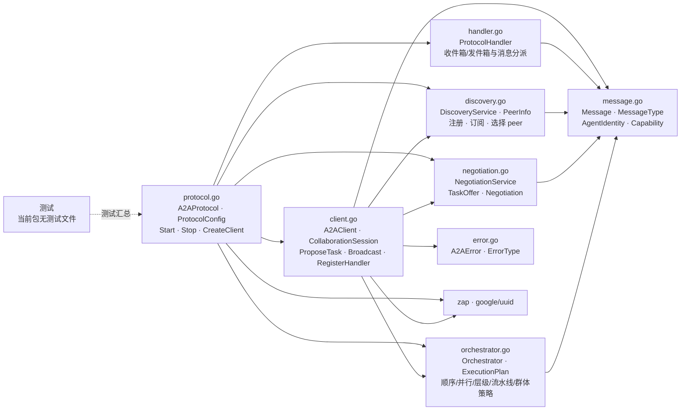

# internal/agent/application/a2a

该包提供内存态的 Agent-to-Agent 协作协议，包括消息传输、能力发现、任务协商、协作会话和多种执行计划编排策略。

完整导入路径：`github.com/byteBuilderX/stratum/internal/agent/application/a2a`

## 说明

`A2AProtocol` 管理客户端、发现、协商、编排和协议处理器的生命周期。`A2AClient` 是主要操作入口，构造 `Message` 并调用各服务；`ProtocolHandler` 负责异步收发和按消息类型分派。该包没有项目内直接依赖，状态保存在进程内并用锁保护。
