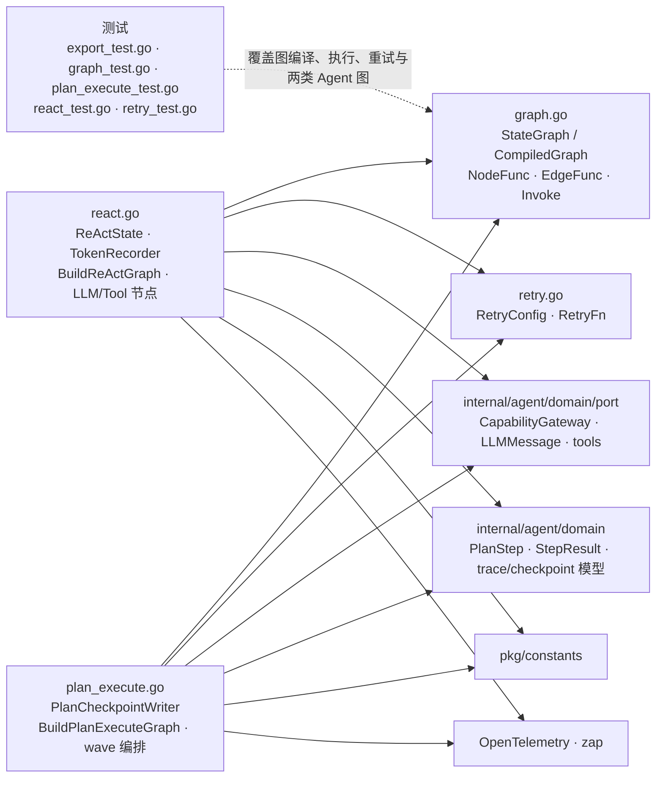

# internal/agent/application/graph

该包实现通用状态图运行器，以及 Agent 的 ReAct 和 Plan-Execute 两套确定性执行图、节点重试与 checkpoint 写入逻辑。

完整导入路径：`github.com/byteBuilderX/stratum/internal/agent/application/graph`

## 说明

`StateGraph` 保存命名节点、普通边和条件边，`Compile` 后由 `CompiledGraph.Invoke` 驱动状态前进。ReAct 图在 LLM 与工具节点间循环；Plan-Execute 图生成计划、按依赖波次执行步骤、反思并综合结果，同时可通过 `PlanCheckpointWriter` 落 checkpoint。
