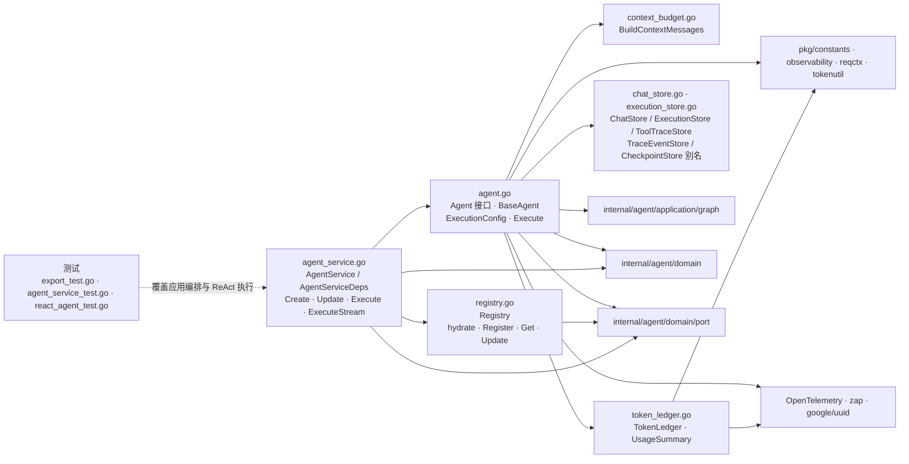

# internal/agent/application

该包编排 Agent 的注册、配置 CRUD、同步/流式执行、上下文预算、会话与执行追踪持久化，并把领域端口、执行图和可观测能力组合为应用用例。

完整导入路径：`github.com/byteBuilderX/stratum/internal/agent/application`

## 说明

`AgentService` 是面向调用方的用例门面，`Registry` 从 `AgentRepo` 装载并水合 `BaseAgent`。`BaseAgent.Execute` 组装 graph 包的 ReAct/Plan-Execute 图，并通过 capability、memory、chat、trace 等消费者侧端口访问外部能力；上下文裁剪与 token 记账分别由独立文件承担。
