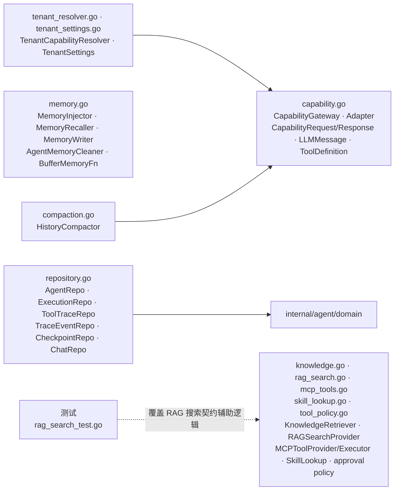

# internal/agent/domain/port

该包声明 Agent 上下文的消费者侧出向契约，覆盖能力路由、LLM/技能/工具、历史压缩、知识与 RAG、记忆、租户解析和各类仓储。

完整导入路径：`github.com/byteBuilderX/stratum/internal/agent/domain/port`

## 说明

这些小接口由 application 消费、由 infrastructure 或 wiring adapter 实现。`capability.go` 统一 LLM capability 请求；`compaction.go` 定义可降级的历史摘要契约；`tool_policy.go` 定义 MCP 风险与 approval 边界；`repository.go` 隔离持久化；其余文件按外部能力拆分，避免 Agent 应用层直接依赖兄弟上下文实现。
