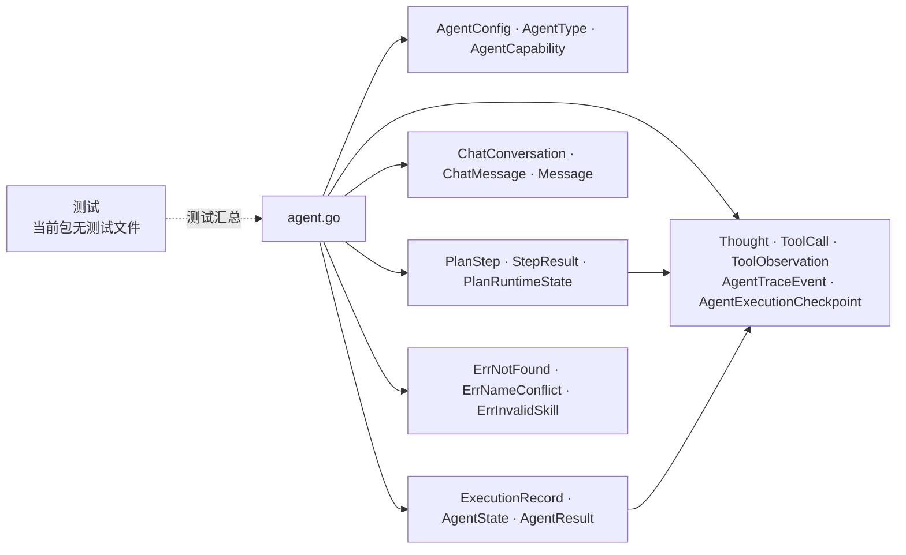

# internal/agent/domain

该包定义 Agent bounded context 的核心领域模型、执行状态、计划步骤、工具观察、追踪事件、checkpoint 与领域错误。

完整导入路径：`github.com/byteBuilderX/stratum/internal/agent/domain`

## 说明

全部非测试源码位于 `agent.go`，仅依赖标准库。模型覆盖配置、聊天、执行、规划和可观测追踪数据，是 application 与 persistence 共享的稳定领域语言；包内没有基础设施调用。
