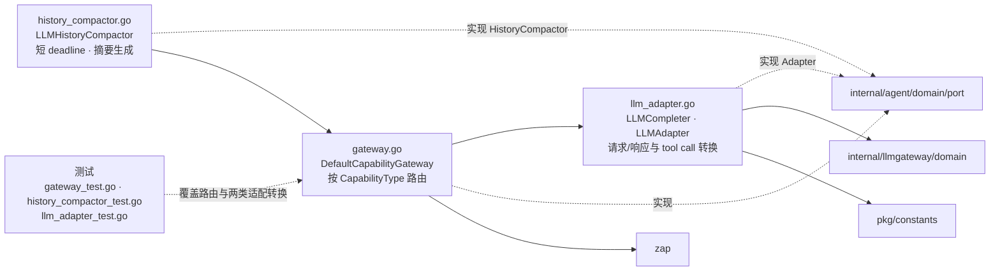

# internal/agent/infrastructure/capability

该包实现 Agent capability 端口的 LLM 路由网关、LLM adapter 与可选历史摘要器。

完整导入路径：`github.com/byteBuilderX/stratum/internal/agent/infrastructure/capability`

## 说明

`DefaultCapabilityGateway.Route` 校验 capability 请求并委托注入的 LLM adapter。`LLMAdapter` 把 Agent 端口模型转换为 llmgateway 领域请求并还原响应；`LLMHistoryCompactor` 可借助同一 gateway 生成摘要，并把摘要调用限制在独立的短 deadline 内。当前 wiring 未注入 compactor，因此生产循环会降级为省略标记。
