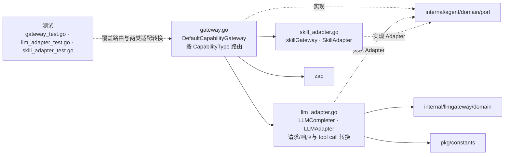

# internal/agent/infrastructure/capability

该包实现 Agent capability 端口的路由网关，并分别适配 LLM gateway 与技能执行网关。

完整导入路径：`github.com/byteBuilderX/stratum/internal/agent/infrastructure/capability`

## 说明

`DefaultCapabilityGateway.Route` 根据明确的 capability 类型选择注入的 adapter。`LLMAdapter` 把 Agent 端口模型转换为 llmgateway 领域请求并还原响应；`SkillAdapter` 把技能请求委托给其最小 `skillGateway` 接口。
