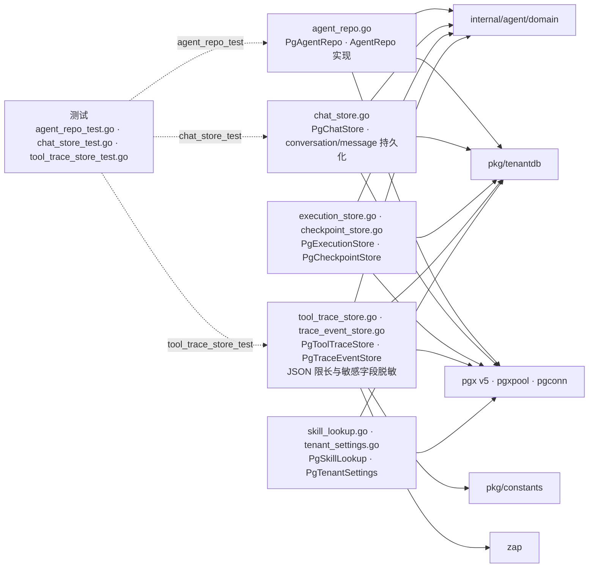

# internal/agent/infrastructure/persistence

该包提供 Agent 配置、聊天、执行、checkpoint、工具追踪、追踪事件、技能查找和租户设置的 PostgreSQL 实现，并统一租户 schema 执行与敏感数据脱敏。

完整导入路径：`github.com/byteBuilderX/stratum/internal/agent/infrastructure/persistence`

## 说明

各 `Pg*` 类型的方法集与 agent domain/port 中的仓储契约对应；构造函数接收连接池或窄化 pool 接口。所有租户数据访问经 `tenantdb`/`execTenant` 切换 schema。工具追踪写入前进行 JSON 编码、大小限制和敏感键值脱敏。
