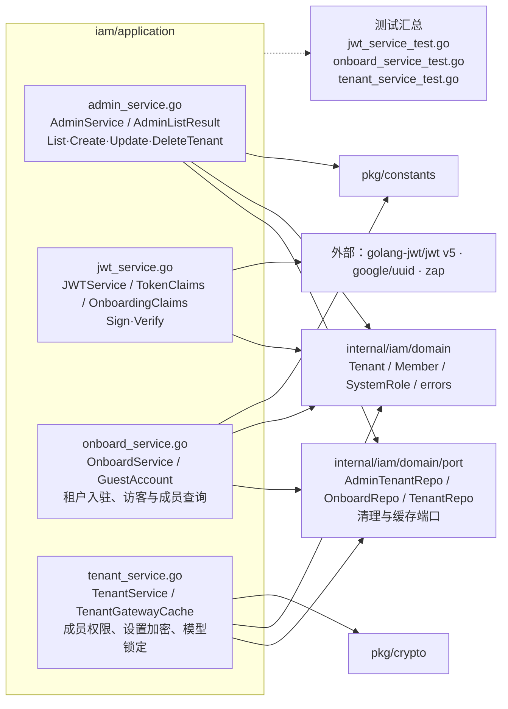

# internal/iam/application

该包编排 IAM 用例：平台租户管理、RS256 令牌、用户入驻与租户成员/设置管理，并通过领域端口隔离持久化和清理设施。

完整导入路径：`github.com/byteBuilderX/stratum/internal/iam/application`

`New*Service` 构造函数注入各领域端口。`AdminService` 在删除租户主记录后依次调用向量、Schema 与缓存清理端口；`TenantService` 实施角色约束、加密/掩码 API key，并通过最小缓存接口失效租户网关。JWT 服务直接使用 RSA 密钥和 `golang-jwt/jwt` 完成签发与校验。
