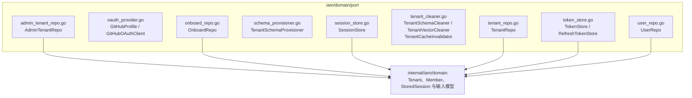

# internal/iam/domain/port

该包声明 IAM 消费方所需的持久化、OAuth、会话、令牌、租户 Schema/向量清理与缓存失效契约。

完整导入路径：`github.com/byteBuilderX/stratum/internal/iam/domain/port`

所有文件均为接口或接口使用的数据形状；应用层依赖这些契约，基础设施在外层实现它们。该包没有测试文件，也没有关键第三方依赖。
