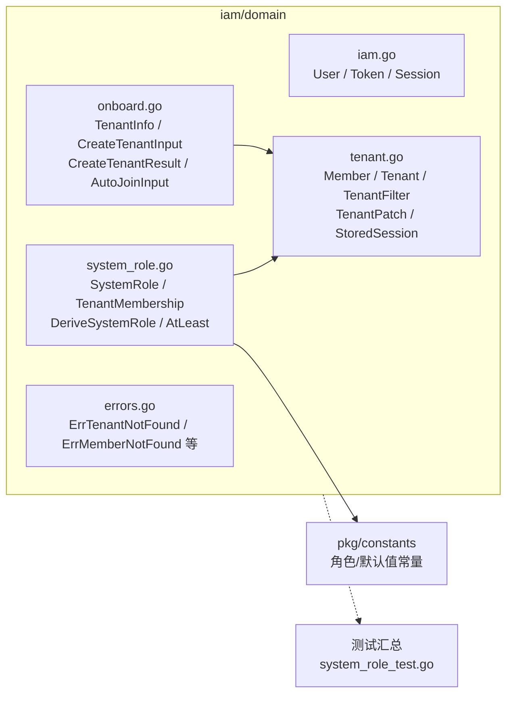

# internal/iam/domain

该包定义 IAM 的领域数据、系统角色推导规则、租户管理输入模型和领域错误，不承担外部 IO。

完整导入路径：`github.com/byteBuilderX/stratum/internal/iam/domain`

`DeriveSystemRole` 根据租户成员关系统一推导系统角色，`AtLeast` 比较权限等级；其余文件提供应用层与端口共享的稳定领域形状和哨兵错误。
