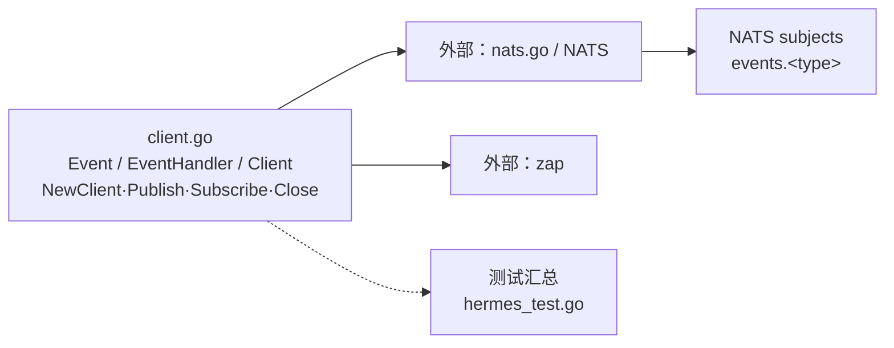

# internal/iam/infrastructure/hermes

该包封装 Hermes 的 NATS 事件客户端，提供连接、JSON 事件发布、按事件类型订阅分发和关闭能力。

完整导入路径：`github.com/byteBuilderX/stratum/internal/iam/infrastructure/hermes`

`NewClient` 使用 `nats.Connect` 建立连接。`Publish` 把 `Event` 编码为 JSON 并发布到 `events.<type>`；`Subscribe` 订阅同名 subject，在 NATS 回调中解码事件并调用该类型已登记的处理器。该包无直接项目内依赖。
