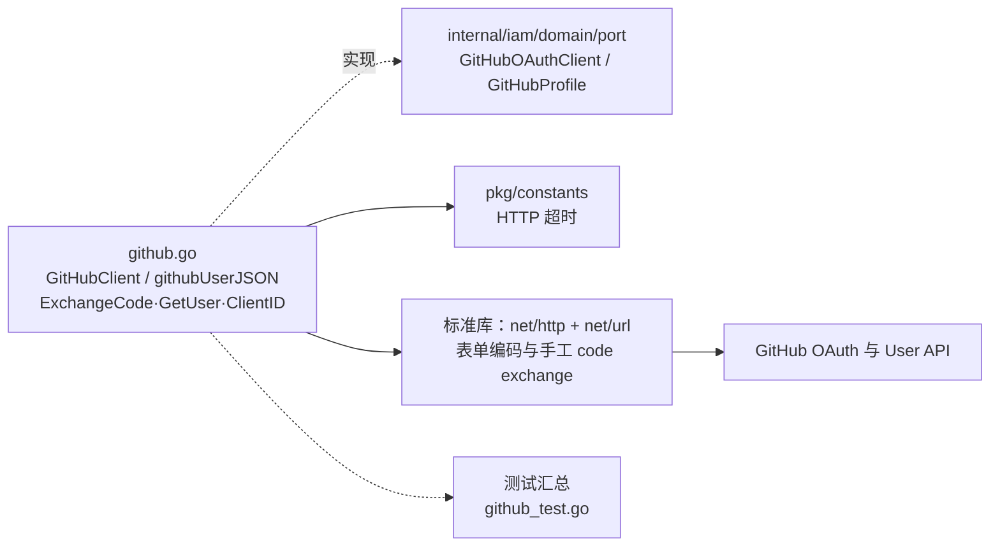

# internal/iam/infrastructure/oauth

该包实现 GitHub OAuth 端口，负责授权码换取访问令牌并读取 GitHub 用户资料。

完整导入路径：`github.com/byteBuilderX/stratum/internal/iam/infrastructure/oauth`

`NewGitHubClient` 配置端点和带超时的 HTTP 客户端；`ExchangeCode` 用 `url.Values` 组装表单并通过 `net/http` 手工交换授权码，`GetUser` 再读取用户 API，最终转换为端口定义的 `GitHubProfile`。
