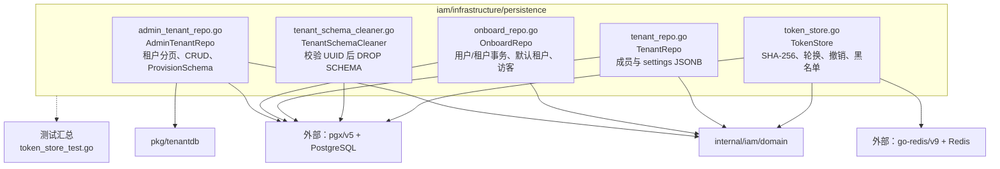

# internal/iam/infrastructure/persistence

该包以 PostgreSQL（以及令牌撤销所需的 Redis）实现 IAM 租户、入驻、成员设置、Schema 清理和刷新令牌存储。

完整导入路径：`github.com/byteBuilderX/stratum/internal/iam/infrastructure/persistence`

三个 Repo 将 SQL 结果映射为领域类型；入驻和租户创建使用事务并创建租户 Schema。`TokenStore` 只持久化原始令牌的 SHA-256，Redis 保存带剩余 TTL 的撤销标记；`TenantSchemaCleaner` 对动态 Schema 名先做 UUID 格式校验。
