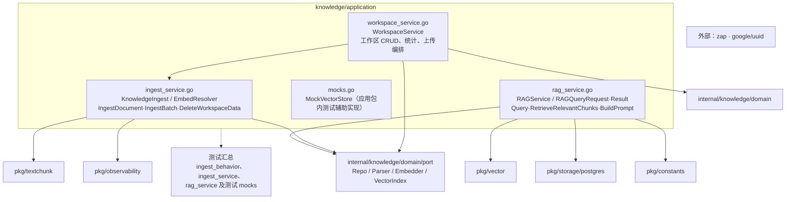

# internal/knowledge/application

该包编排知识工作区、异步文档摄取和 RAG 查询，用端口连接解析、切块、嵌入、向量与 PostgreSQL 存储。

完整导入路径：`github.com/byteBuilderX/stratum/internal/knowledge/application`

`KnowledgeIngest` 管理准入信号量、后台任务生命周期和摄取状态，执行 parse→chunk→embed→持久化；`RAGService` 依据查询模式组合向量/关键词结果；`WorkspaceService` 维护 PostgreSQL 与向量集合的创建、删除和统计编排。
