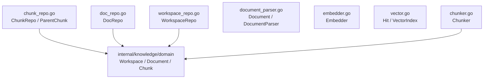

# internal/knowledge/domain/port

该包声明知识上下文对文档解析、切块、嵌入、向量索引和工作区/文档/分块仓储的出向契约。

完整导入路径：`github.com/byteBuilderX/stratum/internal/knowledge/domain/port`

接口按消费者需求拆分：解析器返回标准化文档，嵌入器生成向量，`VectorIndex` 负责集合与检索，三个 Repo 负责租户隔离的关系数据。该包无测试与关键第三方依赖。
