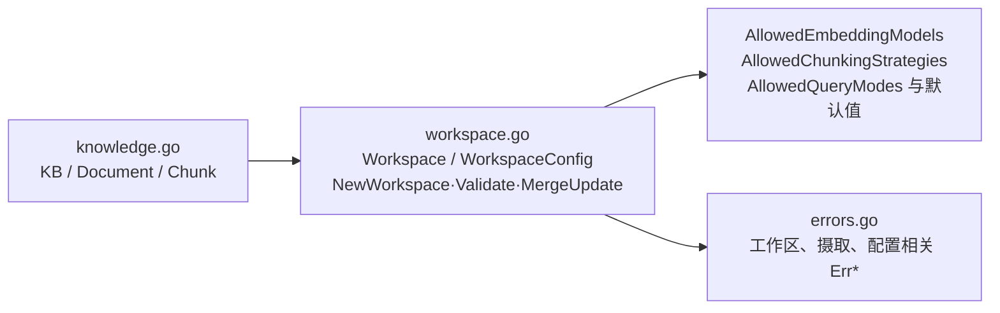

# internal/knowledge/domain

该包定义知识库文档、分块、工作区聚合、配置白名单/默认值及领域错误。

完整导入路径：`github.com/byteBuilderX/stratum/internal/knowledge/domain`

`Workspace` 是带配置校验和更新不变量的聚合；`Document`、`Chunk` 与 `KB` 表达摄取数据。该纯领域包没有测试文件和直接项目/第三方依赖。
