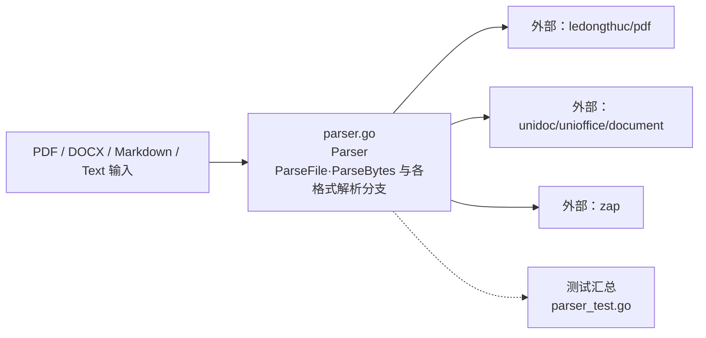

# internal/knowledge/infrastructure/document

该包实现文档解析能力，按文件扩展名或 MIME 提示从 PDF、DOCX、Markdown 或纯文本中提取统一文本。

完整导入路径：`github.com/byteBuilderX/stratum/internal/knowledge/infrastructure/document`

`ParseFile` 按文件扩展名读取磁盘文件，`ParseBytes` 按 MIME 或文件名提示解析内存数据；PDF 使用 `ledongthuc/pdf`，DOCX 使用 `unidoc/unioffice/document` 遍历段落与文本 run。该包无直接项目内依赖。
