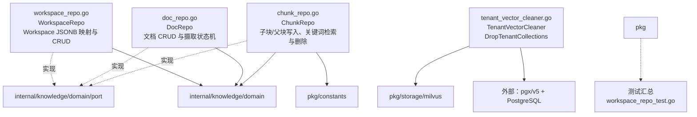

# internal/knowledge/infrastructure/persistence

该包用 PostgreSQL 实现知识工作区、文档与分块仓储，并协调删除租户对应的 Milvus 集合。

完整导入路径：`github.com/byteBuilderX/stratum/internal/knowledge/infrastructure/persistence`

各 Repo 通过租户上下文执行 SQL 并把数据库错误/行转换为领域对象；`ChunkRepo` 同时维护 parent-child 块与全文检索。清理器先查询租户工作区，再按集合命名规则删除 Milvus 集合。
