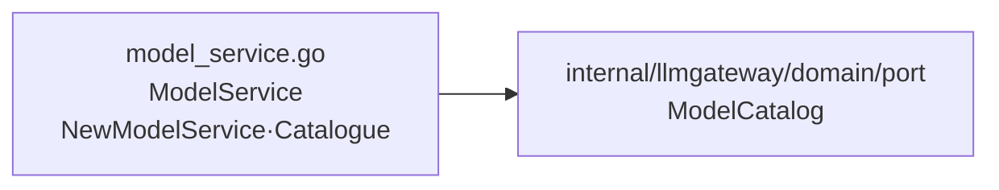

# internal/llmgateway/application

该包提供模型目录查询用例，向上层暴露稳定的聊天模型与嵌入模型列表。

完整导入路径：`github.com/byteBuilderX/stratum/internal/llmgateway/application`

`ModelService.Catalogue` 调用目录端口的 `ListChatModels` 与 `ListEmbeddingModels`，并把 nil 结果规范化为空切片；该包不包含提供商 IO 或缓存逻辑，也没有测试文件和关键第三方依赖。
