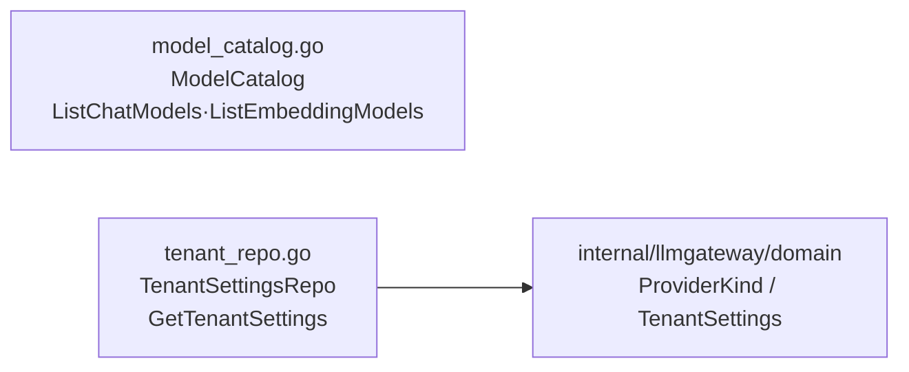

# internal/llmgateway/domain/port

该包声明模型目录与租户 LLM 设置读取端口，为应用服务和基础设施租户网关解析提供边界。

完整导入路径：`github.com/byteBuilderX/stratum/internal/llmgateway/domain/port`

`ModelCatalog` 只返回聊天与嵌入模型名称，不引用领域类型；`TenantSettingsRepo` 返回领域层的租户设置。该包无测试与关键第三方依赖。
