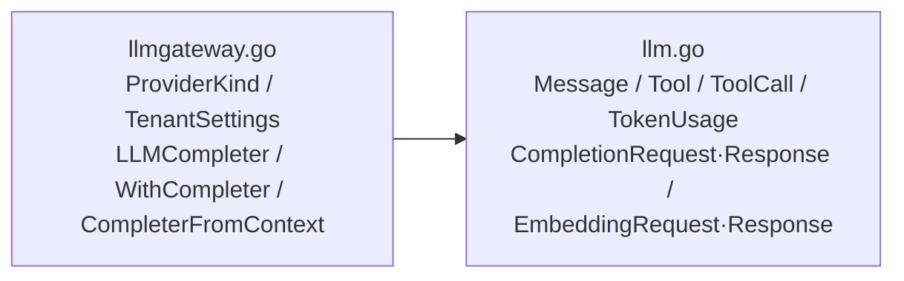

# internal/llmgateway/domain

该包定义统一 LLM/Embedding 请求响应、消息、工具调用、提供商类型、租户设置以及上下文中的补全器契约。

完整导入路径：`github.com/byteBuilderX/stratum/internal/llmgateway/domain`

统一数据模型屏蔽 OpenAI 兼容提供商差异；`LLMCompleter` 是最小补全接口，并可显式放入/取出 `context.Context`。该包无测试和外部依赖。
