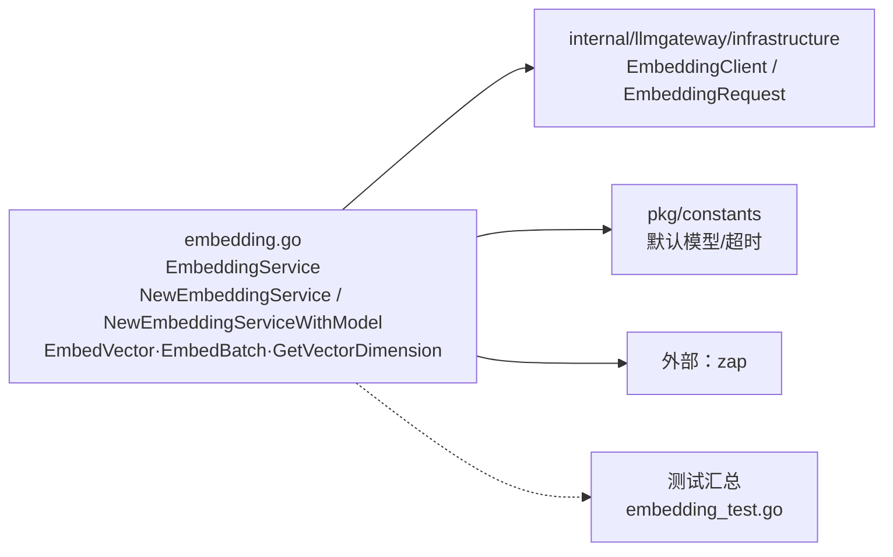

# internal/llmgateway/infrastructure/embedding

该包把 llmgateway 的嵌入客户端包装成面向文本列表的嵌入服务，并固定或覆盖所用模型。

完整导入路径：`github.com/byteBuilderX/stratum/internal/llmgateway/infrastructure/embedding`

`EmbedVector` 为单段文本调用 `CreateEmbeddings`；`EmbedBatch` 按客户端 `BatchSize` 顺序分批，并为每批设置超时；`GetVectorDimension` 按模型名返回维度。两个构造函数分别使用默认模型或调用方指定模型。
