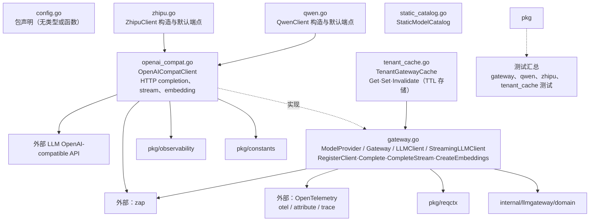

# internal/llmgateway/infrastructure

该包实现统一 LLM 网关、OpenAI 兼容 HTTP 客户端、Qwen/Zhipu 构造、静态模型目录与租户网关 TTL 缓存。

完整导入路径：`github.com/byteBuilderX/stratum/internal/llmgateway/infrastructure`

`ModelProvider` 定义在 `gateway.go`；`Gateway` 按提供商注册客户端并统一执行 `Complete`、`CompleteStream` 与 `CreateEmbeddings`，从 `reqctx` 读取追踪/租户信息，并用 OpenTelemetry 创建 span、记录 attribute/trace 信息。`Gateway` 与 `OpenAICompatClient` 都使用 zap 记录请求、响应和错误。Qwen/Zhipu 提供默认端点构造；`TenantGatewayCache` 仅用 `Get`、`Set`、`Invalidate` 保存带 TTL 的 Gateway 与 API key 副本，不负责读取设置或创建网关。
