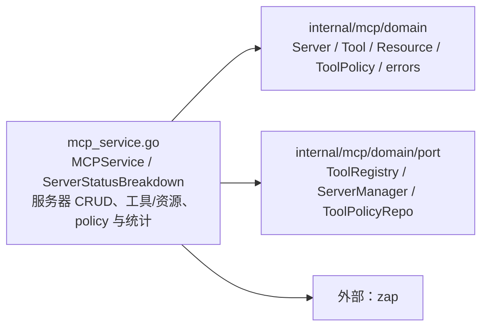

# internal/mcp/application

该包编排 MCP 服务器生命周期、能力发现、工具风险策略与状态统计，并用结构化日志记录连接变更。

完整导入路径：`github.com/byteBuilderX/stratum/internal/mcp/application`

`NewMCPService` 注入 `ToolRegistry`、`ServerManager` 和 `*zap.Logger`，并可设置 `ToolPolicyRepo`；服务通过管理器完成服务器操作与能力发现，通过 registry 同步服务器工具目录，通过 policy repo 读写 tenant 工具风险级别，并记录连接、更新、断开和删除事件。`IsNameConflict` 统一识别领域冲突错误。该包无测试文件。
