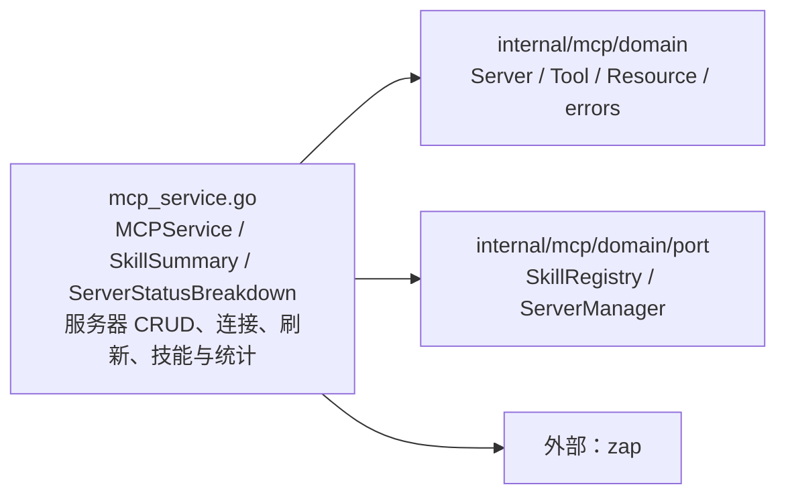

# internal/mcp/application

该包编排 MCP 服务器生命周期、能力发现、技能注册与状态统计，并用结构化日志记录连接变更。

完整导入路径：`github.com/byteBuilderX/stratum/internal/mcp/application`

`NewMCPService` 只注入 `SkillRegistry`、`ServerManager` 和 `*zap.Logger`；服务通过管理器完成服务器操作，通过注册表发现和执行技能，并记录连接、更新、断开和删除事件。`IsNameConflict` 统一识别领域冲突错误。该包无测试文件。
