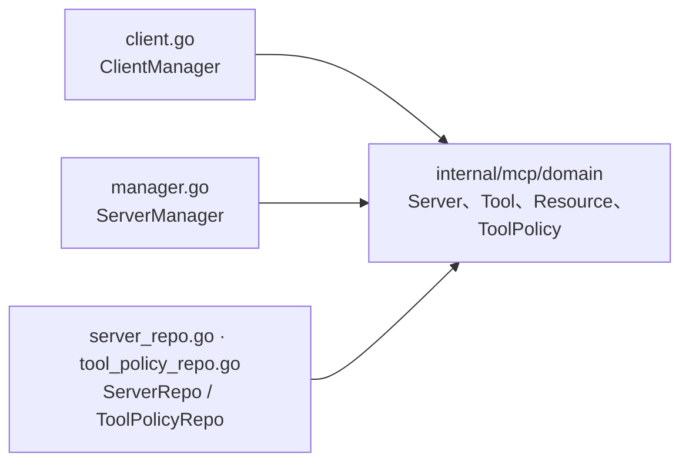

# internal/mcp/domain/port

该包声明 MCP 客户端管理、服务器管理/持久化和工具风险策略契约。

完整导入路径：`github.com/byteBuilderX/stratum/internal/mcp/domain/port`

```mermaid
flowchart LR
  client["client.go<br/>ClientManager"]
  manager["manager.go<br/>ServerManager"]
  repo["server_repo.go · tool_policy_repo.go<br/>ServerRepo / ToolPolicyRepo"]
  domain["internal/mcp/domain<br/>Server、Tool、Resource、ToolPolicy"]
  client --> domain
  manager --> domain
  repo --> domain
```

这些接口让应用层不依赖具体 MCP SDK、连接池或 PostgreSQL。该包无测试和关键第三方依赖。
