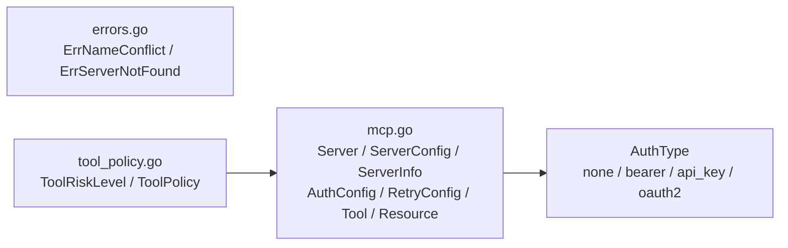

# internal/mcp/domain

该包定义 MCP 服务器配置、认证/重试、工具、资源、工具风险策略及领域错误。

完整导入路径：`github.com/byteBuilderX/stratum/internal/mcp/domain`

`mcp.go` 描述 MCP 连接和能力数据，不执行网络操作；`AuthType` 包含 none、bearer、api_key 与 oauth2。`tool_policy.go` 定义 safe/destructive 风险级别及 tenant-scoped policy；`errors.go` 定义名称冲突和服务器不存在等哨兵错误。该包无测试及项目内或第三方依赖。
