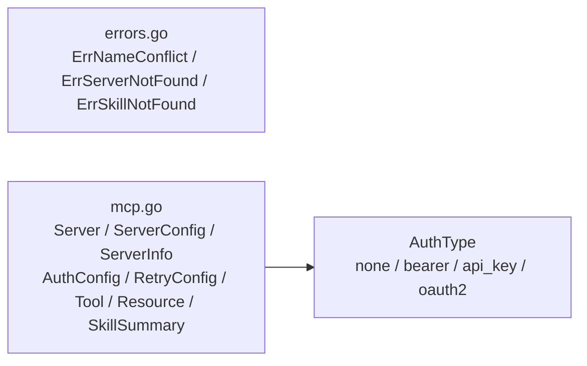

# internal/mcp/domain

该包定义 MCP 服务器配置、认证/重试、工具、资源、技能摘要及领域错误。

完整导入路径：`github.com/byteBuilderX/stratum/internal/mcp/domain`

`mcp.go` 描述 MCP 连接和能力数据，不执行网络操作；`AuthType` 包含 none、bearer、api_key 与 oauth2。`errors.go` 独立定义名称冲突、服务器不存在和技能不存在哨兵错误，源码中没有从模型到错误的直接关系。该包无测试及项目内或第三方依赖。
