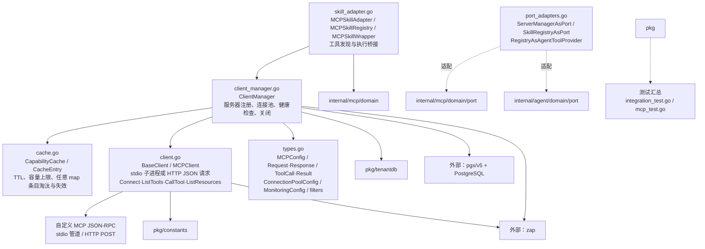

# internal/mcp/infrastructure

该包以自有 JSON-RPC 协议实现 MCP stdio/HTTP 客户端、连接管理/健康检查、能力缓存、端口适配和 Agent 工具桥接。

完整导入路径：`github.com/byteBuilderX/stratum/internal/mcp/infrastructure`

`BaseClient` 自行构造 `MCPRequest`/`MCPResponse`：stdio 模式启动子进程并通过标准输入输出交换逐行 JSON，HTTP/streamable-http 模式发送 JSON POST，并处理认证与 session header。`BaseClient` 和 `ClientManager` 直接使用 zap 记录连接、请求、健康检查与错误；管理器维护按租户和服务器 ID 的客户端及配置。`CapabilityCache` 以 TTL 缓存能力，满容量时删除 Go map 遍历遇到的任意首项，并非 LRU。适配函数将具体管理器/注册表收窄成领域和 Agent 端口，技能适配器再把 MCP 工具映射为可执行能力。
