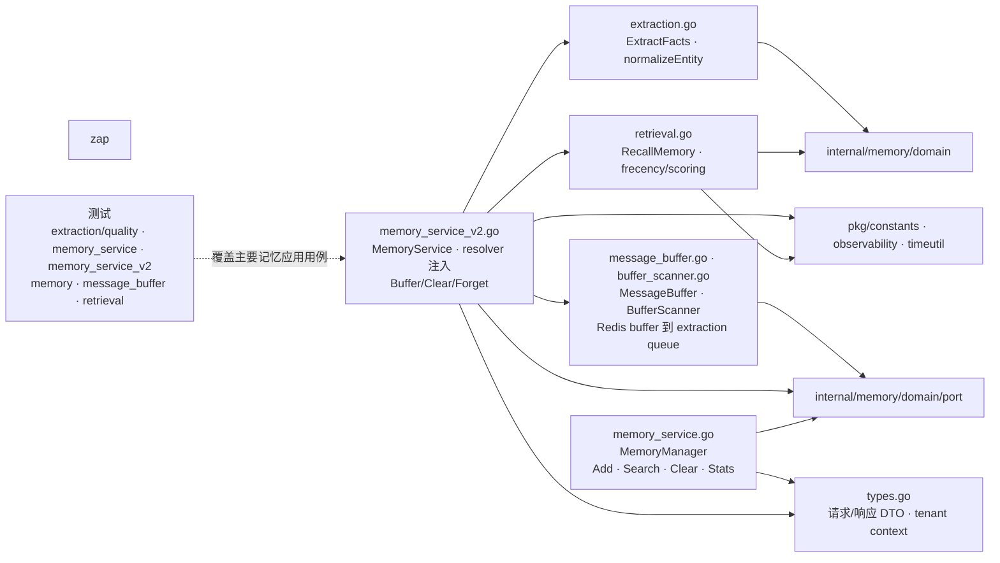

# internal/memory/application

该包编排记忆写入、缓冲与扫描、LLM 事实抽取、实体归一化、混合召回、遗忘和按用户/Agent 清理，并协调 active snapshot 与 History 生命周期清理。

完整导入路径：`github.com/byteBuilderX/stratum/internal/memory/application`

## 说明

`MemoryService` 是事实化记忆的新用例服务，通过仓储、向量、LLM extractor 和 superseder 端口完成抽取与召回；用户/Agent 生命周期删除同时清理 facts、entities、active snapshots、History 和对应向量。`MessageBuffer`/`BufferScanner` 把对话消息聚合后入抽取队列。`MemoryManager` 保留对通用 `MemoryEntry` 的管理接口。
