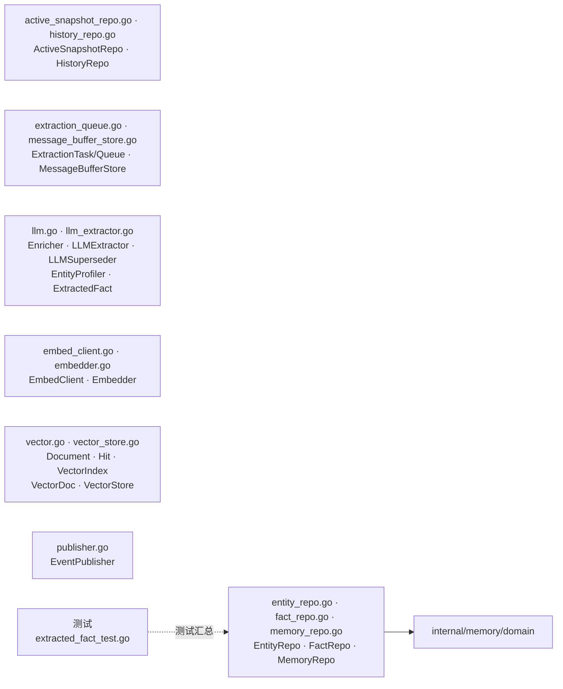

# internal/memory/domain/port

该包定义 memory 上下文的出向端口，包括事实/实体/通用记忆、active snapshot、History 仓储、消息缓冲、抽取队列、LLM、embedding、向量索引和事件发布。

完整导入路径：`github.com/byteBuilderX/stratum/internal/memory/domain/port`

## 说明

接口按能力拆成小文件，application 和 workers 仅依赖这些契约。仓储方法显式携带 `tenantID`；active snapshot 与 History 分别提供幂等 upsert、分层查询/晋级和生命周期清理契约；LLM 与 embedding 可通过 resolver 延迟选择租户能力；向量端口同时保留通用索引模型和 memory 专用文档模型。
