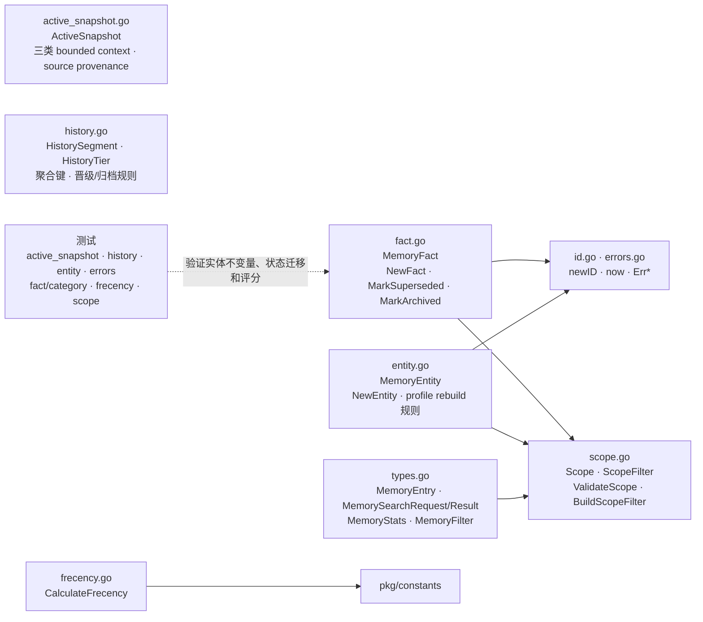

# internal/memory/domain

该包承载记忆领域实体、事实状态机、active snapshot、History 分层、作用域规则、frecency 算法、通用记忆模型、ID/时间生成和领域错误。

完整导入路径：`github.com/byteBuilderX/stratum/internal/memory/domain`

## 说明

`MemoryFact` 通过显式状态迁移维护 active/superseded/archived 生命周期，`MemoryEntity` 管理事实计数与画像重建条件。`ActiveSnapshot` 约束短期工作/个人/top-of-mind 上下文及来源，`HistorySegment` 表达 recent/earlier/background 三层长期历史及确定性聚合。`ScopeFilter` 描述 tenant/user/agent 的可见范围，`CalculateFrecency` 为召回排序提供领域评分。
