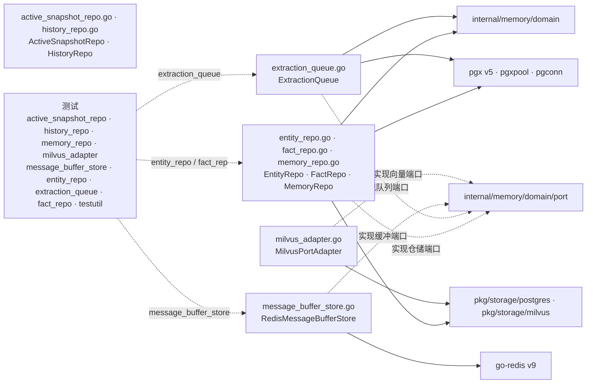

# internal/memory/infrastructure/persistence

该包实现 memory 的 PostgreSQL/Redis/Milvus 持久化适配器，覆盖实体、事实、active snapshot、History、通用记忆、抽取队列、消息缓冲与向量数据清理。

完整导入路径：`github.com/byteBuilderX/stratum/internal/memory/infrastructure/persistence`

## 说明

PostgreSQL 仓储通过 tenant-aware 执行器访问租户 schema，并将 `pgx/pgconn` 错误翻译为领域错误。active snapshot 使用来源时间防止旧/重复事件覆盖新快照；History 以确定性 aggregation key 和精确 source IDs 保证重试幂等与安全归档。Redis adapter 直接映射消息缓冲所需命令；Milvus adapter 包装公共 `VectorStore`，提供 upsert 和按用户/Agent 清理能力。
