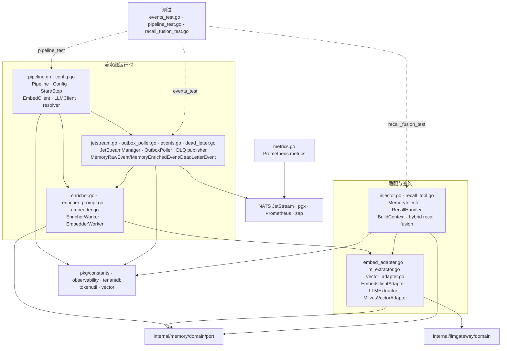

# internal/memory/infrastructure/pipeline

该包构建基于 JetStream 和 PostgreSQL outbox 的异步记忆处理流水线，并提供富化、embedding、注入、召回及 LLM/向量适配能力。

完整导入路径：`github.com/byteBuilderX/stratum/internal/memory/infrastructure/pipeline`

## 说明

`Pipeline.Start` 创建 JetStream consumer，并监督 enricher、embedder 与 outbox poller 的 goroutine 生命周期。永久失败或最后一次瞬态失败通过 `dead_letter.go` 发布脱敏 DLQ 元数据。原始事件先由 `EmbedderWorker` 生成 embedding 并写入 Milvus，随后形成 enriched 事件，再由 `EnricherWorker` 调用 LLM 完成元数据富化与持久化；`MemoryInjector` 和 `RecallHandler` 在请求路径执行 PostgreSQL 文本检索与向量召回融合。
