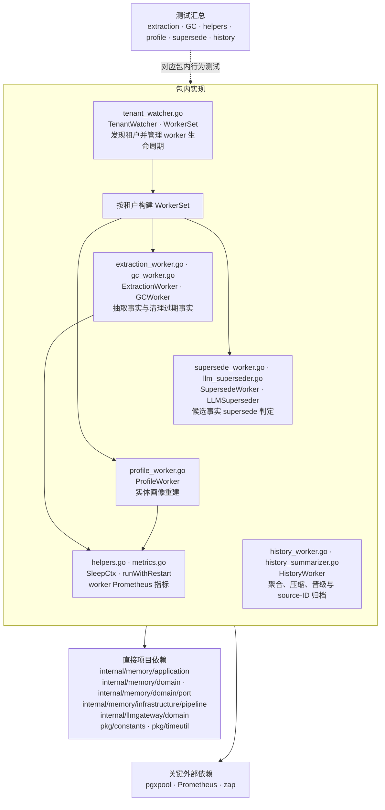

# internal/memory/infrastructure/workers

该包提供按租户运行的后台记忆作业，包括事实抽取、过期清理、事实 supersede 判定、实体画像重建、History 聚合与分层晋级，以及租户发现与 worker 生命周期管理。

完整导入路径：`github.com/byteBuilderX/stratum/internal/memory/infrastructure/workers`

## 说明

`TenantWatcher` 周期读取租户并为新增租户构建 `WorkerSet`，移除租户时停止对应 worker。各 worker 都围绕 domain/port 执行单一后台职责，并用 `helpers.go` 的可取消等待与重启监督逻辑维持生命周期；`HistoryWorker` 在租户后台聚合、压缩并按 age/capacity 晋级历史段，只有替换段写入成功后才按精确 source IDs 归档来源；LLM supersede 与 History summarizer 都复用 tenant-scoped LLM 能力。
