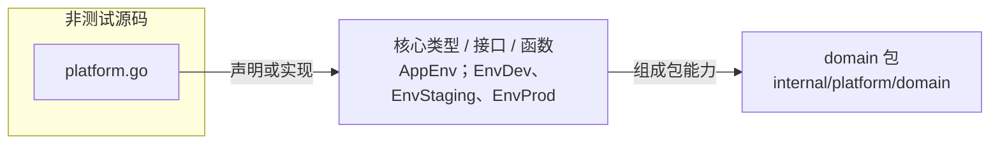

# internal/platform/domain

平台领域层的最小环境模型，定义应用运行环境枚举，避免平台基础设施直接使用裸字符串。

- 完整导入路径：`github.com/byteBuilderX/stratum/internal/platform/domain`

图中每个源码节点均对应 `go list -json` 返回的非测试 Go 文件；核心节点概括这些文件共同暴露或实现的主要架构表面。 当前包没有直接导入其他 stratum 项目包。
