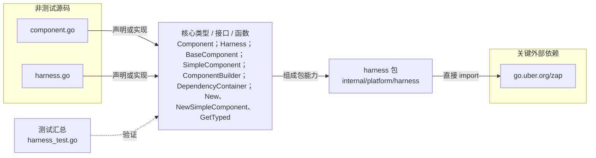

# internal/platform/harness

提供组件生命周期编排、函数式组件适配和线程安全依赖容器；Harness 按注册顺序启动并按逆序停止组件。

- 完整导入路径：`github.com/byteBuilderX/stratum/internal/platform/harness`

图中每个源码节点均对应 `go list -json` 返回的非测试 Go 文件；核心节点概括这些文件共同暴露或实现的主要架构表面。 当前包没有直接导入其他 stratum 项目包。 关键外部依赖为：`go.uber.org/zap`。 测试文件合并为一个节点：`harness_test.go`。
