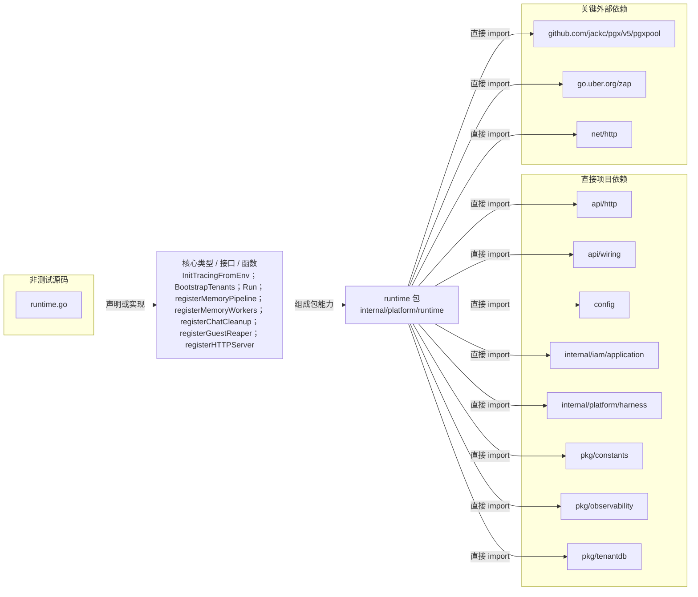

# internal/platform/runtime

承接应用启动期的运行时编排：初始化追踪、引导租户 schema、注册后台组件与 HTTP 服务，并响应进程退出信号。

- 完整导入路径：`github.com/byteBuilderX/stratum/internal/platform/runtime`

图中每个源码节点均对应 `go list -json` 返回的非测试 Go 文件；核心节点概括这些文件共同暴露或实现的主要架构表面。 项目内箭头仅表示当前包的直接 import，包含：`api/http`、`api/wiring`、`config`、`internal/iam/application`、`internal/platform/harness`、`pkg/constants`、`pkg/observability`、`pkg/tenantdb`。 关键外部依赖为：`github.com/jackc/pgx/v5/pgxpool`、`go.uber.org/zap`、`net/http`。
