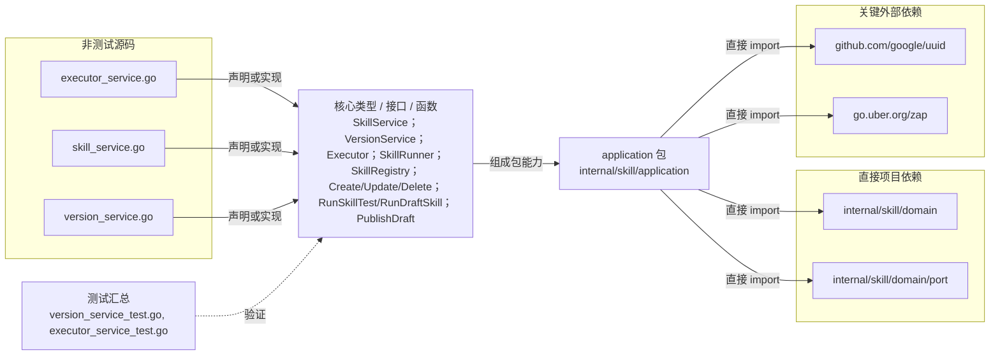

# internal/skill/application

编排 Skill 的 CRUD、草稿/版本发布及执行用例，只依赖领域模型与消费者侧 port。

- 完整导入路径：`github.com/byteBuilderX/stratum/internal/skill/application`

图中每个源码节点均对应 `go list -json` 返回的非测试 Go 文件；核心节点概括这些文件共同暴露或实现的主要架构表面。 项目内箭头仅表示当前包的直接 import，包含：`internal/skill/domain`、`internal/skill/domain/port`。 关键外部依赖为：`github.com/google/uuid`、`go.uber.org/zap`。 测试文件合并为一个节点：`version_service_test.go`、`executor_service_test.go`。
